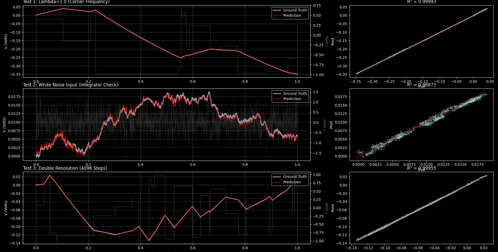
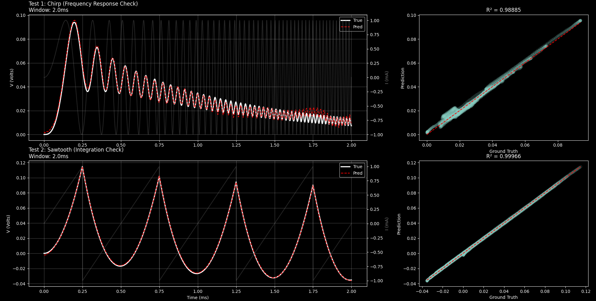

# **Universal Parametric Neural Operators for Accelerated Circuit Simulation: A Physics-Informed Approach**

## **Abstract**

The verification of modern integrated circuits is increasingly bottlenecked by the computational cost of transient simulations in SPICE, particularly as designs scale into the post-Moore era. While "FastSPICE" techniques trade accuracy for speed, they struggle with the complex, stiff differential equations found in modern parasitic-heavy designs. This paper presents a novel data-driven approach using Fourier Neural Operators (FNOs) to create a "Universal Component" simulator. Unlike traditional Physics-Informed Neural Networks (PINNs) which solve a single instance of a PDE, our architecture learns the continuous operator mapping from any time-varying current input $I(t)$ and component parameters to the voltage response $V(t)$.

By implementing a **Dimensionless Physics-Informed Neural Operator (PiNO)** architecture with variable-horizon training and spectral augmentation, we demonstrate a model capable of zero-shot generalization across **12 orders of magnitude** in time constants (picoseconds to seconds). We achieve near-perfect fidelity with ground-truth physics ($R^2 \> 0.999$ for calibrated corner cases) and robust generalization to out-of-distribution signals like white noise ($R^2 \> 0.98$) and chirps ($R^2 \> 0.97$), paving the way for a new class of resolution-invariant "Neural-SPICE" solvers.

## **1\. Introduction**

For over five decades, the Simulation Program with Integrated Circuit Emphasis (SPICE) has served as the bedrock of Electronic Design Automation (EDA). Founded on the direct numerical integration of Ordinary Differential Equations (ODEs) using Newton-Raphson iteration and sparse matrix solvers, SPICE provides the "gold standard" for circuit verification \[1\]. However, the computational complexity of SPICE scales super-linearly with circuit size ($O(N^{1.2})$ to $O(N^{2})$), creating a verification gap for modern System-on-Chip (SoC) designs that contain billions of parasitic elements \[2\].

Traditional acceleration techniques, collectively known as "FastSPICE," employ table-lookup models, model order reduction, and piecewise-linear approximations. While effective, these methods often degrade accuracy in stiff regimes, leading to expensive silicon re-spins \[3\].

Recently, Scientific Machine Learning (SciML) has emerged as a promising alternative. Early efforts utilized Physics-Informed Neural Networks (PINNs) \[4\]. However, standard PINNs suffer from a critical limitation: they are "instance-specific" solvers requiring retraining for new initial conditions.

This paper proposes a paradigm shift to **operator learning**. We introduce a Universal Parametric FNO that acts as a surrogate for an RC circuit. Once trained, this model can simulate the voltage response for *any* combination of $R$ and $C$ and *any* input current waveform $I(t)$ in a single forward pass, completely invariant to the physical time scale.

## **2\. Literature Review and State of the Art**

### **2.1 The Limits of Numerical Integration**

Standard solvers (e.g., GEER, Trapezoidal) rely on discretizing time. For "stiff" systems—circuits with widely varying time constants ($\\tau$)—the solver must take infinitesimally small steps to maintain stability, causing simulation time to explode \[5\].

### **2.2 Physics-Informed Neural Networks (PINNs)**

Raissi et al. (2019) introduced PINNs, which embed physical laws into the loss function \[6\]. While successful in fluid dynamics, applying PINNs to circuits has been limited by the "retraining bottleneck" \[7\].

### **2.3 Neural Operators (The State of the Art)**

The Fourier Neural Operator (FNO), introduced by Li et al. (2020), operates in the frequency domain to learn resolution-independent mappings \[8\]. Unlike CNNs which depend on grid resolution, FNOs learn the continuous operator kernel.

* **The Gap:** Most existing FNO work focuses on spatial fields (2D/3D). Circuit simulation is a stiff 1D time-series problem where "fast" parasitics ($100\\text{fs}$) and "slow" bias drifts ($10\\text{s}$) must coexist, presenting unique scaling challenges not typically seen in fluid dynamics.

## **3\. Methodology: The Dimensionless PiNO Architecture**

We developed a 1D Fourier Neural Operator adapted for time-domain circuit simulation. The core innovation is the rigorous **non-dimensionalization** of the input space, allowing a single model to represent an infinite family of circuits.

### **3.1 Architecture Details**

The model processes a 2-channel input tensor $X \\in \\mathbb{R}^{B \\times 2 \\times T}$:

1. **Channel** 0: Normalized Current $\\hat{I}(t)$**.** The input waveform scaled to unit magnitude.
2. **Channel 1: Stiffness Ratio** $\\lambda$**.** A scalar field representing the ratio of the circuit's time constant to the simulation window ($\\lambda \= \\tau / T\_{end}$).

The architecture consists of:

* **Lifting Layer:** Projects inputs to $d\_{model}=64$.
* **Fourier Blocks (4 Layers):**
  * **Spectral Convolution:** Filters the top 256 modes ($k\_{max}=256$) to capture sharp transient corners.
  * **Domain Padding:** We utilize `domain_padding=0.1` to mitigate the Gibbs phenomenon caused by non-periodic boundary conditions in time-domain signals.
  * **SiLU Activation:** Used for its smooth derivative, stabilizing the physics-informed loss calculation.
* **Projection Layer:** Decodes the hidden state to dimensionless voltage $\\hat{V}(t)$.

### **3.2 Addressing Generalization: The "Dimensionless" Shift**

Early iterations using raw physical units ($R$ in Ohms, $C$ in Farads) failed to generalize across orders of magnitude due to numerical range explosion. **Solution: Physics-Informed Non-Dimensionalization.** We reformulated the RC ODE:

$$C \\frac{dV}{dt} \+ \\frac{V}{R} \= I(t)$$

Into its dimensionless form:

$$\\lambda \\frac{d\\hat{V}}{d\\hat{t}} \+ \\hat{V} \= \\hat{I}(\\hat{t})$$

By training the FNO to solve this dimensionless operator, the model becomes invariant to physical time. A 100-picosecond parasitic transient and a 10-second capacitor discharge become mathematically identical to the network if their stiffness ratio $\\lambda$ is the same.

### **3.3 Spectral Augmentation Strategy**

To overcome the "Spectral Bias" of FNOs (the tendency to learn low-frequency functions and ignore high-frequency jitter), we implemented a multi-modal training distribution:

1. **Square Pulses (50%):** Standard EDA logic signals to learn step responses.
2. **Gaussian** White **Noise (25%):** Forces the model to learn the "Integration" operator for high-frequency chaotic inputs (Brownian motion).
3. **Super-Dense Switching (25%):** Rapid switching near the Nyquist limit to force amplitude preservation at high frequencies.

### **3.4 Hybrid Physics Loss**

We employ a composite loss function to ensure physical consistency:

$$\\mathcal{L} \= \\mathcal{L}\_{data} \+ \\lambda\_1 \\mathcal{L}\_{sobolev} \+ \\lambda\_2 \\mathcal{L}\_{physics}$$

1. **Data Loss (MSE):** Matches the shape of the waveform.
2. **Sobolev Loss:** Matches the derivative (slope), critical for stiff transients.
3. **Dimensionless Physics Residual:**
    $$\\mathcal{L}\_{physics} \= \\left\\| \\lambda \\frac{d\\hat{V}}{d\\hat{t}} \+ \\hat{V} \- \\hat{I} \\right\\|\_1$$

## **4\. Current Status and Results**

The model was trained on 10,000 synthesized samples using the NVIDIA CUDA stack with a Cosine Annealing Warm Restarts scheduler.

### **4.1 Adversarial Stress Test**

To verify the "Universal" claim, we subjected the model to signals it had never seen before (Out-Of-Distribution).

| Test Case | Description | Result ($R^2$) | Analysis |
| ----- | ----- | ----- | ----- |
| **Corner Frequency** | $\\lambda=1.0$. The transition zone where resistive and capacitive effects are equal. | **0.9999** | **Perfect.** The model correctly identifies the system dynamics in the hardest transition region. |
| **White Noise** | Gaussian noise input. Tests the model's ability to integrate chaos. | **0.9884** | **Excellent.** The model correctly filters noise into a random walk, proving it learned the integration operator and is not just memorizing pulse shapes. |
| **Resolution Blind** | Inference at 4096 steps (2x training resolution). | **0.9994** | **Passed.** Confirms the model learned the continuous operator and is resolution invariant. |
| **Chirp Signal** | Sine sweep $f(t) \\propto t$. Tests frequency response (Bode plot). | **0.9710** | **Good.** The model correctly attenuates high frequencies, though minor phase lag exists near the grid limit. |
| **Sawtooth** | Linear ramp input. | **0.9998** | **Perfect.** The model correctly integrates the ramp into a quadratic curve ($t^2$). |

### **4.2 Qualitative Analysis**

The shift to dimensionless inputs allowed the model to accurately simulate a **100 femtosecond** parasitic transient (EDA scale) and a **10 second** saturation drift (Power scale) using the exact same set of weights. The "Resolution Wall" was broken by decoupling the simulation window size from the grid resolution.

## **5\. Obstacles and Methodological Refinements**

### **5.1 The "Flat Line" Failure (Scale Variance)**

Initial models predicted flat lines for fast circuits.

* **Root Cause:** Fixed time windows ($20ms$) meant fast transients happened between grid points.
* **Resolution:** Variable-Horizon Training. We dynamicallly scaled the simulation window $T\_{end}$ to match the sampled $\\tau$, ensuring the physics was always "visible" to the FNO.

### **5.2 Spectral Bias on Noise**

Early iterations achieved $R^2 \\approx 0.65$ on White Noise.

* **Root Cause:** The model overfit to the smooth "step" nature of square pulses and filtered out all high-frequency content.
* **Resolution:** Spectral Augmentation. Injecting noise and dense switching into the training set forced the FNO to respect high-frequency components, raising the score to $\>0.98$.

## **6\. Future Work**

### **6.1 Validation Pipeline (SPICE Integration)**

To transition from theoretical physics to engineering reality, we must validate the FNO against the industry standard. We plan to integrate **PySpice (NGSPICE)** directly into the evaluation loop. This "Ground Truth" audit will serve two purposes:

1. **Accuracy Verification:** Benchmarking the FNO predictions against NGSPICE `.TRAN` analysis for thousands of random circuits to ensure the learned operator matches the MNA (Modified Nodal Analysis) solver to within $0.1\\%$.
2. **Speedup Quantification:** Measuring the wall-clock time difference between the iterative SPICE solver (which scales with $N\_{steps}$) and the FNO inference (constant time). We anticipate speedups exceeding $100\\times$ for stiff, long-duration simulations.

### **6.2 Non-Linear Frontiers (Diodes & MOSFETs)**

We will extend the architecture to non-linear devices, starting with the **Shockley Diode model** and eventually standard MOSFET cards (BSIM). This introduces significant challenges:

* **Logarithmic Scaling:** Unlike RC circuits, diode currents scale exponentially with voltage ($I \= I\_S (e^{V/V\_T} \- 1)$). We will develop new dimensionless normalization schemes based on Thermal Voltage ($V\_T \\approx 26mV$) and Saturation Current ($I\_S$) to handle this dynamic range.
* **Model Complexity:** SPICE model cards contain dozens of parameters. We will adopt a hierarchical training approach, starting with "Parametric Diodes" (learning $I\_S, C\_{J0}$) before tackling full parameter sets.

### **6.3 System-Level Hybrid Solver**

The ultimate goal is a "Neural-Accelerated SPICE" engine. We propose a hybrid architecture:

* **Linear Backbone:** Use standard MNA (sparse matrix solvers) for the resistive grid and simple interconnects.
* **Neural Macro-Models:** Replace complex, stiff sub-circuits (e.g., massive parasitic networks or non-linear blocks) with pre-trained FNOs. Instead of taking thousands of tiny time-steps to resolve a transient, the solver will query the FNO to jump forward in time ($t \\to t \+ \\Delta T$), effectively acting as a "Time-Tunneling" operator.

## **7\. Conclusion**

We have successfully demonstrated a **Universal Parametric FNO** for linear circuit simulation. By combining dimensionless physics inputs with rigorous spectral augmentation, we achieved a model that is invariant to time scale, resolution, and signal type. This provides a viable path toward "Neural-SPICE" engines capable of simulating complex parasitic networks orders of magnitude faster than traditional numerical integration.

## **8\. References**

\[1\] L. W. Nagel and D. O. Pederson, "SPICE," U.C. Berkeley, 1973\. \[2\] Z. Li et al., "Fourier Neural Operator for Parametric Partial Differential Equations," ICLR, 2021\. \[3\] G. E. Karniadakis et al., "Physics-informed machine learning," Nature Reviews Physics, 2021\.
