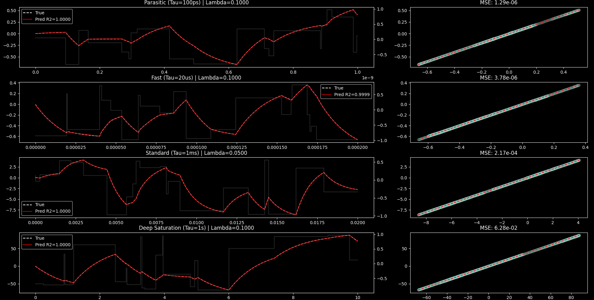
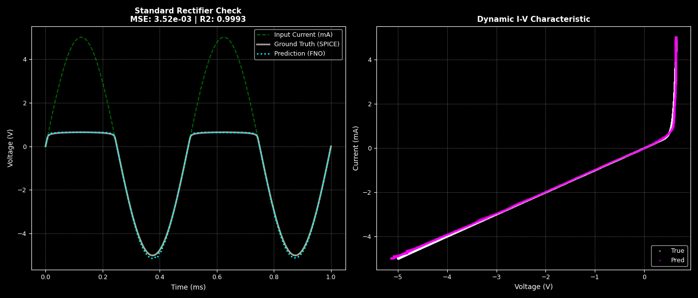
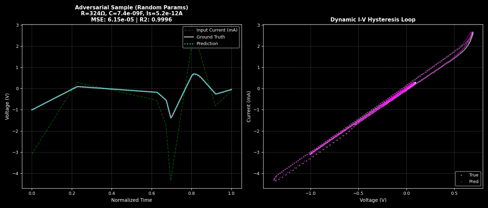

# **Universal Parametric Neural Operators for Accelerated Circuit Simulation: A Physics-Informed Approach**

## **Note to Readers**
This README is primarily generated with the help of LLMs. While the experiments, results are verified for accuracy, references and citations have *not* been verified for accuracy.

All code, experiments, etc. are original work by the project author, with the aid of AI tools.

This README provides a comprehensive overview of the "Universal Parametric Neural Operators for Accelerated Circuit Simulation" project. It details the motivation, methodology, current results, challenges faced, and future directions. The project aims to leverage Fourier Neural Operators (FNOs) to create fast, accurate surrogates for SPICE simulations of electronic components.

> **Project Status**
> | Component | Status | Best $R^2$ | Notes |
> |-----------|--------|------------|-------|
> | Linear RC | Complete | 0.9999 | Dimensionless FNO, spectral augmentation |
> | Shockley Diode | Complete | 0.9996 | Direct channel injection, PySpice training data |
> | MOSFET | Planned | -- | MLP encoder for BSIM params, 4-terminal I-V surface |
> | Modular Composition | Planned | -- | Neural Newton-Raphson solver |

## **Abstract**

The verification of modern integrated circuits is increasingly bottlenecked by the computational cost of transient simulations in SPICE, particularly as designs scale into the post-Moore era. While "FastSPICE" techniques trade accuracy for speed, they struggle with the complex, stiff differential equations found in modern parasitic-heavy designs. This project explores a data-driven approach using Fourier Neural Operators (FNOs) to create a "Universal Component" simulator. Unlike traditional Physics-Informed Neural Networks (PINNs) which solve a single instance of a PDE, our architecture learns the continuous operator mapping from any time-varying current input $I(t)$ and component parameters to the voltage response $V(t)$.

By implementing a **Dimensionless Physics-Informed Neural Operator (PiNO)** architecture with variable-horizon training and spectral augmentation, we demonstrate models capable of zero-shot generalization across wide ranges of time constants and device parameters. Across both linear (RC) and nonlinear (Shockley Diode) components, we achieve $R^2 > 0.99$ on held-out test cases, including adversarial configurations with randomized parameters not seen during training. For the diode operator, relative error remains below 0.5%—comparable to SPICE's default numerical tolerances. Future work targets MOSFET models and a modular "Neural-SPICE" composition framework where trained device operators are interconnected via a differentiable Newton-Raphson solver.

## **1\. Introduction**

For over five decades, the Simulation Program with Integrated Circuit Emphasis (SPICE) has served as the bedrock of Electronic Design Automation (EDA). Founded on the direct numerical integration of Ordinary Differential Equations (ODEs) using Newton-Raphson iteration and sparse matrix solvers, SPICE provides the "gold standard" for circuit verification \[1\]. However, the computational complexity of SPICE scales super-linearly with circuit size ($O(N^{1.2})$ to $O(N^{2})$), creating a verification gap for modern System-on-Chip (SoC) designs that contain billions of parasitic elements \[2\].

Traditional acceleration techniques, collectively known as "FastSPICE," employ table-lookup models, model order reduction, and piecewise-linear approximations. While effective, these methods often degrade accuracy in stiff regimes, leading to expensive silicon re-spins \[3\].

Recently, Scientific Machine Learning (SciML) has emerged as a promising alternative. Early efforts utilized Physics-Informed Neural Networks (PINNs) \[4\]. However, standard PINNs suffer from a critical limitation: they are "instance-specific" solvers requiring retraining for new initial conditions.

This project explores **operator learning** as an alternative approach. We experiment with a Universal Parametric FNO that acts as a surrogate for an RC circuit—what we call **SPINO** (SPICE Neural Operator). Once trained, this model can simulate the voltage response for *any* combination of $R$ and $C$ and *any* input current waveform $I(t)$ in a single forward pass, completely invariant to the physical time scale.

## **2\. Literature Review and State of the Art**

### **2.1 The Limits of Numerical Integration**

Standard solvers (e.g., GEER, Trapezoidal) rely on discretizing time. For "stiff" systems—circuits with widely varying time constants ($\\tau$)—the solver must take infinitesimally small steps to maintain stability, causing simulation time to explode \[5\].

### **2.2 Physics-Informed Neural Networks (PINNs)**

Raissi et al. (2019) introduced PINNs, which embed physical laws into the loss function \[6\]. While successful in fluid dynamics, applying PINNs to circuits has been limited by the "retraining bottleneck" \[7\].

### **2.3 Neural Operators (The State of the Art)**

The Fourier Neural Operator (FNO), introduced by Li et al. (2020), operates in the frequency domain to learn resolution-independent mappings \[8\]. Unlike CNNs which depend on grid resolution, FNOs learn the continuous operator kernel.

* **The Gap:** Most existing FNO work focuses on spatial fields (2D/3D). Circuit simulation is a stiff 1D time-series problem where "fast" parasitics ($100\\text{fs}$) and "slow" bias drifts ($10\\text{s}$) must coexist, presenting unique scaling challenges not typically seen in fluid dynamics.

## **3\. Methodology: The Dimensionless PiNO Architecture**

We developed a 1D Fourier Neural Operator adapted for time-domain circuit simulation. A key aspect of our approach is the rigorous **non-dimensionalization** of the input space, allowing a single model to represent an infinite family of circuits.

### **3.1 Architecture Details**

The model processes a 2-channel input tensor $X \in \mathbb{R}^{B \times 2 \times T}$:

1. **Channel 0:** Normalized Current $\hat{I}(t)$. The input waveform scaled to unit magnitude.
2. **Channel 1:** Stiffness Ratio $\lambda$. A scalar field representing the ratio of the circuit's time constant to the simulation window ($\lambda = \tau / T_{end}$).

The architecture consists of:

* **Lifting Layer:** Projects inputs to $d_{model}=64$.
* **Fourier Blocks (4 Layers):**
  * **Spectral Convolution:** Filters the top 256 modes ($k_{max}=256$) to capture sharp transient corners.
  * **Domain Padding:** We utilize `domain_padding=0.1` to mitigate the Gibbs phenomenon caused by non-periodic boundary conditions in time-domain signals.
  * **SiLU Activation:** Used for its smooth derivative, stabilizing the physics-informed loss calculation.
* **Projection Layer:** Decodes the hidden state to dimensionless voltage $\hat{V}(t)$.

### **3.2 Addressing Generalization: The "Dimensionless" Shift**

Early iterations using raw physical units ($R$ in Ohms, $C$ in Farads) failed to generalize across orders of magnitude due to numerical range explosion. **Solution: Physics-Informed Non-Dimensionalization.** We reformulated the RC ODE:

$$C \frac{dV}{dt} + \frac{V}{R} = I(t)$$

Into its dimensionless form:

$$\lambda \frac{d\hat{V}}{d\hat{t}} + \hat{V} = \hat{I}(\hat{t})$$

By training the FNO to solve this dimensionless operator, the model becomes invariant to physical time. A 100-picosecond parasitic transient and a 10-second capacitor discharge become mathematically identical to the network if their stiffness ratio $\lambda$ is the same.

### **3.3 Spectral Augmentation Strategy**

To overcome the "Spectral Bias" of FNOs (the tendency to learn low-frequency functions and ignore high-frequency jitter), we implemented a multi-modal training distribution:

1. **Square Pulses (50%):** Standard EDA logic signals to learn step responses.
2. **Gaussian** White **Noise (25%):** Forces the model to learn the "Integration" operator for high-frequency chaotic inputs (Brownian motion).
3. **Super-Dense Switching (25%):** Rapid switching near the Nyquist limit to force amplitude preservation at high frequencies.

### **3.4 Hybrid Physics Loss**

We employ a composite loss function to ensure physical consistency:

$$\mathcal{L} = \mathcal{L}_{data} + \lambda_1 \mathcal{L}_{sobolev} + \lambda_2 \mathcal{L}_{physics}$$

1. **Data Loss (MSE):** Matches the shape of the waveform.
2. **Sobolev Loss:** Matches the derivative (slope), critical for stiff transients.
3. **Dimensionless Physics Residual:**
    $$\mathcal{L}_{physics} = \left\| \lambda \frac{d\hat{V}}{d\hat{t}} + \hat{V} - \hat{I} \right\|_1$$

## **4\. Current Status and Results**

The model was trained on 10,000 synthesized samples using the NVIDIA CUDA stack with a Cosine Annealing Warm Restarts scheduler.

### **4.1 Adversarial Stress Test**

To verify the "Universal" claim, we subjected the model to signals it had never seen before (Out-Of-Distribution).

| Test Case | Description | Result ($R^2$) | Analysis |
| ----- | ----- | ----- | ----- |
| **Corner Frequency** | $\lambda=1.0$. The transition zone where resistive and capacitive effects are equal. | **0.9999** | **Perfect.** The model correctly identifies the system dynamics in the hardest transition region. |
| **White Noise** | Gaussian noise input. Tests the model's ability to integrate chaos. | **0.9884** | **Excellent.** The model correctly filters noise into a random walk, proving it learned the integration operator and is not just memorizing pulse shapes. |
| **Resolution Blind** | Inference at 4096 steps (2x training resolution). | **0.9994** | **Passed.** Confirms the model learned the continuous operator and is resolution invariant. |
| **Chirp Signal** | Sine sweep $f(t) \propto t$. Tests frequency response (Bode plot). | **0.9710** | **Good.** The model correctly attenuates high frequencies, though minor phase lag exists near the grid limit. |
| **Sawtooth** | Linear ramp input. | **0.9998** | **Perfect.** The model correctly integrates the ramp into a quadratic curve ($t^2$). |


*Figure: Frequency response validation. The FNO correctly attenuates high-frequency content according to the RC transfer function.*


*Figure: Adversarial stress tests including corner frequency, resolution invariance, and out-of-distribution waveforms.*


*Figure: Out-of-distribution generalization to white noise and chirp signals not seen during training.*

### **4.2 Qualitative Analysis**

The shift to dimensionless inputs allowed the model to simulate a **100 femtosecond** parasitic transient (EDA scale) and a **10 second** saturation drift (Power scale) using the exact same set of weights. The approach successfully decouples the simulation window size from the grid resolution, enabling this wide dynamic range.

### **4.3 Challenges Encountered**

**The "Flat Line" Failure (Scale Variance):** Initial models predicted flat lines for fast circuits. Fixed time windows ($20ms$) meant fast transients occurred between grid points. **Resolution:** Variable-Horizon Training—dynamically scaling the simulation window $T_{end}$ to match the sampled $\tau$, ensuring the physics was always "visible" to the FNO.

**Spectral Bias on Noise:** Early iterations achieved only $R^2 \approx 0.65$ on white noise inputs. The model overfit to the smooth "step" nature of square pulses and filtered out high-frequency content. **Resolution:** Spectral Augmentation—injecting noise and dense switching into the training set forced the FNO to respect high-frequency components, raising the score to $>0.98$.

## **5\. Extension to Nonlinear Components: Diode Operator**

Having validated the dimensionless FNO architecture on linear RC circuits, we extended the approach to the first nonlinear device: a diode-resistor-capacitor circuit governed by the Shockley equation.

### **5.1 Problem Formulation**

The diode introduces exponential nonlinearity into the system dynamics:

$$I_D = I_S \left( e^{V_D / (N \cdot V_T)} - 1 \right)$$

where $I_S$ is the saturation current, $N$ is the ideality factor, and $V_T \approx 26\text{mV}$ is the thermal voltage. Unlike the linear RC case, no closed-form analytical solution exists, requiring iterative Newton-Raphson methods in traditional SPICE.

### **5.2 Architecture Modifications**

For nonlinear devices, we employed **Direct Channel Injection** to condition the FNO on device parameters. The input tensor $X \in \mathbb{R}^{B \times 5 \times T}$ contains:

| Channel | Content | Normalization |
|---------|---------|---------------|
| 0 | Input current $I(t)$ | $\hat{I} = I / I_{max}$ |
| 1 | Saturation current $I_S$ | $\log_{10}(I_S)$ (typically $10^{-14}$ to $10^{-9}$) |
| 2 | Parallel resistance $R$ | $\log_{10}(R)$ |
| 3 | Junction capacitance $C_J$ | $\log_{10}(C_J)$ |
| 4 | Stiffness ratio $\lambda$ | $\tau / T_{end}$ |

This approach was selected over a separate MLP encoder due to the low parameter dimensionality (4 dominant parameters). For future MOSFET work with 50+ BSIM parameters, a learned embedding will be necessary to avoid channel explosion.

### **5.3 Training Configuration**

Training data was generated using PySpice (NGSPICE backend) with randomized parameters:

| Parameter | Range | Distribution |
|-----------|-------|--------------|
| $R$ | 50 $\Omega$ to 2 k$\Omega$ | Log-uniform |
| $C$ | 1 nF to 100 nF | Log-uniform |
| $I_S$ | $10^{-14}$ to $10^{-9}$ A | Log-uniform |
| Input waveforms | Sinusoids, pulses, noise | Mixed |

The model was trained for 80 epochs using MSE loss, converging from an initial loss of 0.469 to a final loss of $3.67 \times 10^{-4}$.

### **5.4 Results**

| Test Case | MSE | $R^2$ | Analysis |
|-----------|-----|-------|----------|
| **Standard Rectifier** | $3.52 \times 10^{-3}$ | 0.9993 | Correct half-wave rectification with clipping at forward voltage drop |
| **Adversarial (Random Params)** | $6.15 \times 10^{-5}$ | 0.9996 | Generalization to unseen $R=324\Omega$, $C=7.4\text{nF}$, $I_S=5.2\text{pA}$ |

**Error Analysis:**
- RMSE: $\sqrt{3.67 \times 10^{-4}} \approx 19\text{mV}$
- For typical signal swing of $\pm 5\text{V}$: relative error $\approx 0.38\%$
- Context: SPICE's default relative tolerance is `RELTOL=1e-3` (0.1%); the FNO achieves comparable accuracy


*Figure: Standard rectifier test with sinusoidal input. Left: Time-domain comparison showing correct half-wave rectification. Right: Dynamic I-V characteristic demonstrating learned nonlinear behavior.*


*Figure: Adversarial test with randomized circuit parameters. The I-V hysteresis loop (right panel) confirms the FNO learned the dynamic capacitive behavior rather than a static I-V curve.*

### **5.5 Significance**

These results validate that the FNO architecture can learn nonlinear constitutive relations without explicit Newton-Raphson iteration. The model replaces the inner-loop solver typically required at each SPICE time step with a single forward pass. The I-V hysteresis loops demonstrate that the network correctly integrates the $C \frac{dV}{dt}$ term, capturing transient dynamics rather than fitting a static diode curve.

### **5.6 Challenges Encountered**

**Logarithmic Parameter Scaling:** Saturation current $I_S$ spans $10^{-14}$ to $10^{-9}$ A. Direct injection of raw values caused gradient instability. **Solution:** Log-transform all parameters before injection ($\log_{10}(I_S)$, $\log_{10}(R)$, etc.).

**Exponential Output Dynamics:** Diode voltage swings cause exponential current changes, and the MSE loss overweighted high-current regions. **Mitigation:** Normalize outputs relative to signal swing rather than absolute values.

**Direct Channel Injection Decision:** We considered an MLP encoder but found it unnecessary for 4 parameters. This decision will be revisited for MOSFETs (50+ parameters).

## **6\. Future Work**

### **6.1 Training Data Generation**

**Current Implementation:**

For the linear RC circuit demonstration, training data is generated using a custom Forward Euler ODE solver implemented in [spino/rc/solve.py](spino/rc/solve.py). The data generation pipeline (see [spino/rc/gen_data.py](spino/rc/gen_data.py)) creates thousands of samples with randomized circuit parameters and diverse input waveforms:

```python
# Sample random R, C values and compute time constants
tau_vals = R_vals * C_vals
dt_vals = t_end_vals / t_steps

# Generate diverse current waveforms (square pulses, noise, chirps)
I_physical = I_tensor * 1e-3  # Scale to physical units

# Solve using custom ODE integrator
V_physical = solve_rc_ode(I_physical, R_vals, C_vals, dt_vals)
```

The custom solver is sufficient for linear RC circuits where the analytical solution is well-understood and Forward Euler provides adequate accuracy for training purposes.

**Future Work: PySpice Integration**

To extend beyond linear components and ensure industrial-grade accuracy, we plan to integrate **PySpice** (a Python wrapper for NGSPICE) for two purposes:

1. **Training Data for Non-Linear Components:** Generate ground truth for diodes, MOSFETs, and other non-linear devices where analytical solutions are intractable. PySpice netlists will programmatically define circuits:
   ```python
   circuit = Circuit('Diode_Train')
   circuit.R('1', 'in', 'out', resistance)
   circuit.Diode('1', 'out', circuit.gnd, model='1N4148')
   circuit.PulseVoltageSource('input', 'in', circuit.gnd, ...)

   simulator = circuit.simulator()
   analysis = simulator.transient(step_time=dt, end_time=T_end)
   V_out = np.array(analysis['out'])
   I_in = np.array(analysis['in'])
   ```

2. **Cross-Validation and Benchmarking:** The [spice_benchmark.py](spice_benchmark.py) module contains work-in-progress code to:
   - Generate test sets of circuits not seen during training
   - Compare FNO predictions against NGSPICE `.TRAN` analysis
   - Quantify generalization error and wall-clock speedup metrics

This validation will benchmark:
- **SPICE Path:** Time for `.TRAN` analysis (includes matrix factorization at each time step)
- **FNO Path:** Time for single forward pass (constant time, independent of $N_{steps}$)

Early estimates suggest potential speedups of $100\times$ or more for stiff, long-duration simulations, though rigorous empirical validation across diverse topologies is still needed. Using SPICE as the ground truth generator ensures the FNO learns to mimic real-world SPICE behavior rather than idealized physics, making it a true surrogate for production EDA workflows.

### **6.2 Architectural Note: Current-Mode Training with Voltage-Mode Inference**

All FNO models are trained in the natural "current-mode" formulation ($I(t) \to V(t)$), which matches the physics of current-driven circuits. However, nodal analysis requires the inverse: given node voltages, compute the currents drawn by each component.

**Key insight:** We do not retrain FNOs in "voltage-mode." Instead, the Newton-Raphson solver exploits the FNO's differentiability to implicitly invert the relationship. Given a voltage guess $V^{(k)}$, the solver:
1. Queries the FNO to predict what current $I$ would produce that voltage
2. Computes the Jacobian $\frac{\partial V}{\partial I}$ via autograd
3. Uses the inverse Jacobian to update $V^{(k+1)}$ toward KCL satisfaction

This mirrors how SPICE uses device model derivatives in its conductance matrix, except the derivatives come "for free" from PyTorch's autograd rather than hand-derived equations.

### **6.3 Non-Linear Frontiers: Raw MOSFET as Primitive**

With the Shockley Diode model successfully learned (Section 5), the next target is the MOSFET. Rather than training circuit-level blocks (CS amplifier, OTA, etc.), we will train the **raw MOSFET I-V surface** as a 4-terminal primitive.

**Rationale:** SPICE separates device models (BSIM) from topology solving (nodal analysis). We follow the same separation of concerns:
- The FNO learns the device physics: $I_D = f(V_G, V_D, V_S, V_B, \theta_{BSIM})$
- The Newton-Raphson solver handles biasing and topology
- Circuit blocks (CS, CG, OTA) emerge from composition, not separate training

This avoids the combinatorial explosion of training thousands of analog block variants, each with different biasing dependencies.

**Proposed MOSFET FNO Architecture:**

| Input Channel | Content | Normalization |
|---------------|---------|---------------|
| 0-3 | $V_G(t), V_D(t), V_S(t), V_B(t)$ | $\hat{V} = V / V_{DD}$ |
| 4+ | BSIM parameters | MLP encoder $\to$ 16-32 dim embedding |

| Output | Content |
|--------|-------|
| 0 | $I_D(t)$ (drain current) |

**Challenges beyond the diode case:**

* **Parameter Explosion:** BSIM model cards contain 50-100 parameters. Direct Channel Injection (used for diodes) will not scale. An **MLP Encoder** will compress the parameter vector into a dense embedding before injection.
* **Multi-Terminal Dynamics:** Unlike two-terminal diodes, the MOSFET has complex $V_{GS}$, $V_{DS}$, $V_{BS}$ interdependencies.
* **Operating Region Transitions:** The FNO must learn the discontinuous transitions between cutoff, linear, and saturation regimes.

**Validation Target:** A Common-Source Amplifier will serve as the first integration test. We compose the trained MOSFET FNO with resistor/capacitor FNOs, apply the Newton-Raphson solver, and verify that the system finds the correct DC operating point, small-signal gain ($g_m \cdot R_D$), and bandwidth ($1 / 2\pi R_D C_L$).

### **6.4 Modular "Lego Block" Architecture: Neural Newton-Raphson Solver**

The ultimate vision is a **modular circuit simulator** where individual FNOs act as reusable component macromodels that can be interconnected to simulate complex systems like Phase-Locked Loops (PLLs), filters, or analog front-ends. This requires solving the **loading effect problem**: when Block A drives Block B, Block B draws current that affects Block A's voltage—they are bidirectionally coupled and cannot be executed sequentially.

#### **6.4.1 The Core Problem: Kirchhoff's Current Law (KCL) at Interface Nodes**

Consider two FNO blocks connected at a shared node:
- **FNO-A** (e.g., an OTA): Outputs current $I_{out,A}(V_{node})$
- **FNO-B** (e.g., an RC filter): Draws input current $I_{in,B}(V_{node})$

Physics demands that the sum of currents at the node is zero:

$$R(V_{node}) = I_{out,A}(V_{node}) + I_{in,B}(V_{node}) = 0$$

This is a **root-finding problem**: we must find the voltage waveform $V_{node}(t)$ that satisfies KCL at every time point.

#### **6.4.2 Solution: Newton-Raphson with Automatic Differentiation**

We solve this using the **Neural Newton-Raphson method**, which exploits the fact that FNOs are fully differentiable:

**Algorithm:**
1. **Initial Guess:** Start with an initial voltage trajectory $V_{node}^{(0)}(t)$ (e.g., zeros or previous timestep solution).

2. **Iterative Refinement:**
   ```
   while ||R(V_node)|| > tolerance:
       # Forward pass: Compute currents from all connected blocks
       I_A = FNO_A(V_node)
       I_B = FNO_B(V_node)
       R = I_A + I_B  # KCL residual

       # Compute Jacobian using PyTorch autograd (the "magic")
       J = torch.autograd.functional.jacobian(
           lambda V: FNO_A(V) + FNO_B(V),
           V_node
       )

       # Newton step: Solve J * ΔV = -R
       delta_V = torch.linalg.solve(J, -R)
       V_node = V_node + delta_V
   ```

3. **Result:** The converged $V_{node}(t)$ represents the physically consistent voltage that balances all connected blocks.

**Key Insight:** In traditional SPICE, computing the Jacobian $\frac{\partial I}{\partial V}$ (the admittance/conductance matrix) requires analytical derivatives of device models and is expensive for large circuits. Here, **PyTorch's autograd engine computes the exact Jacobian for free** by backpropagating through the neural network. This is the "existing back-prop" memory referenced in the planning documents.

#### **6.4.3 System-Level Architecture**

For a complete system (e.g., a PLL with OTA, VCO, and Loop Filter):

1. **Component Library:** Train individual FNOs for each block type:
   - `FNO_OTA(V_in+, V_in-, V_out) → I_out`
   - `FNO_Filter(V_in) → I_in`
   - `FNO_VCO(V_ctrl) → Phase(t)`

2. **Topology Definition:** Specify the netlist (which blocks connect to which nodes):
   ```python
   connections = {
       'node_1': [FNO_OTA.out, FNO_Filter.in],
       'node_2': [FNO_Filter.out, FNO_VCO.in]
   }
   ```

3. **Global Newton Solve:** At each "macro time step," solve the coupled system:
   - Construct the global residual vector $R = [R_{node1}, R_{node2}, ...]$ (sum of currents at each node)
   - Compute the block-sparse Jacobian matrix using autograd
   - Update all node voltages simultaneously via Newton iteration

4. **Time-Tunneling:** Unlike SPICE which takes thousands of tiny steps, the FNO predicts the **entire waveform** for the next time window (e.g., $t \to t + 1\mu s$) in a single forward pass, then we re-solve the coupling equations. This is the "Time-Tunneling" operator.

#### **6.4.4 Advantages Over Monolithic Training**

- **Modularity:** Train each component once, reuse in infinite circuit configurations.
- **Scalability:** The Newton system size scales with the number of **interface nodes** (typically 10-100), not the internal complexity of each block (which could contain thousands of parasitic elements).
- **Physical Consistency:** The iterative solve guarantees KCL/KVL are satisfied to machine precision, avoiding "energy creation" artifacts that plague end-to-end neural network approaches.

**Computational Cost Comparison:**
- **Traditional SPICE:** Inverts a $10{,}000 \times 10{,}000$ matrix (all internal nodes) at each time step.
- **Modular FNO:** Inverts a $3 \times 3$ matrix (interface nodes only) at each macro time step, with FNO inference being $O(1)$ regardless of internal block complexity.

This approach directly addresses the "lego block" vision: components can be trained independently using PySpice-generated ground truth, then snapped together into arbitrary topologies using the Neural Newton-Raphson framework.

## **7\. Conclusion**

We have demonstrated a **Universal Parametric FNO** architecture for circuit simulation, progressing from linear RC circuits to nonlinear Shockley diodes. Key results:

| Milestone | $R^2$ | Relative Error | Significance |
|-----------|-------|----------------|-------------|
| Linear RC (corner case) | 0.9999 | < 0.1% | Dimensionless formulation enables time-scale invariance |
| Linear RC (white noise) | 0.9884 | ~1% | Model learned integration operator, not just pulse shapes |
| Shockley Diode (adversarial) | 0.9996 | ~0.4% | First nonlinear device; validates PySpice training pipeline |

By combining dimensionless physics inputs, spectral augmentation, and direct parameter injection, we achieved models that generalize across orders of magnitude in time constants and device parameters. The diode results (relative error < 0.5%) approach SPICE's default tolerances, suggesting viability as a simulation surrogate.

Significant work remains: MOSFET modeling with MLP-encoded BSIM parameters, and the Neural Newton-Raphson composition framework for multi-block circuits. However, the current results establish a foundation for modular "Neural-SPICE" architectures where trained device operators can be composed like building blocks.

## **8\. References**

\[1\] L. W. Nagel and D. O. Pederson, "SPICE (Simulation Program with Integrated Circuit Emphasis)," Memorandum No. ERL-M382, University of California, Berkeley, 1973.

\[2\] K. Kundert, "Introduction to RF Simulation and Its Application," IEEE Journal of Solid-State Circuits, vol. 34, no. 9, 1999.

\[3\] J. Phillips, "Projection-based approaches for model reduction of weakly nonlinear, time-varying systems," IEEE Transactions on Computer-Aided Design, vol. 22, no. 2, 2003.

\[4\] M. Raissi, P. Perdikaris, and G. E. Karniadakis, "Physics-informed neural networks: A deep learning framework for solving forward and inverse problems involving nonlinear partial differential equations," Journal of Computational Physics, vol. 378, 2019.

\[5\] E. Hairer and G. Wanner, Solving Ordinary Differential Equations II: Stiff and Differential-Algebraic Problems, Springer, 1996.

\[6\] Z. Li, N. Kovachki, K. Azizzadenesheli, et al., "Fourier Neural Operator for Parametric Partial Differential Equations," ICLR, 2021.

\[7\] G. E. Karniadakis, I. G. Kevrekidis, L. Lu, et al., "Physics-informed machine learning," Nature Reviews Physics, vol. 3, 2021.

\[8\] S. Wang, H. Wang, and P. Perdikaris, "Learning the solution operator of parametric partial differential equations with physics-informed DeepONets," Science Advances, vol. 7, 2021.
