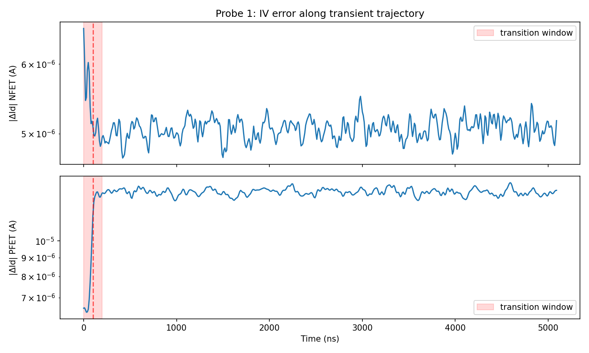
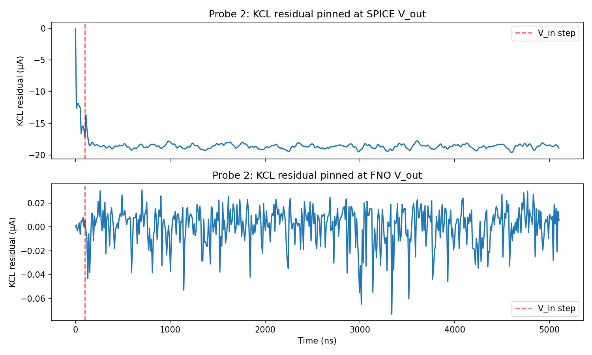
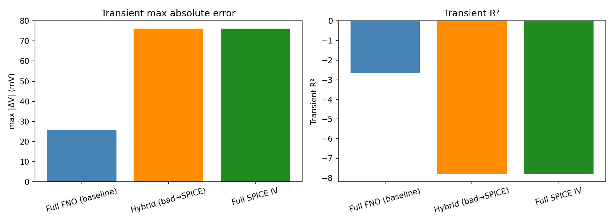
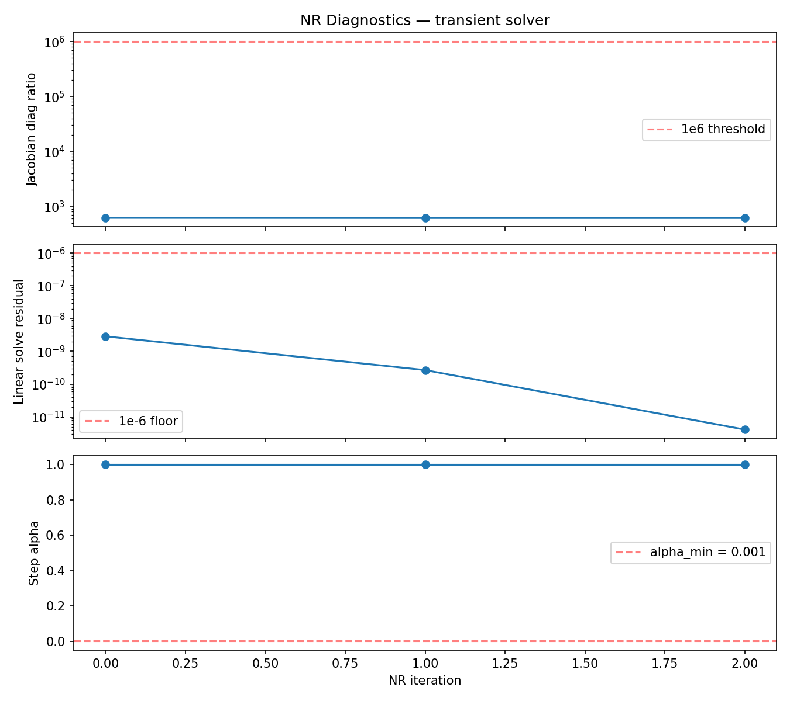
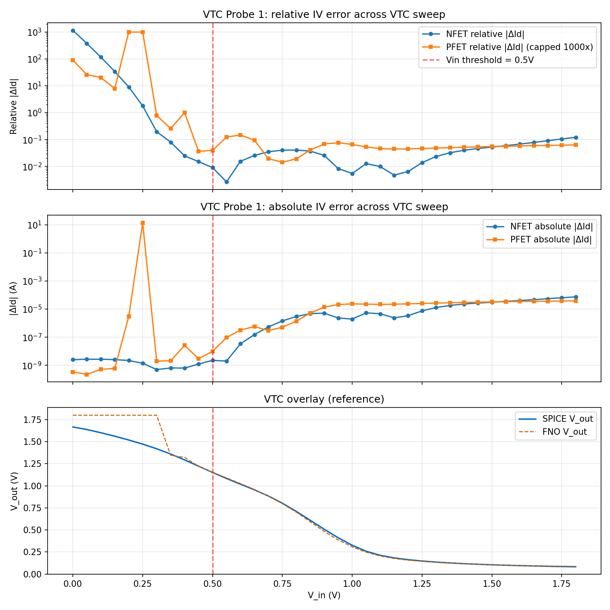
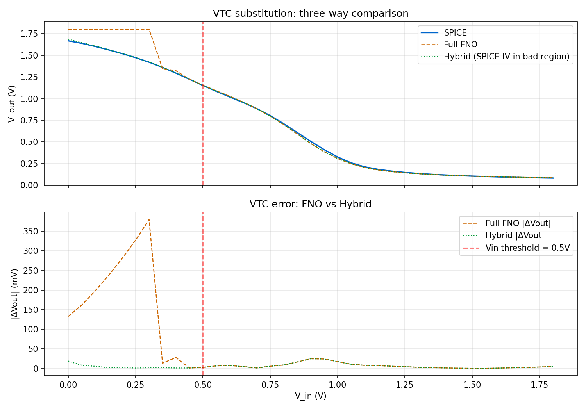
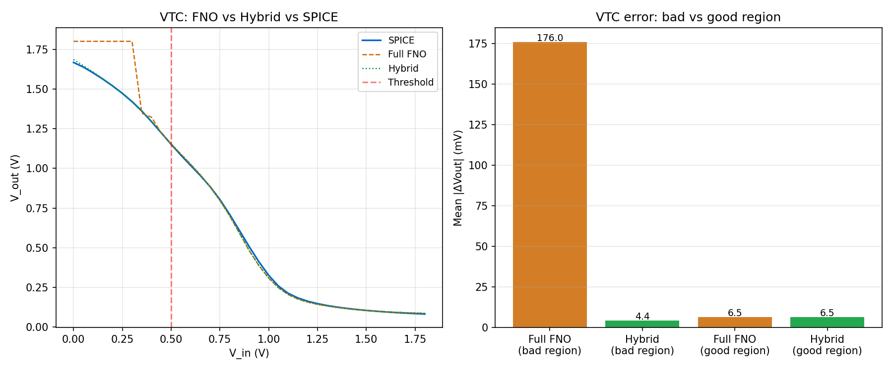

# Error attribution: L=0.18 CUDA stress geometry

This note records the causal attribution for the **cross-bin stress** common-source
composition run (`L_n = L_p = 0.18 um`, CUDA, archived as `cs_amp_fno_exp2`). The
**`L = 0.40 um` showcase** run is in-bin and already matches SPICE closely; it is
not attributed here.

Method details for the composition stack remain in
[Neural composition: CS amplifier method](composition.md). Aggregate composition
metrics remain in [CS amplifier composition results](results.md).

## Method: four-probe isolation

Attribution proceeds as a fixed sequence so IV-surface error, KCL imbalance,
substitution experiments, and Newton diagnostics are not conflated.

1. **Probe 1 (transient):** FNO vs SPICE drain current along the converged transient
   trajectory (nominal strong-inversion `V_gs` window).
2. **Probe 2 (transient):** KCL residual waveforms with `V_out` pinned to the
   SPICE-converged value vs the FNO-converged value. The whole-window residual vector
   stores row `0` as the IC clamp `V_out[0] - v_out_dc` in **volts** and rows `1..T-1`
   as KCL imbalance in **amperes**; published headline numbers use **KCL-only** maxima
   (`kcl_max_a`) after separating that row. Large imbalance at the SPICE pin with
   negligible imbalance at the FNO pin isolates wrong branch currents, not a broken
   global Newton loop.
3. **Probe 3 (transient):** Hybrid / full-SPICE substitution runs. With the
   current implicit NR + whole-window routing, transient substitution causal
   closure is **not executable** (see Open items). The published VTC substitution
   uses scalar `brentq` on the SPICE IV cache directly (Stage 7), not the
   `HybridMosfetDevice` wrapper class (that class is scaffolding for a future
   transient-substitution attempt).
4. **Probe 4 (transient):** Per-iteration Newton diagnostics (Jacobian diagonal
   ratio, linear solve residual, line-search `alpha`). Together with stable
   convergence, these rule out numerical pathology as the primary driver.

A parallel **VTC** track repeats Probe 1 on a DC sweep and performs a **region-wise
IV substitution** (SPICE IV cache in the bad `V_in` band, FNO elsewhere) with
scalar KCL root-finding. That isolates weak-inversion / near-off IV error from the
nominal-bias transient window.

Canonical numbers are in
[`attribution_result.json`](assets/cs_amp_fno_exp2/attribution/attribution_result.json).
Raw probe arrays, IV caches, and full compose-run trees live under
`runs/attribution/cs_amp_fno_exp2/` (gitignored; multi-hour rebuild if deleted).

## Transient attribution

Baseline composition metrics for this geometry match the published stress run
(`transient` Pearson `r`, max `|Delta V|`, `R^2`, etc.; see `results.md`).

**Conclusion:** NR on this trajectory is stable: **three** outer iterations with
**`alpha = 1.0`** accepted every iteration. The Stage-5 NR-diagnostics figure
[`probe4_nr_diagnostics.png`](assets/cs_amp_fno_exp2/attribution/probe4_nr_diagnostics.png)
(generated by [`spino/attribution.ipynb`](../spino/attribution.ipynb)) tracks a
**cheap Jacobian diagonal ratio** `max(|diag|) / min(|diag|)` (~`616` here),
**not** `cond(J)`; the `1e6` line on that plot is a notebook heuristic from the float32 conditioning
story and does **not** transfer literally to this ratio (which is bounded above by
`kappa(J)` but is generally much smaller). The "solver healthy" claim rests on
**`alpha` and iteration count**, not on the diagonal ratio alone. The dominant
effect is **FNO IV error at the nominal bias** (`V_gs` roughly `0.85`–`0.90` V along
the step): at the SPICE-pinned `V_out`, the **KCL** residual peaks near **19.6 uA**
vs **73 nA** at the FNO-pinned `V_out` (ratio **268x**). The solver converges to a
**wrong IV surface**, not a numerically unstable solve.

## VTC attribution

**Conclusion:** VTC error is concentrated where both devices operate in weak
inversion / near-off (`V_in < 0.5` V in this sweep). Relative IV error ratios
(bad region vs good region) reach roughly **4500x** (NFET, uncapped mean-of-ratio).
For the PFET, the arithmetic mean of per-point relative `|Delta I_D| / max(|I_D,SPICE|, 1e-12)`
in the bad band is dominated by the near-off spike at `V_in ~ 0.30` V (the same
locus as the headline **379.7 mV** `V_out` error). The notebook therefore caps
per-point PFET relative error at **1000x** before averaging so the reported **~3700x**
"capped mean ratio" is a **robust-by-truncation** summary, not an arbitrary
editorial. **Uncapped** mean bad/mean good is **~3.0e10** (uninformative). **Median**
bad/median good is **~266x**; ratio of geometric means of per-point relative errors
is **~1157x** — both agree the bad band is catastrophically worse without the spike
single-handedly defining the printed scalar.

At `V_in ~ 0.25` V the PFET exhibits a catastrophic near-off spike: FNO on the order
of **13.7 A** vs SPICE **785 pA** (evaluated at the **SPICE-converged** terminal
voltages on the VTC grid; the value at the FNO self-consistent operating point
differs, but the IV surface is uniformly bad in this band).

A **brentq** KCL solve using the SPICE IV cache in the bad region (pure FNO held
above `V_in = 0.5` V by construction) collapses **mean** `|V_out,FNO - V_out,SPICE|`
in that band from **176 mV** to **4.4 mV** (**97.5%** reduction). In the same band,
**max** `|V_out,FNO - V_out,SPICE|` falls from **379.7 mV** to **18.7 mV** (**95.1%** reduction).
Shape fidelity collapses with the absolute error: bad-region Pearson `r` over `V_out`
drops from the full-sweep `r = 0.9929` to **`r = 0.865`** for the pure FNO, and the
hybrid recovers it to **`r = 0.9996`** in the same band. The full-sweep number is
dominated by the wide swing of the good-region transfer curve and masks the
bad-region shape failure; the substitution closes both the magnitude and shape gaps
together. The good-region row in [`docs/results.md`](results.md) is a **gating
invariant**: the hybrid curve is **identical to FNO** for `V_in >= 0.5` V by code
construction, so "0.0% collapse" there is a sanity check that the bad-region
`brentq` substitution does not leak into the good band — not evidence that SPICE IV
was applied in the good band and had no effect.

The archived `summary.json` does not record per-sweep-point DC Newton iteration
histograms for the VTC curve; at this geometry scalar DC OP for each `V_in` is the
same code path as the published composition DC solve and shows no pathology in the
stress run's nominal/off bias reports. A full per-point iteration export would be
straightforward instrumentation if subsequent investigation requires it.

## Open items

1. **Transient substitution:** The step stimulus stays in strong inversion; a
   narrow weak-inversion hybrid threshold never arms. A broad threshold routes
   the entire implicit window to the SPICE cache and drives NR divergence because
   the FNO Jacobian is inconsistent with cached branch currents. **Probe 2**
   remains the causal evidence for the transient; substitution is blocked on the
   current whole-window NR architecture. The `HybridMosfetDevice` class in the repo
   targets this future path; it is **not** on the published VTC `brentq` path above.
2. **Residual ~4.4 mV** after VTC substitution in the bad band is unexplained
   (likely cache interpolation or a secondary residual). It is small relative to
   the original **176 mV** gap and does not weaken the attribution claim.

## Reproduction

1. Run [`spino/attribution.ipynb`](../spino/attribution.ipynb) top-to-bottom from
   the **repository root** so `DOCS_ROOT` and `RUNS_ROOT` resolve correctly.
2. IV cache generation uses [`scripts/cache_spice_iv.py`](../scripts/cache_spice_iv.py)
   (see notebook Stage 3). Cache `.npz` files under `runs/attribution/cs_amp_fno_exp2/`
   are expensive to rebuild; do not delete them unless the geometry or PDK changes.
3. Composition reproduction commands for this geometry are listed in
   [`docs/results.md`](results.md).
