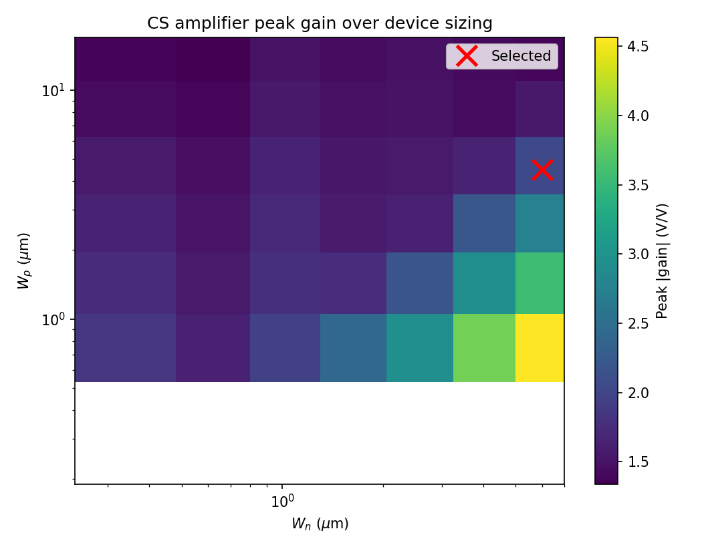
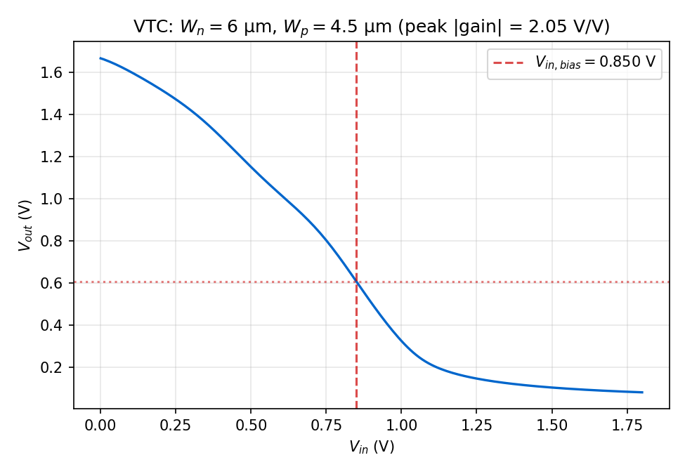
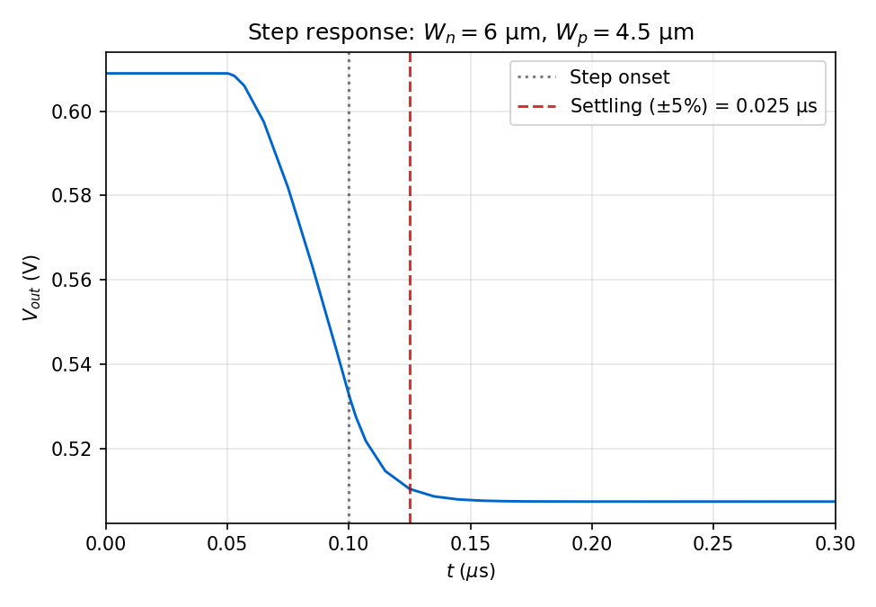

# Common-source amplifier: NGSpice ground truth

This note documents a **reproducible** sky130 `nfet_01v8` / `pfet_01v8` common-source
amplifier with a **diode-connected PMOS** active load. The selected design point is the
outcome of a **pre-registered** 2D sweep and selection rule, not a post-hoc best pick
from plots.

This reference is the SPICE-only ground truth against which a planned FNO-composed
counterpart will later be validated. Its purpose is to fix a defended sizing point, a
reproducible measurement protocol, and a deterministic set of traces; it makes no
neural-network claims itself.

## Replication

```text
python -m spino.circuit.characterize --output-dir docs/assets/cs_amp
```

The command writes `summary.json` (full sweep) and the figures embedded below. PDK:
SKY130 via the Volare path resolved in `spino.circuit.topologies` (tt corner).

## Topology

- NFET: common source — drain on `out`, gate on `in`, source and bulk on `0`.
- PFET: diode-connected active load — drain and gate on `out`, source and bulk on `vdd`.
- Supply: 1.8 V.

## Methodology (fixed before running the sweep)

| Parameter | Value | Rationale |
|---|---|---|
| Channel length L (both) | 0.18 µm | Core trained geometry of the NFET / PFET FNO operators. |
| V_DD | 1.8 V | Nominal sky130 I/O supply. |
| NFET W grid | 0.36, 0.6, 1.0, 1.6, 2.5, 4.0, 6.0 µm | 7 log-spaced points. |
| PFET W grid | 0.36, 0.7, 1.4, 2.5, 4.5, 8.0, 14.0 µm | 7 log-spaced points. |
| VTC sweep | Vin from 0 to V_DD, step 10 mV | Standard gain extraction. |
| Gain extractor | max abs of dVout/dVin via `numpy.gradient` | Peak small-signal magnitude. |
| Bias for OP / transient | Vin at that peak (auto-bias) | Avoids hard-coding a Vin off the gain sweet spot. |
| Step stimulus (sweep) | 50 mV up-step at 100 ns, 5 µs window, 10 ns max step, no load | Small-signal probe at the auto-bias. Load excluded from ranking because it would only rescale settling times by a constant factor and not change the ordering. |
| Step stimulus (figure only) | Same as sweep, plus ideal linear `C_load = 10 pF` at the output | Lifts the time constant above the simulation timestep so the published step-response figure is informative. Reported as `selected.figure_metrics` in `summary.json`. |
| Feasible output band | 0.6 V <= Vout(at peak gain) <= 1.2 V | Keeps the bias clear of the rails. |
| Selection rule | Maximise peak abs gain; tie-break on lower abs I(VDD) | Single scalar objective with a sane secondary. |

The selection rule was committed to source before the sweep ran. See
`spino/circuit/tuning.py::SelectionRule` and `spino/circuit/characterize.py`.

## Outcome: selected design

| Quantity | Value |
|---|---|
| W_n | 6.0 µm |
| W_p | 4.5 µm |
| Peak abs gain | 2.052 V/V |
| Vin at peak gain | 0.85 V |
| Vout at peak gain (bias) | 0.609 V |
| abs I(VDD) (DC at that bias) | 128.5 µA |
| 5% settling time, loaded with 10 pF | 25.0 ns (figure-only metric) |

`build_cs_amp_active_load` in `spino/circuit/topologies.py` now defaults to this W_n,
W_p, and Vin_DC = 0.85 V.

## Sweep health

49 corners simulated (7 × 7). 42 completed all three analyses (VTC, operating point,
transient). 7 failed at the VTC step with NGSpice `Error: circuit not parsed` — all with
W_p = 0.36 µm at various W_n. They are recorded as non-converged in `summary.json` and
excluded from selection. A natural follow-up is to start the PFET width grid at 0.5 µm
or higher; the 0.36 µm column is kept here for a complete rectangular design space and
for transparency of simulator limits.

## Figures

### Peak abs gain over the (W_n, W_p) plane



The heatmap shows that higher peak gain is available at smaller W_p, but those corners
all bias `Vout` below the 0.6 V feasibility threshold (see selection-rule discussion
below). The selected point (red cross) is the highest peak gain inside the feasible band.

### VTC at the selected design



Inverting transfer as expected. The vertical guide is the auto-bias at peak gain
(`Vin = 0.850 V`); the horizontal guide is the corresponding `Vout = 0.609 V`.

### Step response at the selected design



The figure-only transient adds an ideal linear `C_load = 10 pF` at the output node so
the settling behaviour is observable above the simulation timestep. Settling to the
5% band lands at 25 ns past the labelled step onset, consistent with `R_out * C_load`
where `R_out ~ 1 / g_m,PFET ~ 770 ohm` at the selected bias. The load is **not** part
of the ranking sweep (where it would only rescale settling times by a common factor
and not change the ordering); it is added solely so the published figure has a
visible time constant. See "Capacitor handling" below.

Full numeric trace: [`summary.json`](assets/cs_amp/summary.json) (no-load sweep
metrics under `selected.metrics`, loaded figure metrics under
`selected.figure_metrics`).

## Discussion

### Why the selected gain is below the heatmap maximum

The selection rule rejected every corner whose peak-gain bias landed below 0.6 V. The
highest-gain rejected corner was W_n = 6.0 µm, W_p = 0.7 µm at 4.56 V/V, which biases
`Vout = 0.357 V` — i.e., the device under measurement was biased into the bottom rail
where the small-signal model degrades. The selected point is the maximum peak gain
**conditional on a usable linear region**, which is the design-relevant figure of merit.

### Why peak gain caps near 2 V/V

Intrinsic gain `g_m * r_o` is fundamentally low at L = 0.18 µm in sky130. We pre-committed
to 0.18 µm because both FNO operators are trained most heavily at this L; the SPICE
reference is meant to characterise the topology *at the operators' core geometry*, not
to maximise textbook analog performance. A re-run at L = 0.5–1.0 µm would yield a more
impressive headline number; whether to do so is a downstream decision for the planned
neural-composition validation that this reference supports.

### Capacitor handling and FNO scope

The 10 pF load in the step-response figure is an ideal linear element. The planned
neural-composition solver handles it analytically as a KCL constraint at the output
node, with one `C_load / dt` term added to the Newton–Raphson Jacobian. **No "capacitor
operator" is required and none should be inserted**: linear passives have closed-form
constitutive equations and learning them would only inject error.

Drain-side intrinsic capacitive effects of the NFET and PFET are **not** out of FNO
scope. Training labels for the MOSFET operators are the drain-branch currents
(`vd#branch`) of full BSIM4 transient simulations. By KCL at the drain, those branches
carry the channel current plus the displacement currents from `Cgd` and `Cdb`, so the
learned operator already reproduces the dynamic terminal current including drain-side
intrinsic-cap contributions, in the slew-rate range covered by training (variable
T_end mode samples up to ~1e8 V/s). At the selected bias with the 10 pF load, peak
slew is ~1.3e7 V/s — comfortably in distribution.

Gate-side intrinsic capacitances (`Cgs`, `Cgb`, and `Cgd` viewed from the gate) are
out of scope for the trained operators because the operators output only `I_D`, never
`I_G`. For this CS amp it does not matter: the gate is driven by an ideal voltage
source, so KCL at the gate node is trivially satisfied. It will matter for any
topology where one stage's drain drives the next stage's gate (e.g., an inverter
chain); a separate gate-charge model — analytical from the BSIM model card, or an
auxiliary FNO — will need to be added in that work, and is not made here.

## Source references

- Harness: `spino/circuit/tuning.py`, `spino/circuit/characterize.py`,
  `spino/circuit/plotting.py`.
- Topology factory: `spino/circuit/topologies.py::build_cs_amp_active_load`.
