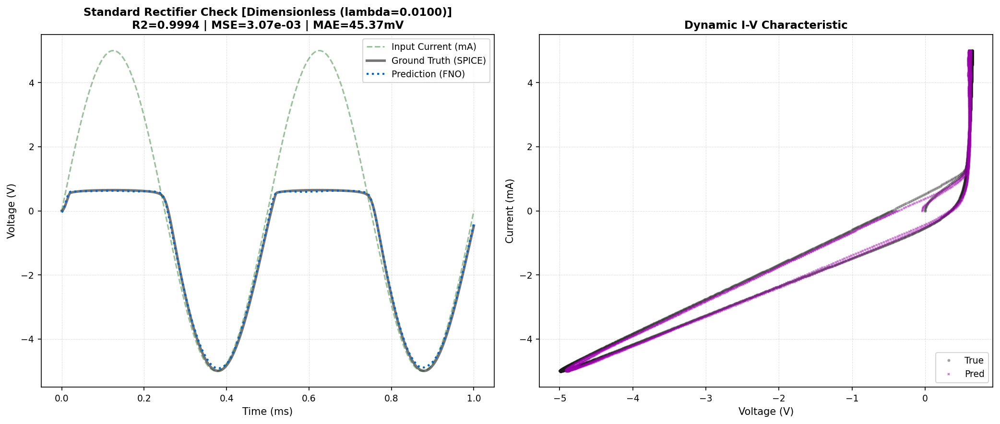
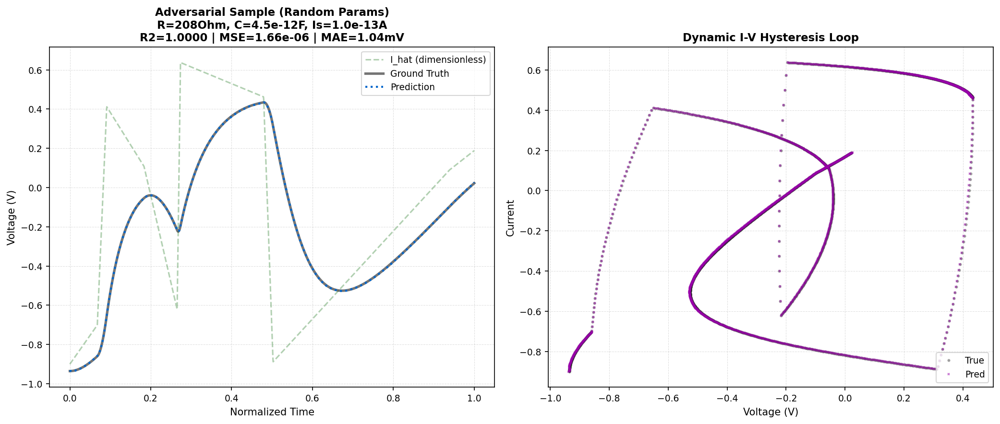
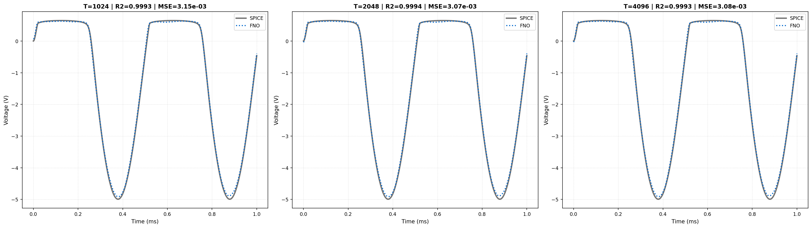
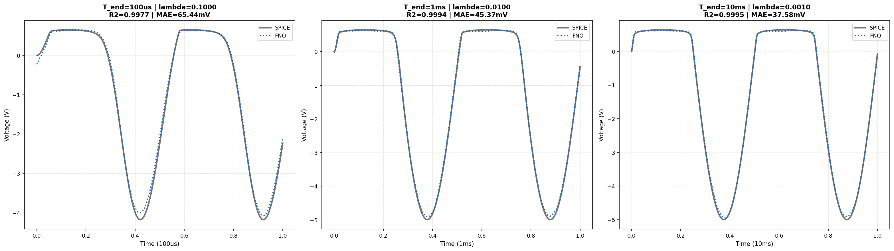

# Diode Operator

SPINO's diode component learns the nonlinear circuit voltage operator in dimensionless form:

$$\hat{V}(\hat{t}) = \mathcal{F}\!\left(\hat{I}(\hat{t}),\, \lambda,\, \log R,\, \log C,\, \log I_S,\, N\right)$$

where $\hat{t} = t / T_{end}$, $\hat{I} = I / I_{scale}$, $\hat{V} = V / (I_{scale} R)$, and
$\lambda = \tau / T_{end}$ is the circuit stiffness ratio ($\tau = RC$). Physical voltage is
recovered via $V = \hat{V} \cdot I_{scale} \cdot R$.

---

## Architecture

1D Fourier Neural Operator (Li et al., 2021) with direct channel injection:

| Hyperparameter | Value |
|---|---|
| Fourier modes | 256 |
| Hidden channels | 64 |
| Input channels | 6 (see below) |
| Output channels | 1 ($\hat{V}(\hat{t})$) |
| Activation | SiLU |
| Domain padding | 0.1 |
| Skip connection | Linear |

**Input tensor** $X \in \mathbb{R}^{B \times 6 \times T}$:

| Channel | Content | Encoding |
|---|---|---|
| 0 | Normalised current $\hat{I}(\hat{t})$ | $I / I_{scale}$, range $[-1, 1]$ |
| 1 | Stiffness ratio $\lambda = \tau / T_{end}$ | Raw (broadcast) |
| 2 | Shunt resistance $R$ | $\log_{10}(R)$ (broadcast) |
| 3 | External capacitance $C$ | $\log_{10}(C)$ (broadcast) |
| 4 | Saturation current $I_S$ | $\log_{10}(I_S)$ (broadcast) |
| 5 | Ideality factor $N$ | Raw (broadcast) |

$I_{scale} = 5\,\text{mA}$. Channels 1–5 are constant-valued and broadcast along the time dimension.

---

## Problem Formulation

The circuit ODE for the diode–RC network driven by an external current source is:

$$C \frac{dV}{dt} + \frac{V}{R} + I_S \left( e^{V / NV_T} - 1 \right) = I(t)$$

No closed-form solution exists for arbitrary $I(t)$. Traditional SPICE iterates Newton–Raphson
at each time step. The FNO replaces the inner-loop solver with a single forward pass.

**Dimensionless reformulation.** Substituting $\hat{t} = t / T_{end}$, $\hat{I} = I / I_{scale}$,
$\hat{V} = V / (I_{scale} R)$:

$$\lambda \frac{d\hat{V}}{d\hat{t}} + \hat{V} + \frac{I_S R}{I_{scale}} \left( e^{\hat{V} I_{scale} R / NV_T} - 1 \right) = \hat{I}(\hat{t})$$

The parameter $\lambda = RC / T_{end}$ is the sole time-scale descriptor. All other coefficients
depend only on the device parameters $(R, C, I_S, N)$, not on $T_{end}$ or the absolute time axis.
A single trained FNO therefore generalises across simulation windows without retraining.

---

## Training

- **Dataset:** 30 000 SPICE-simulated samples (`diode_30k_v2.h5`)
- **Data generator:** PySpice/NGSpice backend with per-sample $T_{end}$
- **Parameter ranges:**

| Parameter | Range | Distribution |
|---|---|---|
| $R$ | 50 Ω – 2 kΩ | Log-uniform |
| $C$ | 1 pF – 10 nF | Log-uniform |
| $I_S$ | $10^{-15}$ – $10^{-9}$ A | Log-uniform |
| $N$ | 1.0 – 2.0 | Uniform |
| $T_{end}$ | Clamped to $[10\,\text{ns},\, 10\,\text{ms}]$ | Via $\lambda$ ratio |
| $\lambda$ | $\approx [0.001,\, 100]$ | Derived ($\tau / T_{end}^{\text{clamped}}$) |

- **Epochs:** 250
- **Loss:** MSE + Sobolev with fade-in schedule
  - Dead zone: 0–50 epochs (data MSE only)
  - Warmup: 50–150 epochs (Sobolev weight linearly $0 \to 10^{-2}$)
  - Full: 150–200 epochs (Sobolev at full weight)
  - Polish: 200–250 epochs (Sobolev off, data MSE fine-tune)
- **Optimiser:** AdamW, $\eta = 10^{-3}$, weight decay $10^{-5}$
- **Scheduler:** CosineAnnealingWarmRestarts

---

## Results

| Test | R² | MSE | MAE |
|---|---|---|---|
| Standard rectifier ($\lambda = 0.01$) | **0.9994** | $3.07 \times 10^{-3}$ | 45 mV |
| Adversarial (random params from dataset) | **0.9999** | $1.03 \times 10^{-5}$ | 3 mV |

**Error context:**
The $\pm 5$ V signal swing gives a relative rectifier error of $\approx 0.45\%$, comparable to
NGSpice's default tolerance `RELTOL=1e-3` (0.1%). The diode's exponential I–V characteristic
makes the forward-bias knee the hardest region to fit; MAE of 45 mV there is expected.

### Simulation Speedup

| | NGSpice | FNO | Speedup |
|---|---|---|---|
| Standard rectifier (2048 steps) | ~264 ms | ~4 ms | **~66×** |

Measured wall-clock time for a single `.tran` simulation vs. a single FNO forward pass.
Batch GPU inference scales throughput further.

---

## Validation

### Resolution Invariance

The same circuit (R=1 kΩ, C=10 nF, $T_{end}=1$ ms) evaluated at three grid resolutions without
retraining:

| Grid points | R² | MSE |
|---|---|---|
| 1024 | 0.9993 | $3.15 \times 10^{-3}$ |
| 2048 (training resolution) | 0.9994 | $3.07 \times 10^{-3}$ |
| 4096 | 0.9993 | $3.08 \times 10^{-3}$ |

$\Delta R^2 < 0.0001$ across 4× the resolution range. The Fourier modes are decoupled from
grid density, as expected for an FNO trained on normalised input.

### Time-Scale Invariance

Same circuit parameters, three simulation windows spanning two decades of $\lambda$:

| $T_{end}$ | $\lambda = \tau / T_{end}$ | R² | MAE |
|---|---|---|---|
| 100 µs | 0.100 | 0.9977 | 65 mV |
| 1 ms | 0.010 | 0.9994 | 45 mV |
| 10 ms | 0.001 | 0.9995 | 38 mV |

All windows exceed R² = 0.997. The slight degradation at $\lambda = 0.1$ (the stiffest case —
fastest transient relative to the window) reflects the harder fitting regime, not a structural
limitation. The model was not retrained between windows.

---

## Figures

*Standard rectifier (R=1 kΩ, C=10 nF, $I_S$=2.5 nA, N=1.75, 2 kHz, $T_{end}$=1 ms,
$\lambda$=0.01): time-domain comparison (left) and dynamic I–V characteristic (right).*

*Adversarial test with a randomly sampled circuit from the dataset. The I–V hysteresis loop
(right panel) confirms the learned dynamic capacitive response at unseen parameter combinations.*

*Same circuit evaluated at 1024, 2048, and 4096 grid points. $\Delta R^2 < 0.0001$
across the range — the FNO's spectral convolutions are independent of grid density.*

*Same circuit parameters at simulation windows spanning two decades. $\lambda$ shifts from
0.001 (slow) to 0.1 (stiff), with R² $\geq$ 0.997 throughout.*

---

## Design Decisions

**Dimensionless formulation over fixed-grid training.** The previous 5-channel formulation
trained on a fixed 1 ms window and injected $I$ in mA. At inference, any circuit whose
time constant differed from the training distribution caused silent degradation. The
dimensionless reformulation encodes all time-scale information in $\lambda$, making the
operator a true coordinate-free map from normalised current to normalised voltage.

**T_end clamping.** Sampling $T_{end} = \tau \cdot r$ with ratio $r$ drawn log-uniformly
from $[0.01, 1000]$ can produce physically degenerate simulations when $\tau$ is very small
and $r$ is large (e.g. $T_{end} = 20$ s, sim step $= 5$ ms for a 4 ns time constant — the
FNO grid cannot resolve the transient). A hard clamp to $[10\,\text{ns},\, 10\,\text{ms}]$
guarantees the NGSpice sim step remains below $\tau / 10$ across all parameter combinations.
$\lambda$ is recomputed from the clamped $T_{end}$, not from the raw ratio.

**Sobolev loss over physics residual.** The dimensionless diode residual contains
$\exp(\hat{V} I_{scale} R / NV_T)$, which is catastrophically unstable as a loss term —
even modest overestimates of $\hat{V}$ send the gradient to infinity. The Sobolev term
(MSE on the derivative $d\hat{V}/d\hat{t}$) provides derivative-level physics signal
without this instability. At R² = 0.9994, MSE + Sobolev is sufficient.

**Direct channel injection vs. MLP encoder.** With only five scalar parameters, direct
channel injection is sufficient and avoids the complexity of a learned embedding. This
approach does not scale to higher-dimensional parameter spaces — the
[NFET operator](nfet.md) uses VCFiLM conditioning for 29 BSIM4 parameters instead.
