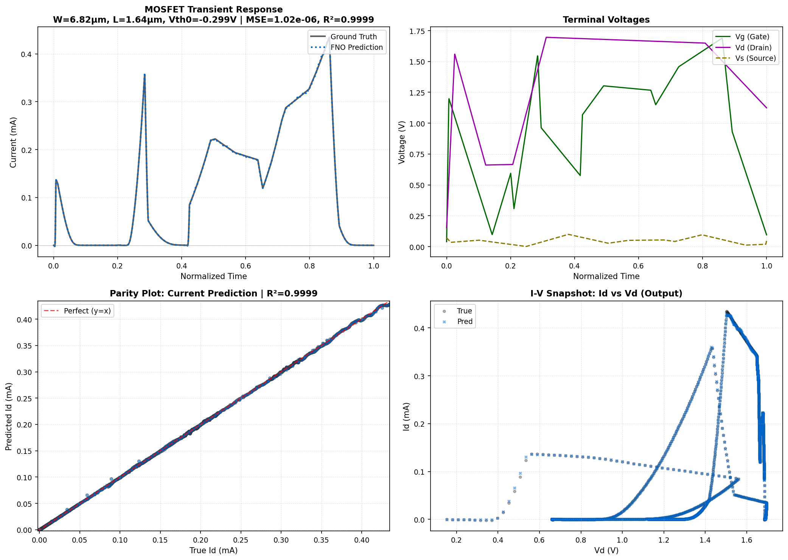
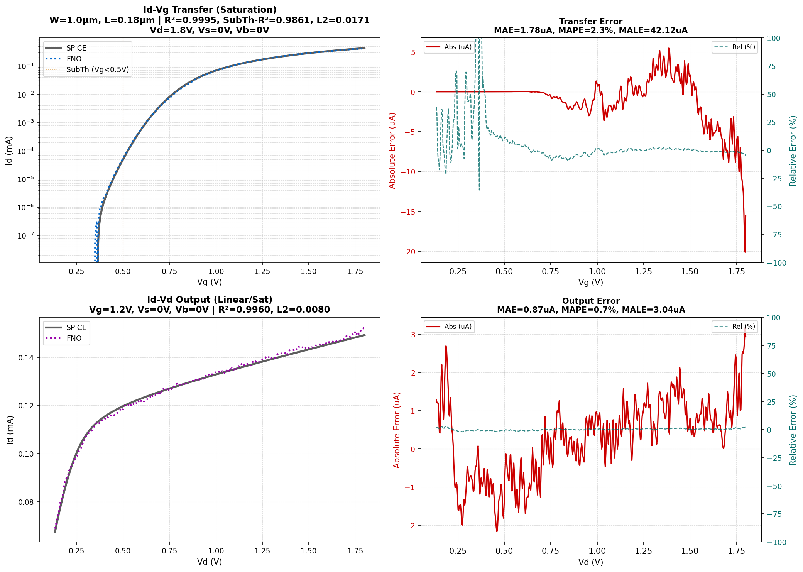
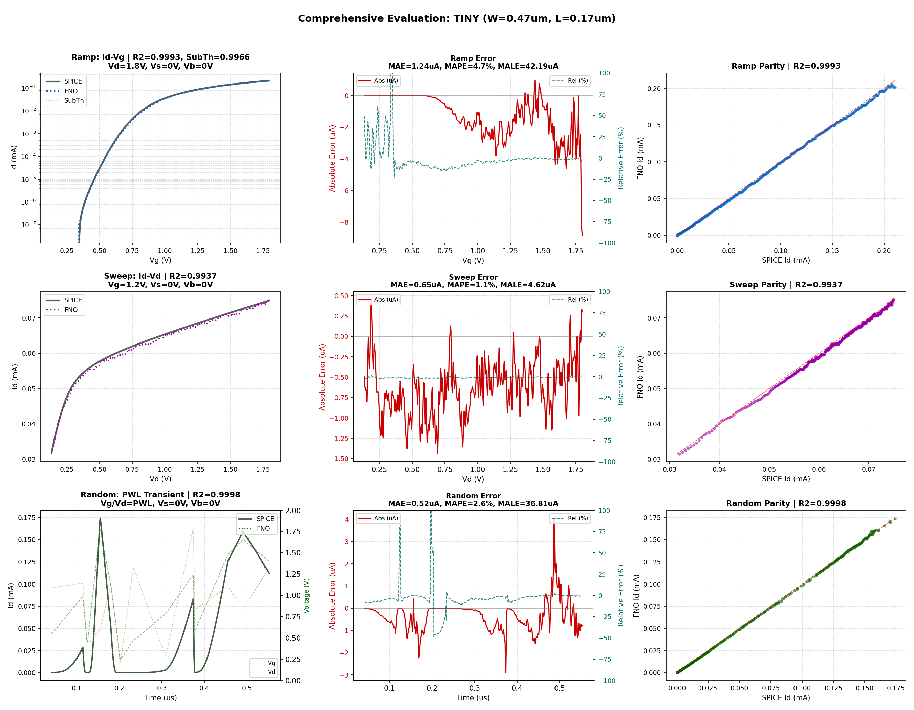
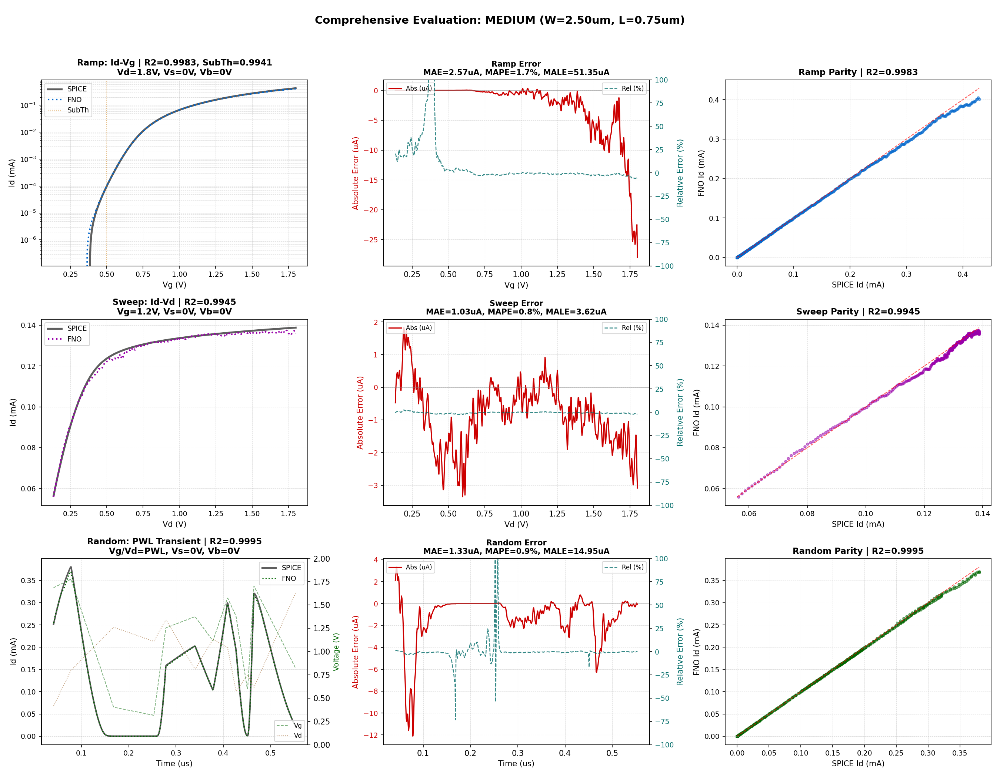
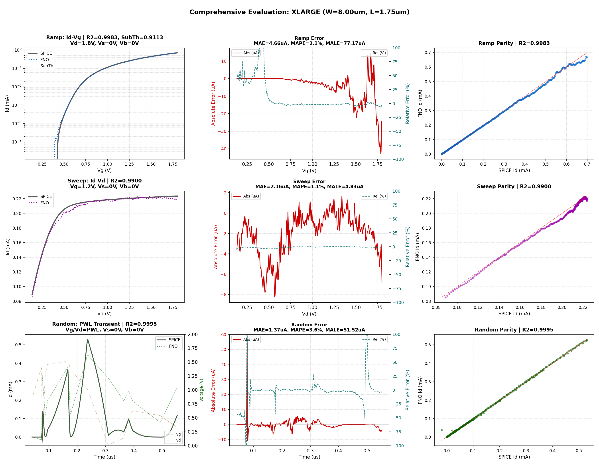

# NFET: sky130 NMOS Operator

SPINO's MOSFET component learns the 4-terminal drain-current operator
$I_D(t) = \mathcal{F}(V_G(t), V_D(t), V_S(t), V_B(t),\, \boldsymbol{\theta}_{BSIM})$
for the SkyWater 130 nm NMOS device `sky130_fd_pr__nfet_01v8`.

---

## Architecture: MosfetVCFiLMFNO

The production model uses a **VCFiLM-conditioned Fourier Neural Operator** (Variable-Conditioning
Feature-wise Linear Modulation FNO).

| Hyperparameter | Value |
|---|---|
| Architecture | `MosfetVCFiLMFNO` |
| Fourier modes | 256 |
| Hidden width | 64 |
| Physics embedding dim | 16 |
| Input param dim | 29 (curated BSIM subset) |
| Total parameters | 2,331,985 |
| Backbone (frozen in Phase 2) | 2,155,969 |
| Conditioning head (trained in Phase 2) | 176,016 |

The 29-dimensional physics vector is projected through a learned MLP embedding before being
injected into each Fourier block via FiLM scaling/shifting, decoupling geometry generalization
from waveform representation.

---

## Training: Two-Phase Strategy

**Phase 1 — Full training (300 epochs):**
61,041 samples from NGSPICE transient simulations of the Sky130 NMOS device across five
geometry bins (tiny through xlarge). Each sample is a 2048-step time series (2007 steps
post startup-trim; see Startup trim below) of random PWL voltage excitation and corresponding
drain current, paired with a 29-element BSIM4 parameter
vector covering geometry, threshold, mobility, and parasitic parameters.
All 2.3 M model parameters trained end-to-end.

**Phase 2 — Frozen-backbone fine-tune (20 epochs):**
The spectral operator backbone (lifting, FNO blocks, projection — 2.16 M parameters) is
frozen. Only the 176 K conditioning parameters (device embedding MLP + 8 VCFiLM layers)
are updated on the same 61 K dataset at reduced learning rate.

The two-phase approach preserves the operator's broad spectral knowledge while sharpening
its geometry-conditioned response. The fine-tuning phase improved xlarge subthreshold R²
from 0.8577 to 0.9113 — the first model to exceed 0.90 on large-geometry subthreshold
without degrading other metrics (see Results).

**Startup trim (`.op` artifact removal):**
NGSPICE `.tran` analysis begins by computing a DC operating point (`.op`), then transitioning
to time-domain integration. This handoff produces a brief current spike at $t \approx 0$ in
every sample — a numerical solver transient, not physical device behaviour. The first 41
timesteps (2% of each raw 2048-step waveform) are discarded from both input voltages and
target currents during data loading. The same trim is applied symmetrically to SPICE ground
truth and FNO predictions during evaluation, so no asymmetric advantage is conferred. All
metrics reported below are computed on the post-trim waveform. Removing this artifact halved
the production model's Mean Absolute Largest Error (MALE) from 120 µA to 62 µA by eliminating
a non-physical error source the FNO was previously forced to fit.

---

## Results

### Core Geometry (W = 1.0 µm, L = 0.18 µm)

SPICE-validated quasi-static sweeps. Each sweep uses 512 time steps (post-trim; see
Startup trim above).

| Metric | Value |
|---|---|
| Transfer R² | 0.9995 |
| Output R² | 0.9960 |
| Subthreshold R² | 0.9861 |
| MALE (transfer) | 42.12 µA |

**Subthreshold R² (SubTh-R²)** is the coefficient of determination computed exclusively over
the gate voltage range $V_G < 0.5\,\text{V}$, where drain current is exponentially sensitive
to threshold voltage and the signal magnitude drops to nanoamperes. This is the hardest regime
for the surrogate — predicting the correct order of magnitude at $10^{-9}\,\text{A}$ is more
difficult than matching milliamp-scale saturation.

> The core SubTh-R² of 0.9861 is a −0.0023 shift from the Phase 1 model. This is within
> evaluation noise and reflects an expected tradeoff: the Phase 2 fine-tune improved xlarge
> SubTh-R² by +0.054 at the cost of marginal regression elsewhere.

### Comprehensive Evaluation (3 Geometries × 3 Waveform Types)

| Geometry | W (µm) | L (µm) | Ramp R² | SubTh R² | Sweep R² | Random R² | MAE | MALE |
|---|---|---|---|---|---|---|---|---|
| tiny | 0.47 | 0.17 | 0.9993 | 0.9966 | 0.9937 | 0.9999 | 1.24 µA | 42.19 µA |
| medium | 2.50 | 0.75 | 0.9983 | 0.9941 | 0.9945 | 0.9998 | 2.57 µA | 51.35 µA |
| xlarge | 8.00 | 1.75 | 0.9983 | 0.9113 | 0.9900 | 0.9997 | 4.66 µA | 77.17 µA |

**Waveform types:**
- **Ramp** — quasi-static $I_D$–$V_G$ transfer sweep, $V_D = 1.8$ V (includes log-scale subthreshold)
- **Sweep** — quasi-static $I_D$–$V_D$ output sweep, $V_G = 1.2$ V
- **Random** — PWL stochastic transient, randomized $V_G(t)$ and $V_D(t)$

### Simulation Speedup

| Mode | Speedup |
|---|---|
| Warm inference (JIT compiled) | ~1300× |
| Cold inference (first call, includes JIT cost) | ~21× |

Reference: single NGSPICE `.tran` simulation vs. single FNO forward pass on the same geometry.

---

## Figures

*Randomly sampled dataset waveform: time-domain transient (top-left), terminal voltages
(top-right), parity plot (bottom-left), I–V snapshot (bottom-right).*

*SPICE-validated W=1.0 µm, L=0.18 µm. Transfer curve (log scale) and output curve with
dual-axis absolute/relative error panels.*

*Tiny geometry (W=0.47 µm, L=0.17 µm): 3×3 grid — ramp, sweep, and random waveforms with
parity and error panels.*

*Medium geometry (W=2.50 µm, L=0.75 µm).*

*XLarge geometry (W=8.00 µm, L=1.75 µm). Note the degraded subthreshold R²=0.9113 at large W/L.*

---

## Known Limitations

- **Fixed temporal resolution:** The operator is trained on 512-step waveforms over a ~1 µs
  window. The FNO's spectral convolutions are coupled to this grid — changing the step count
  or simulation window at inference alters the physical frequency mapping of the Fourier modes.
  Unlike the [RC operator](rc.md), which factors out physical time via dimensionless
  conditioning, the MOSFET operator cannot be used at arbitrary `.tran` resolutions. This is
  the most significant constraint for practical EDA integration. See the
  [project-level discussion](../README.md#known-limitations) for mitigation strategies.
- **XLarge subthreshold:** R²=0.9113 at W=8.0 µm, L=1.75 µm. Attempts to improve this via
  supplemental subthreshold data (5 K additional deep- and transitional-subthreshold samples)
  caused distribution shift that degraded core metrics across all tested loss functions.
  The 61 K dataset remains the production training set. Further improvement likely requires
  architectural changes to the conditioning pathway or geometry-aware curriculum strategies.
- **Short-channel edge cases:** Geometries at or below minimum L can exhibit DIBL-like behaviour
  not fully captured at the current dataset density.
- **Cold-start latency:** The 21× cold speedup includes a one-time TorchScript JIT compilation.
  Sustained throughput (warm) is ~1300×.
- **Single device type:** This model is specific to `sky130_fd_pr__nfet_01v8`. PMOS and other
  flavours require retraining on their respective BSIM model cards.
