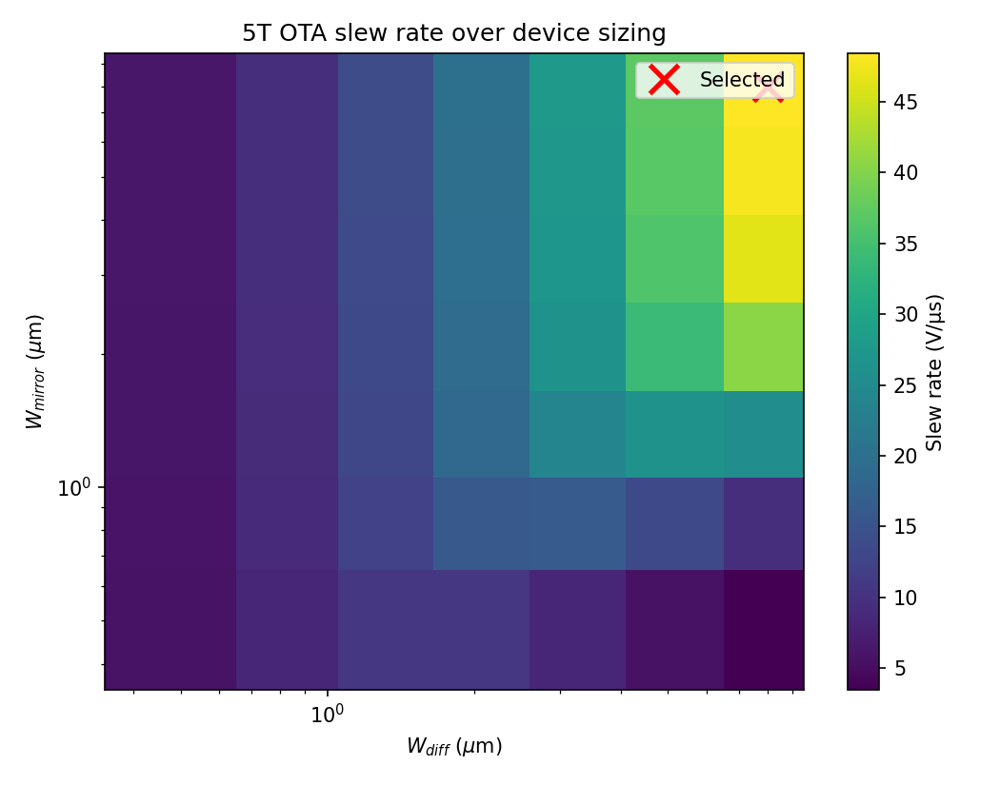
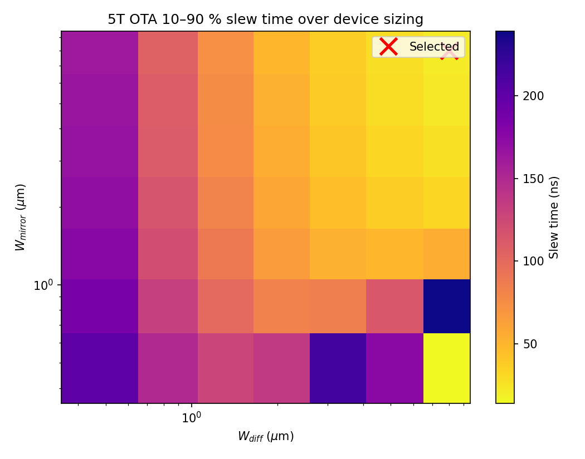
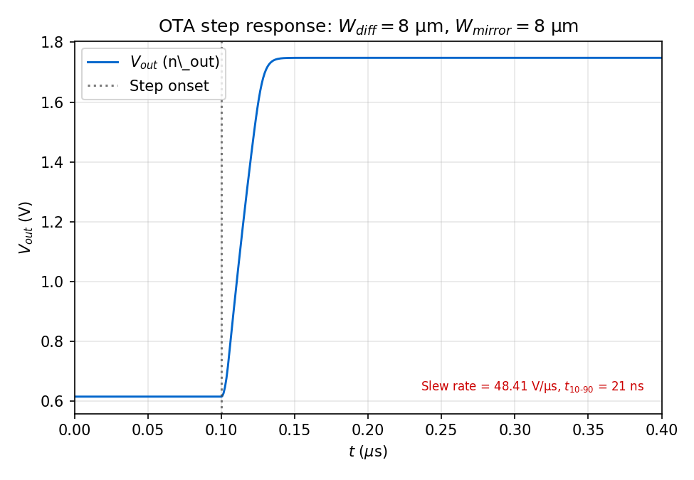
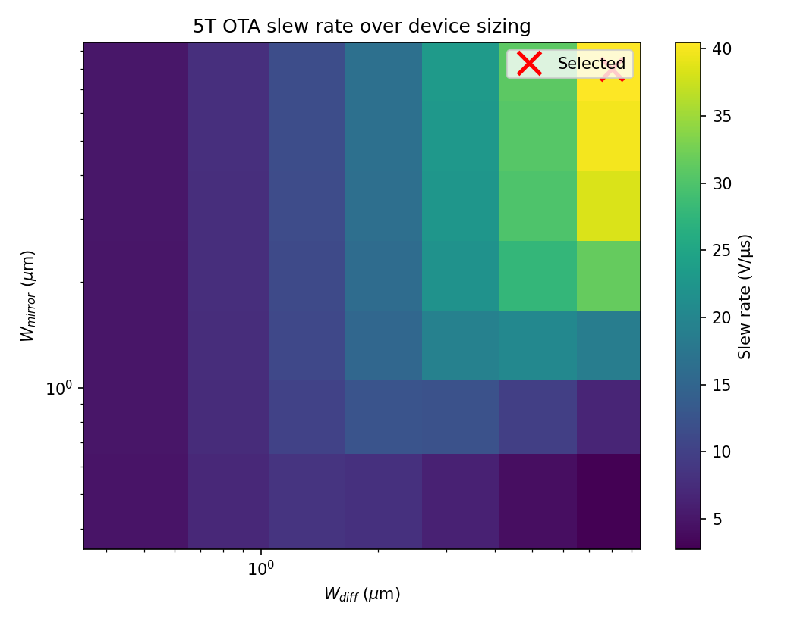
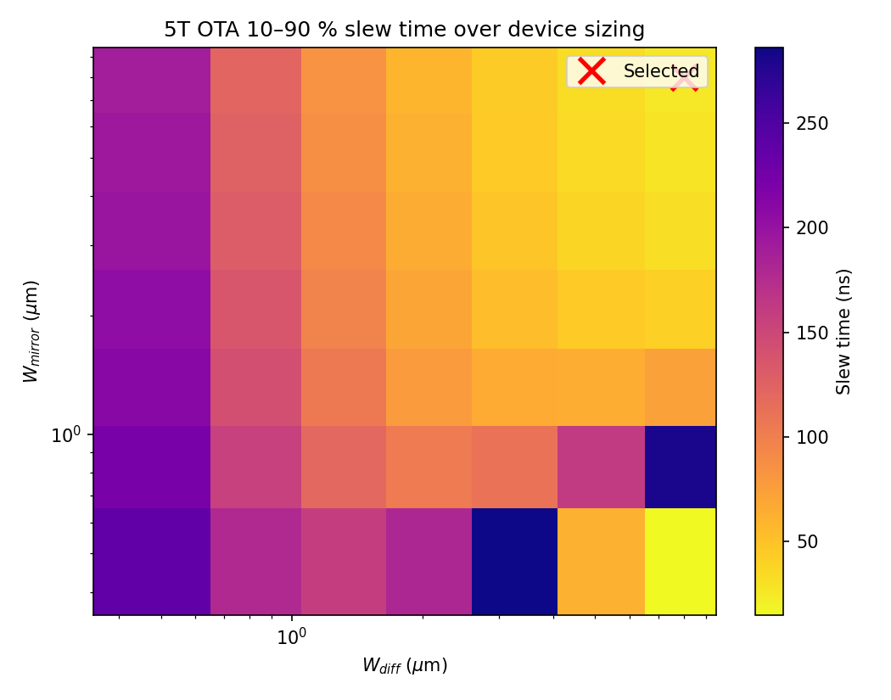
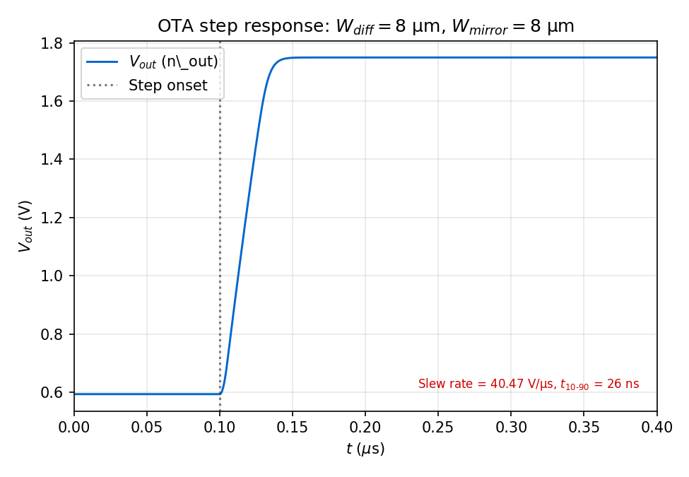

# 5T OTA: NGSpice ground truth

This note documents a **reproducible** sky130 five-transistor operational
transconductance amplifier (5T OTA) built from `nfet_01v8` and `pfet_01v8`
primitives. The selected design point is the outcome of a **pre-registered** 2D
sweep and selection rule, not a post-hoc best pick from plots.

This reference is the SPICE-only ground truth against which a planned
FNO-composed counterpart will later be validated. Its purpose is to fix a
defended sizing point, a reproducible measurement protocol, and a deterministic
set of traces; it makes no neural-network claims itself.

## Replication

```text
python -m spino.circuit.characterize_ota --nfet-l 0.40 --pfet-l 0.40 --tail-l 0.40 \
    --output-dir docs/assets/ota_5t_l040

python -m spino.circuit.characterize_ota --nfet-l 0.50 --pfet-l 0.50 --tail-l 0.50 \
    --output-dir docs/assets/ota_5t_l050
```

Each command writes `summary.json` (full sweep plus selected design) and the
figures embedded in the Results section below. PDK: SKY130 via the Volare path
resolved in `spino.circuit.topologies` (tt corner).

## Topology

Single-stage 5-transistor OTA with NFET differential pair and PFET
current-mirror load.

```
                     VDD (1.8 V)
              ┌────┐    ┌────┐
              │ M3 │    │ M4 │   (PFET current mirror; M3 diode-connected)
              └─┬──┘    └─┬──┘
       n_left ──┤        ├── n_out  ← single-ended output
              ┌─┴──┐    ┌─┴──┐
   Vin+ ──── G│ M1 │    │ M2 │G ──── Vin-
              └─┬──┘    └─┬──┘
                └────┬────┘
                     ├── n_tail
                   ┌─┴──┐
            Vbias─G│ M5 │       (NFET tail current source)
                   └─┴──┘
                    GND
```

Node naming:

| Node | Description |
|---|---|
| `n_tail` | Shared source of M1 and M2; drain of M5 |
| `n_left` | Drain of M1; gate and drain of M3 (diode) |
| `n_out` | Drain of M2; drain of M4; single-ended output |

Terminal connections:

| Device | Type | Gate | Drain | Source | Bulk |
|---|---|---|---|---|---|
| M1 | NFET diff pair | Vin+ | n_left | n_tail | GND |
| M2 | NFET diff pair | Vin- | n_out | n_tail | GND |
| M3 | PFET mirror (diode) | n_left | n_left | VDD | VDD |
| M4 | PFET mirror (output) | n_left | n_out | VDD | VDD |
| M5 | NFET tail source | Vbias | n_tail | GND | GND |

M1 and M2 are nominally matched (same W/L). M3 and M4 are nominally matched.

## Methodology (fixed before running the sweep)

| Parameter | Value | Rationale |
|---|---|---|
| L (diff pair, M1/M2) | 0.40 µm and 0.50 µm | Avoids the known-poor L=0.18 µm short-channel corner. Two L values give cross-geometry sanity. |
| L (mirror, M3/M4) | Same as diff pair | Current-mirror matching requires equal L. |
| L (tail, M5) | Same as diff pair | Consistent with PDK characterisation depth of the FNO operator. |
| VDD | 1.8 V | Nominal sky130 I/O supply. |
| W_diff grid (M1/M2) | 0.5, 0.8, 1.3, 2.0, 3.2, 5.0, 8.0 µm | 7 log-spaced points. |
| W_mirror grid (M3/M4) | 0.5, 0.8, 1.3, 2.0, 3.2, 5.0, 8.0 µm | 7 log-spaced points. |
| M5 sizing | CLI flags `--tail-w`, `--vbias` | W_tail and Vbias are CLI inputs, not pre-registered. Chosen per run to target I_tail ≈ 50 µA; exact values reported in `summary.json`. |
| Vcm (input common mode) | VDD/2 = 0.9 V | Maximises differential input headroom. |
| Step amplitude | ±250 mV differential (Vin+ = Vcm + 250 mV, Vin- = Vcm − 250 mV after step) | Large-signal regime; same stimulus for both Phase 3a ranking and Phase 3b FNO validation. |
| Step rise time | 5 ns | Finite slew avoids numerical Gibbs artefacts. |
| Step start | t = 100 ns | Allows initial quiescent settle before stimulus. |
| Simulation window | 5 µs | Captures settling to better than 5% for all expected designs. |
| Time step | 10 ns | Standard SPICE default; refine per-deck as needed. |
| Metrics extracted | Slew rate (V/µs), slew time (10–90% of output swing, ns) | Tran-only for composition comparison; see note on gain below. |
| DC gain (reported only) | Small-signal Vin_diff DC sweep (±20 mV, Vcm fixed) in SPICE | Reported as a design descriptor to confirm the circuit is reasonable; not a Phase 3b gate (FNO is a transient operator). |

### Selection rule

Feasibility criterion (both must hold):

- Slew rate ≥ 5 V/µs
- Slew time (10–90% of output swing) ≤ 500 ns

Ranking (among feasible designs): descending slew rate; tiebreak ascending
settling time. The selected design is the first row of the ranked feasible set.

This rule is implemented in `OtaSelectionRule` in `spino/circuit/tuning.py`.

## Pre-registered acceptance criteria

The following gates apply jointly to both L values. Failure at both L values is
reported as the result — not silently retuned.

| Metric | Gate | Note |
|---|---|---|
| Slew rate (selected design, both L) | ≥ 5 V/µs | Selection gate |
| Slew time (10–90%, selected design, both L) | ≤ 500 ns | Selection gate |
| DC open-loop gain (both L) | reported only | SPICE `.dc` sweep; not a Phase 3b gate |
| Phase 3b Pearson r (n_out vs SPICE, both L) | ≥ 0.99 | FNO accuracy gate |
| Phase 3b max \|ΔV\| at n_out (both L) | ≤ 30 mV | FNO accuracy gate |
| Phase 3b slew-rate relative error (both L) | ≤ 10% | FNO accuracy gate |
| Phase 3b slew-time relative error (both L) | ≤ 10% | FNO accuracy gate |
| Phase 3b NR transient iterations (both L) | ≤ 25 | Solver health |

## Results

*This section will be filled after the characterisation sweep runs.*

### L = 0.40 µm — selected design

| Quantity | Value |
|---|---|
| W_diff (M1/M2) | — |
| W_mirror (M3/M4) | — |
| Slew rate | — |
| Settling time (5% band) | — |
| Quiescent I_tail | — |
| Quiescent n_out | — |

### L = 0.50 µm — selected design

| Quantity | Value |
|---|---|
| W_diff (M1/M2) | — |
| W_mirror (M3/M4) | — |
| Slew rate | — |
| Settling time (5% band) | — |
| Quiescent I_tail | — |
| Quiescent n_out | — |

### Sweep health

*To be filled: number of corners simulated, converged, and failed; reason for
failures if any.*

## Figures

*Figures will be embedded here after the sweep runs.*

### Slew rate over (W_diff, W_mirror) — L = 0.40 µm



### Settling time over (W_diff, W_mirror) — L = 0.40 µm



### Step response — selected design, L = 0.40 µm



### Slew rate over (W_diff, W_mirror) — L = 0.50 µm



### Settling time over (W_diff, W_mirror) — L = 0.50 µm



### Step response — selected design, L = 0.50 µm


