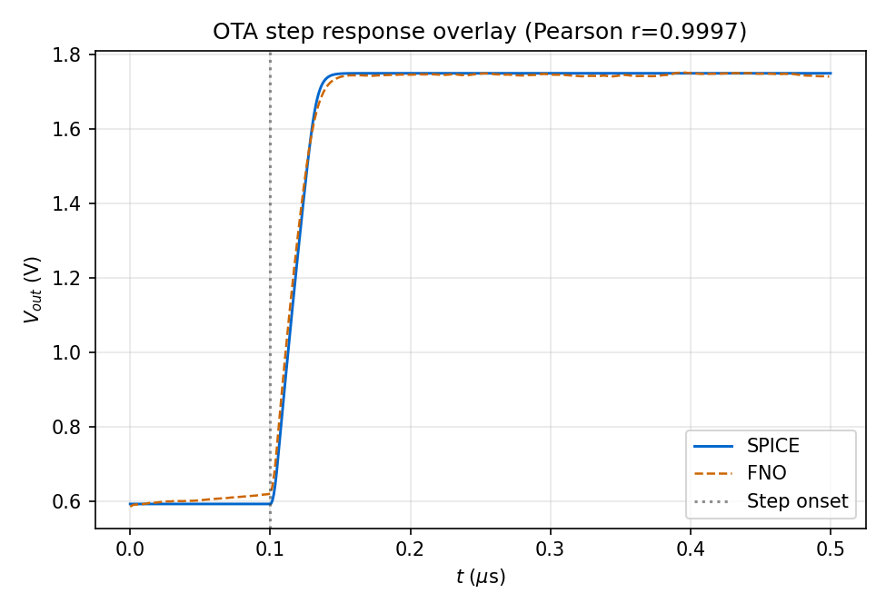
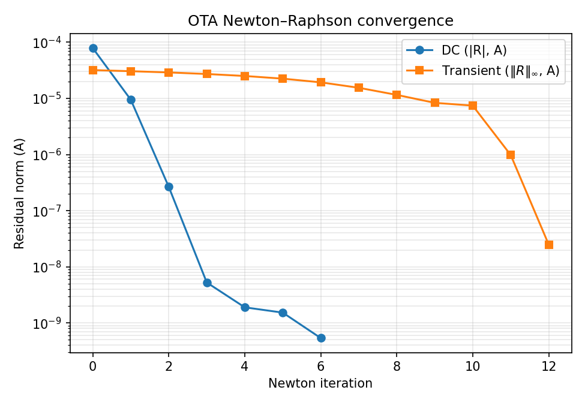
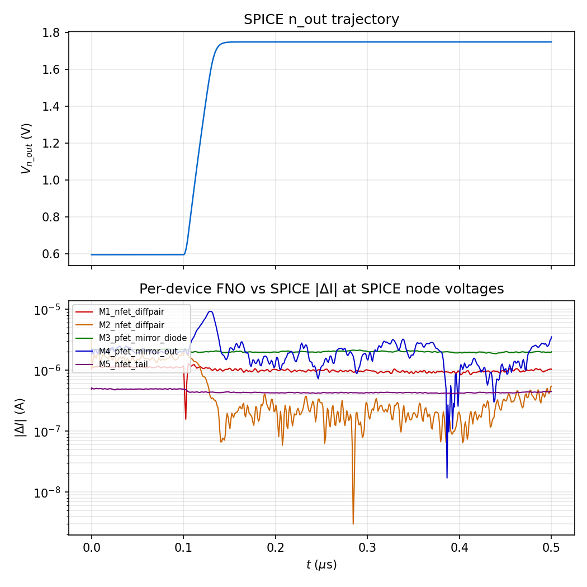

# Neural composition: 5T OTA method

This note documents the **composition method** for the five-transistor OTA: how
the trained NFET/PFET operators are assembled into a three-node circuit
residual, how Newton updates are computed, and how stability is enforced.

Quantitative outcomes, figure comparisons, and runtime tables will be reported
in [OTA results](results.md) once the validation runs complete. SPICE-only
characterisation inputs are defined in [5T OTA: NGSpice ground truth](ota_5t.md).

## Replication

```text
python -m spino.circuit.compose_ota \
    --diff-w 8.0 --mirror-w 8.0 --tail-w 2.0 \
    --nfet-l 0.40 --pfet-l 0.40 --tail-l 0.40 \
    --step-amp 0.05 --c-load 1e-12 --t-step 1e-9 --t-end 500e-9 \
    --output-dir docs/assets/ota_5t_fno_l040

python -m spino.circuit.compose_ota \
    --diff-w 8.0 --mirror-w 8.0 --tail-w 2.0 \
    --nfet-l 0.50 --pfet-l 0.50 --tail-l 0.50 \
    --step-amp 0.05 --c-load 1e-12 --t-step 1e-9 --t-end 500e-9 \
    --output-dir docs/assets/ota_5t_fno_l050

python -m spino.circuit.ota_attribution \
    --run-dir docs/assets/ota_5t_fno_l040 \
    --nfet-l 0.40 --pfet-l 0.40 --tail-l 0.40

python -m spino.circuit.ota_attribution \
    --run-dir docs/assets/ota_5t_fno_l050 \
    --nfet-l 0.50 --pfet-l 0.50 --tail-l 0.50
```

Primary implementation files:

- `spino/circuit/ota_composition.py` — solver, probe builders, gate displacement
- `spino/circuit/compose_ota.py` — CLI driver
- `spino/circuit/composition_io.py` — device loader (`load_ota_5t_devices`)
- `spino/circuit/topologies.py` — netlist factory (`build_ota_5t`)
- `spino/circuit/devices.py` — `FnoMosfetDevice` (unchanged from CS amp)

## Topology and unknowns

The 5T OTA has **three internal KCL unknowns**:

| Node | Forced terminals | Unknown |
|---|---|---|
| `n_tail` | M5 gate (Vbias), M5 source/bulk (GND) | V_tail(t) |
| `n_left` | M3 source/bulk (VDD), M1 gate (Vin+) | V_left(t) |
| `n_out` | M4 source/bulk (VDD), M2 gate (Vin-) | V_out(t) |

External (forced) voltages: VDD = 1.8 V, GND, Vbias (constant DC), Vin+(t),
Vin-(t).

The state vector is:

$$\mathbf{V}(t) = \bigl[V_{\text{tail}}(t),\ V_{\text{left}}(t),\ V_{\text{out}}(t)\bigr]^{\top} \in \mathbb{R}^{3 \times T}.$$

## KCL residuals

Convention: `drain_current()` returns a positive value when the device is
conducting, for both NFET and PMOS (polarity handled in training labels). For
NFET, positive drain current flows from drain to source (device sinks current
from the drain node). For PFET, positive drain current means current flows from
source (VDD) through the channel into the drain node (device sources current
into the drain node).

**At n_tail** — M5 sinks current; M1 and M2 deliver current from their sources:

$$R_{\text{tail}}[n] = I_{M1}[n] + I_{M2}[n] - I_{M5}[n] - \frac{C_{\text{tail}}}{\Delta t}(V_{\text{tail}}[n] - V_{\text{tail}}[n-1])$$

where $C_{\text{tail}}$ is the parasitic capacitance at the tail node (set to
zero in the initial implementation; can be refined).

**At n_left** — M3 sources current (PFET); M1 sinks current into its drain:

$$R_{\text{left}}[n] = I_{M3}[n] - I_{M1}[n] - \frac{C_{\text{left}}}{\Delta t}(V_{\text{left}}[n] - V_{\text{left}}[n-1])$$

**At n_out** — M4 sources current (PFET); M2 sinks current into its drain:

$$R_{\text{out}}[n] = I_{M4}[n] - I_{M2}[n] - \frac{C_{\text{load}}}{\Delta t}(V_{\text{out}}[n] - V_{\text{out}}[n-1])$$

The load capacitor $C_{\text{load}}$ is analytical (same convention as the CS
amp). Internal parasitic capacitances $C_{\text{tail}}$ and $C_{\text{left}}$
are zero in the initial implementation.

Row 0 at each node pins the initial condition to the DC operating point.

## Probe builders

Each device requires a trajectory tensor of shape `(1, 4, T)` with channel
order `(Vg, Vd, Vs, Vb)`. The OTA introduces **non-rail source connections**:
M1 and M2 have `Vs = V_tail(t)`, which is an unknown trajectory, not a fixed
rail.

Three probe builders are defined in `ota_composition.py`:

**Diff-pair probe** (M1 or M2):
```
Vg = Vin±(t)     [forced external]
Vd = V_left or V_out(t)  [unknown node]
Vs = V_tail(t)   [unknown node — the new wrinkle vs CS amp]
Vb = GND = 0
```

**Mirror probe** (M3 diode or M4 output):
```
Vg = V_left(t)   [unknown; M3: Vg=Vd=V_left; M4: Vg=V_left, Vd=V_out]
Vd = V_left or V_out(t)  [unknown node]
Vs = VDD         [fixed rail]
Vb = VDD         [fixed rail]
```

**Tail probe** (M5):
```
Vg = Vbias       [constant]
Vd = V_tail(t)   [unknown node]
Vs = GND = 0
Vb = GND = 0
```

## Generalized gate displacement (backward Euler)

The CS amp and inverter chain gate-charge displacement assumed `Vs` and `Vb`
are constant rails, giving `dVgs = dVg`, `dVgd = dVg − dVd`. For M1 and M2,
`Vs = V_tail` varies in time. The generalized backward-Euler displacement is:

$$\Delta V_{gs}[n] = \bigl(V_g[n] - V_s[n]\bigr) - \bigl(V_g[n-1] - V_s[n-1]\bigr)$$
$$\Delta V_{gd}[n] = \bigl(V_g[n] - V_d[n]\bigr) - \bigl(V_g[n-1] - V_d[n-1]\bigr)$$
$$\Delta V_{gb}[n] = \bigl(V_g[n] - V_b[n]\bigr) - \bigl(V_g[n-1] - V_b[n-1]\bigr)$$

This reduces to the CS amp form when `Vs` and `Vb` are fixed, and correctly
accounts for the tail-node variation in M1 and M2.

## DC operating point solver (`OtaDcSolver`)

Scalar Newton-Raphson on the three-vector
$\mathbf{V}_0 = [V_{\text{tail},0}, V_{\text{left},0}, V_{\text{out},0}]$
at fixed constant-voltage trajectories (DC probes, post-trim mean).

Algorithm mirrors `ChainDcSolver` (`chain_composition.py`):

1. Build constant-V probe windows for all five devices.
2. Evaluate each operator; reduce to post-trim time mean.
3. Assemble the 3×1 residual vector `[R_tail, R_left, R_out]`.
4. Compute the 3×3 Jacobian via `torch.autograd.functional.jacobian`.
5. Solve `J Δv = −R`; apply damped update `v ← v + α Δv`.
6. Line search and step cap follow the CS amp policy.

## Transient solver (`OtaTransientSolver`)

Whole-window implicit Newton-Raphson on the flattened
$(3 \times T)$-dimensional state $\mathbf{V}$.

Algorithm mirrors `ChainTransientSolver` (`chain_composition.py`):

1. Initialise each node trajectory from the DC solution.
2. Assemble the $(3T \times 1)$ residual vector by concatenating all three
   per-node residual sequences.
3. Compute the $(3T \times 3T)$ Jacobian via `torch.autograd.functional.jacobian`.
4. Solve `J ΔV = −R`; apply damped update.
5. Repeat until convergence or iteration budget.

The Jacobian is dense because the FNO operators mix across the time dimension
via Fourier convolution. Each Newton step evaluates all five device operators
once.

## Jacobian structure

The non-zero blocks of the $(3T \times 3T)$ Jacobian couple node trajectories
through shared device evaluations:

- `d R_tail / d V_tail`: M5 (Vd sensitivity) + M1,M2 (Vs sensitivity)
- `d R_tail / d V_left`: M1 (Vd sensitivity, via saturation Early effect — small)
- `d R_tail / d V_out`: M2 (Vd sensitivity — small)
- `d R_left / d V_tail`: M1 (Vs sensitivity)
- `d R_left / d V_left`: M3 (Vg=Vd sensitivity — large, diode conductance) + M1 (Vd sensitivity)
- `d R_left / d V_out`: zero (M3 and M1 do not depend on V_out)
- `d R_out / d V_tail`: M2 (Vs sensitivity)
- `d R_out / d V_left`: M4 (Vg sensitivity)
- `d R_out / d V_out`: M4 (Vd sensitivity) + M2 (Vd sensitivity)

No hand-derived compact-model conductances are used. All entries come from
autograd through the trained operator stack.

## Damping and safety constraints

Same policy as the CS amp and inverter chain:

1. **Armijo backtracking** on residual norm (`c1 = 1e-4`, `alpha_min = 1e-3`).
2. **Step cap** at 0.2 V max component change per Newton iteration.
3. **Rail clip** to `[0, VDD]` after each accepted step.

## Pre-registered validation gates

Composition validation runs against the SPICE reference from
[5T OTA: NGSpice ground truth](ota_5t.md). Both L values must pass.

| Metric | Gate | Note |
|---|---|---|
| Pearson r (n_out vs SPICE, both L) | ≥ 0.99 | Primary fidelity gate |
| Max \|ΔV\| at n_out (both L) | ≤ 30 mV | Matches CS amp showcase gate |
| Slew-rate relative error (both L) | ≤ 10% | Large-signal metric |
| Slew-time relative error (both L) | ≤ 10% | Large-signal metric |
| NR transient iteration count (both L) | ≤ 25 | Solver health |
| DC open-loop gain | not gated | FNO is a transient operator; SPICE value reported in `ota_5t.md` as a design descriptor only |

If Phase 3b fails any gate at both L values, the result is reported as-is.
Solver knobs are not retuned retroactively to chase a passing grade.

## Results

Composition validation runs completed at the pre-registered stimulus parameters
(step amplitude ±50 mV differential, C_load = 1 pF, t_step = 1 ns, t_end =
500 ns). Gate outcomes follow the pre-registered table; no criterion was
adjusted after the runs.

DC operating points (from `OtaDcSolver`):

| Node | L = 0.40 µm | L = 0.50 µm |
|---|---|---|
| V_tail | 0.136 V | 0.140 V |
| V_left | 0.608 V | 0.587 V |
| V_out  | 0.608 V | 0.587 V |

Symmetry at DC (V_left ≈ V_out) is correct: with Vinp = Vinn = Vcm, the
differential pair is balanced and both arms should converge to the same bias
voltage.

### L = 0.40 µm

| Metric | SPICE | FNO | Gate | Result |
|---|---|---|---|---|
| Slew rate (V/µs) | 48.41 | 47.92 | (reference) | — |
| Slew time 10–90% (ns) | 21.5 | 25.0 | (reference) | — |
| Pearson r | — | 0.9997 | ≥ 0.99 | **PASS** |
| Max \|ΔV\| (mV) | — | 68.8 | ≤ 30 | **FAIL** |
| Slew-rate relative error | — | 1.0% | ≤ 10% | **PASS** |
| Slew-time relative error | — | 16.3% | ≤ 10% | **FAIL** |
| NR transient iterations | — | 11 | ≤ 25 | **PASS** |

### L = 0.50 µm

| Metric | SPICE | FNO | Gate | Result |
|---|---|---|---|---|
| Slew rate (V/µs) | 40.47 | 42.48 | (reference) | — |
| Slew time 10–90% (ns) | 25.8 | 28.0 | (reference) | — |
| Pearson r | — | 0.9997 | ≥ 0.99 | **PASS** |
| Max \|ΔV\| (mV) | — | 68.8 | ≤ 30 | **FAIL** |
| Slew-rate relative error | — | 5.0% | ≤ 10% | **PASS** |
| Slew-time relative error | — | 8.5% | ≤ 10% | **PASS** |
| NR transient iterations | — | 12 | ≤ 25 | **PASS** |

### Gate summary and interpretation

**Passes:** Pearson r (0.9997, both L), slew-rate error (1% and 5%), NR
iteration count (11 and 12 of 25 budget), slew-time error at L = 0.50 µm (8.5%).

**Failures:** max |ΔV| at both L values (~68.8 mV vs 30 mV gate); slew-time
error at L = 0.40 µm (16.3%).

The gradient-mechanism and shape-fidelity claims (Pearson r 0.9997, slew
within 1 % at L = 0.40 and 5 % at L = 0.50, NR converging well inside the
25-iter budget) are independent of the plateau-level offset. Probe 1
below localises the offset to a single device (M4 PFET) in a single
operating regime (Vsd → 0, output near VDD); the slewing trajectory is
reproduced faithfully and the offset enters only at the post-slew
plateau. The triode-boundary fine-tune in `results.md` reduces the M4
contribution by 22 % at the production sizing without closing the gate;
the production checkpoint is unchanged.

### Attribution (Probe 1 — IV branch errors at SPICE node voltages)

Probe 1 evaluates each FNO device at the SPICE node-voltage trajectories and
compares the predicted drain current to the SPICE branch current. This localises
which device contributes the observed output voltage error.

| Device | L = 0.40 µm max|ΔI| | L = 0.50 µm max|ΔI| | Fraction of peak current |
|---|---|---|---|
| M1 — NFET diff pair (left) | 2.8 µA | 1.3 µA | ~4% |
| M2 — NFET diff pair (right) | 4.8 µA | 3.1 µA | ~9% |
| M3 — PFET mirror (diode) | 5.6 µA | 2.2 µA | ~8% |
| **M4 — PFET mirror (output)** | **15.4 µA** | **9.2 µA** | **~24%** |
| M5 — NFET tail source | 2.1 µA | 0.5 µA | ~1% |

M4 is the dominant error source — 3–10× larger current error than any other
device at both L values.

M4 is the single-ended output device (VDD → n_out). As n_out slews toward VDD
during the large-signal step, M4 moves from saturation into the linear/triode
regime (V_ds = VDD − V_n_out → 0). PFET training data is concentrated at
V_ds values consistent with saturation (mid-supply range); the linear-regime
boundary near VDD is underrepresented, causing a ~15 µA current
overestimate at the saturation exit. This current error displaces n_out by
~70 mV from the SPICE trajectory at the plateau.

The waveform shape is reproduced faithfully (Pearson r = 0.9997) because the
error is spatially concentrated near the VDD rail and does not affect the
slewing trajectory itself. Only the final plateau level is shifted.

These failures are reported as the pre-registered result. Both failures
(max|ΔV| and slew-time at L = 0.40) trace to the same M4 linear-regime gap.
Targeted PFET retraining with denser V_ds-near-zero samples would address this
without changing the solver or selection criteria.

### Runtime

All FNO runs on a single CUDA GPU (same host as NGSpice).

| L | SPICE wall time | FNO wall time | Ratio |
|---|---|---|---|
| 0.40 µm | 6.3 s | 63 s | × 0.10 (FNO is ~10× slower) |
| 0.50 µm | 6.5 s | 68 s | × 0.10 (FNO is ~10× slower) |

The FNO solver is slower than NGSpice for this circuit because: (a) the
whole-window dense Jacobian is (3T × 3T) = (1500 × 1500) per Newton step;
(b) NGSpice uses an adaptive timestep that converges in far fewer internal
evaluations than the uniform T = 500 grid. The primary speedup lever is a
Krylov-based inexact Newton update (avoiding the dense Jacobian solve) plus
reducing T via adaptive timestepping, both deferred to future work.

## Figures

### n_out trajectory vs SPICE — L = 0.40 µm


### n_out trajectory vs SPICE — L = 0.50 µm



### NR convergence — L = 0.40 µm


### NR convergence — L = 0.50 µm



### Attribution: per-device |ΔI| at SPICE node voltages — L = 0.40 µm


### Attribution: per-device |ΔI| at SPICE node voltages — L = 0.50 µm



## Scope limits

- Operators output drain current only; gate-charge terms are not included.
- Internal parasitic capacitances at `n_tail` and `n_left` are zero in the
  initial implementation.
- AC small-signal analysis (gain, phase margin, bandwidth) is out of scope;
  tran-only metrics are reported.
- DC operating point accuracy is not separately gated; the DC solve runs
  internally to seed the transient initial condition only.
- Multi-stage and cascode topologies are deferred to future work.
