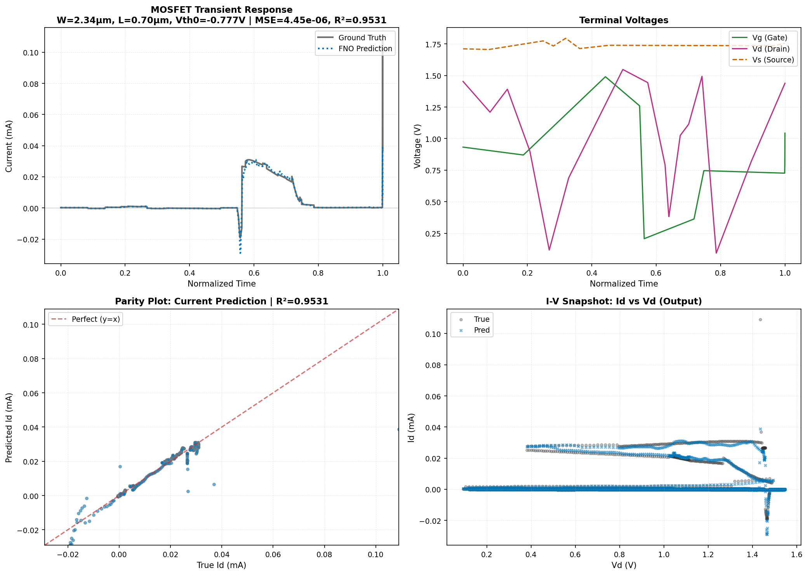
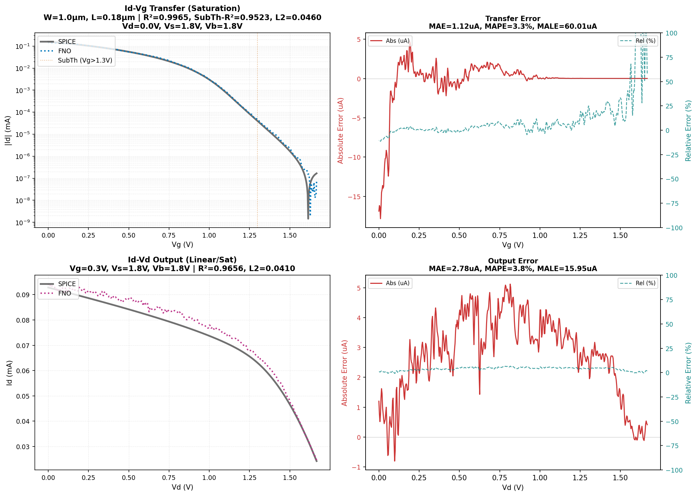
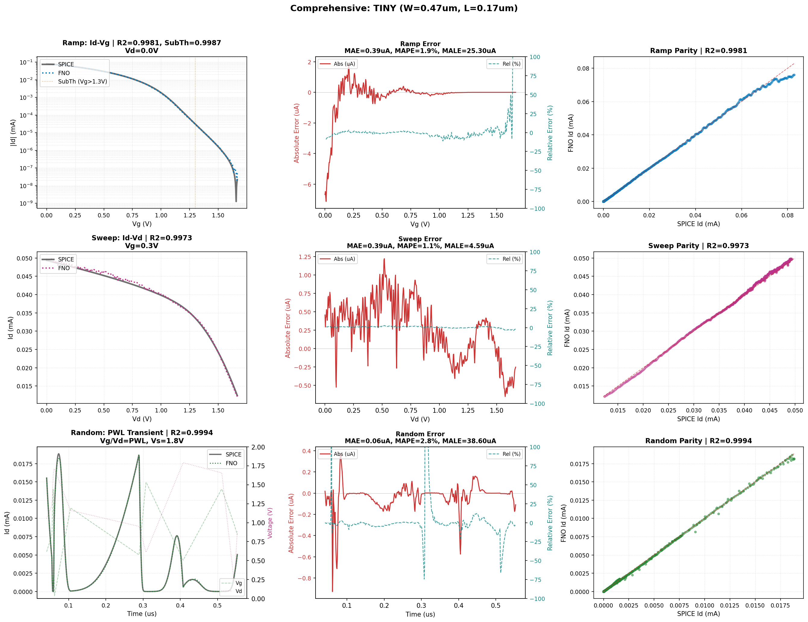
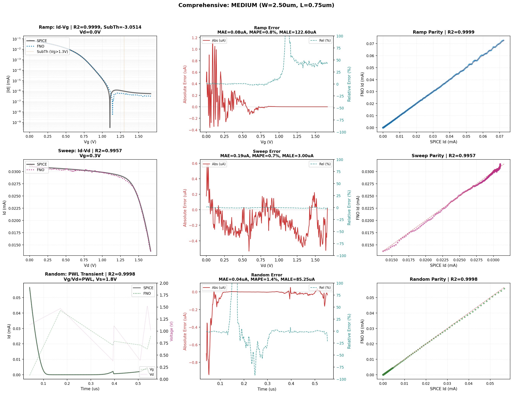
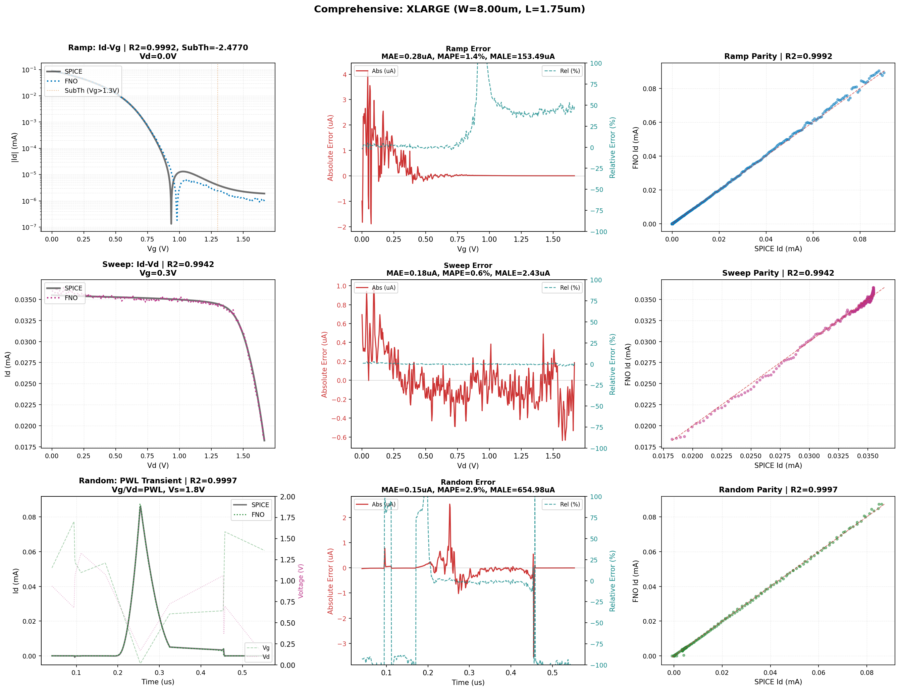

# PFET: sky130 PMOS Operator

SPINO's PMOS component learns the 4-terminal drain-current operator
$I_D(t) = \mathcal{F}(V_G(t), V_D(t), V_S(t), V_B(t),\, \boldsymbol{\theta}_{BSIM})$
for the SkyWater 130 nm PMOS device `sky130_fd_pr__pfet_01v8`.

---

## Architecture: MosfetVCFiLMFNO

The production model uses the same **VCFiLM-conditioned Fourier Neural Operator** architecture
as the [NFET operator](nfet.md). Weights are trained independently on PMOS simulation data.

| Hyperparameter | Value |
|---|---|
| Architecture | `MosfetVCFiLMFNO` |
| Fourier modes | 256 |
| Hidden width | 64 |
| Physics embedding dim | 16 |
| Input param dim | 29 (curated BSIM subset) |
| Total parameters | 2,331,985 |

The 29-dimensional physics vector is projected through a learned MLP embedding before being
injected into each Fourier block via FiLM scaling/shifting, decoupling geometry generalization
from waveform representation.

---

## Training: Single-Phase Strategy

**Full training (300 epochs):**
44,000 samples from NGSPICE transient simulations of the Sky130 PMOS device across five
geometry bins (tiny through xlarge). The dataset is composed of 40,000 random PWL waveforms,
2,000 output sweeps ($V_D$ ramp, $V_G$ constant) and 2,000 transfer sweeps ($V_G$ ramp,
$V_D$ constant). Each sample is a 2048-step time series (2007 steps post startup-trim; see
Startup trim below) of voltage excitation and corresponding drain current, paired with a
29-element BSIM4 parameter vector covering geometry, threshold, mobility, and parasitic
parameters. All 2.3 M model parameters trained end-to-end with LpLoss.

Unlike the NFET, the PMOS model does not use a frozen-backbone fine-tuning phase. The
sweep-augmented dataset provides sufficient coverage of the I-V manifold that a single
training phase reaches production quality. The sweep samples are critical: without them,
quasi-static transfer and output curves (where only one terminal ramps) are out-of-distribution
for a model trained exclusively on random PWL excitation.

**Startup trim (`.op` artifact removal):**
NGSPICE `.tran` analysis begins by computing a DC operating point (`.op`), then transitioning
to time-domain integration. This handoff produces a brief current spike at $t \approx 0$ in
every sample — a numerical solver transient, not physical device behaviour. The first 41
timesteps (2% of each raw 2048-step waveform) are discarded from both input voltages and
target currents during data loading. The same trim is applied symmetrically to SPICE ground
truth and FNO predictions during evaluation, so no asymmetric advantage is conferred. All
metrics reported below are computed on the post-trim waveform.

---

## Results

### Core Geometry (W = 1.0 µm, L = 0.18 µm)

SPICE-validated quasi-static sweeps. Each sweep uses 512 time steps (post-trim; see
Startup trim above).

| Metric | Value |
|---|---|
| Transfer R² | 0.9965 |
| Output R² | 0.9656 |
| Subthreshold R² | 0.9523 |
| MALE (transfer) | 60.01 µA |

**Subthreshold R² (SubTh-R²)** is the coefficient of determination computed exclusively over
the gate voltage range $V_G > 1.3\,\text{V}$ (PMOS subthreshold is at high $V_G$, near $V_{DD}$),
where drain current is exponentially sensitive to threshold voltage and the signal magnitude
drops to nanoamperes.

### Comprehensive Evaluation (3 Geometries × 3 Waveform Types)

| Geometry | W (µm) | L (µm) | Ramp R² | SubTh R² | Sweep R² | Random R² | MAE | MALE |
|---|---|---|---|---|---|---|---|---|
| tiny | 0.47 | 0.17 | 0.9981 | 0.9987 | 0.9973 | 0.9993 | 0.39 µA | 25.30 µA |
| medium | 2.50 | 0.75 | 0.9999 | -3.05 | 0.9957 | 0.9998 | 0.07 µA | 122.60 µA |
| xlarge | 8.00 | 1.75 | 0.9992 | -2.48 | 0.9942 | 0.9997 | 0.28 µA | 153.49 µA |

**Waveform types:**
- **Ramp** — quasi-static $I_D$–$V_G$ transfer sweep, $V_D = 0.0$ V (includes log-scale subthreshold)
- **Sweep** — quasi-static $I_D$–$V_D$ output sweep, $V_G = 0.3$ V
- **Random** — PWL stochastic transient, randomized $V_G(t)$ and $V_D(t)$

> **Degenerate SubTh-R² at medium and xlarge.** The negative R² values for medium and xlarge
> subthreshold are caused by arcsinh compression of the target space. At large $W/L$, the
> entire PMOS current range lives within a narrow band of arcsinh units (0.69 arcsinh units
> for xlarge vs. 3.40 for the equivalent NFET), leaving almost no dynamic range for the
> subthreshold region. The model's absolute error in this regime is on the order of
> nanoamperes; the degenerate R² reflects the denominator (total variance) collapsing, not
> a large prediction error. Ramp R² > 0.999 at these geometries confirms the model captures
> the overall transfer characteristic accurately.

### Simulation Speedup

| Mode | Speedup |
|---|---|
| Warm inference (JIT compiled) | ~522× |

Reference: single NGSPICE `.tran` simulation vs. single FNO forward pass on the same geometry.

---

## Figures

*Randomly sampled dataset waveform: time-domain transient (top-left), terminal voltages
(top-right), parity plot (bottom-left), I–V snapshot (bottom-right).*

*SPICE-validated W=1.0 µm, L=0.18 µm. Transfer curve (log scale) and output curve with
dual-axis absolute/relative error panels.*

*Tiny geometry (W=0.47 µm, L=0.17 µm): 3×3 grid — ramp, sweep, and random waveforms with
parity and error panels.*

*Medium geometry (W=2.50 µm, L=0.75 µm). Note the degenerate subthreshold R² due to arcsinh
compression at large W/L.*

*XLarge geometry (W=8.00 µm, L=1.75 µm). Same arcsinh compression effect; Ramp R² remains
0.9992, confirming the overall transfer characteristic is captured.*

---

## Known Limitations

- **Temporal/resolution invariance validated:** The MOSFET I-V mapping is quasi-static.
  The VCFiLM conditioning reconstructs an effective time constant internally from the
  29-param BSIM vector and per-timestep terminal voltages, so no explicit dimensionless
  $\lambda$ is needed. Empirically confirmed ($\Delta R^2 < 0.001$ across 50× $T_{end}$
  and 8× step-count ranges). See the
  [project-level discussion](../README.md#known-limitations) for the full test matrix.
- **Arcsinh compression at large W/L:** The fixed arcsinh scale ($1\,\mu\text{A}$) compresses
  high-current PMOS geometries into a narrow target range. At xlarge (W=8.0 µm, L=1.75 µm),
  the entire drain current span occupies 0.69 arcsinh units compared to the NFET's 3.40. This
  makes subthreshold metrics degenerate (negative R²) despite nanoampere-scale absolute
  errors. A geometry-aware or adaptive scaling strategy could alleviate this.
- **Horizontal shift at saturation knee:** Spectral truncation in the FNO (Gibbs phenomenon)
  produces a 10–19 mV horizontal shift at the linear-to-saturation transition in output
  sweeps. This is architecturally intrinsic to the fixed-mode Fourier representation and
  cannot be eliminated by retraining.
- **Single device type:** This model is specific to `sky130_fd_pr__pfet_01v8`. See
  [NFET](nfet.md) for the companion NMOS operator.
