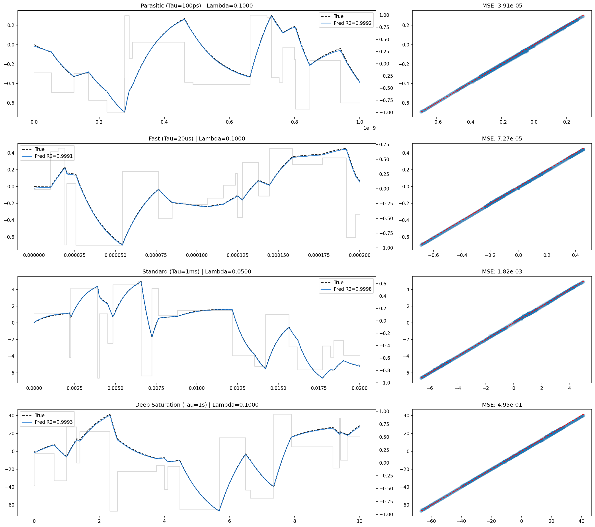
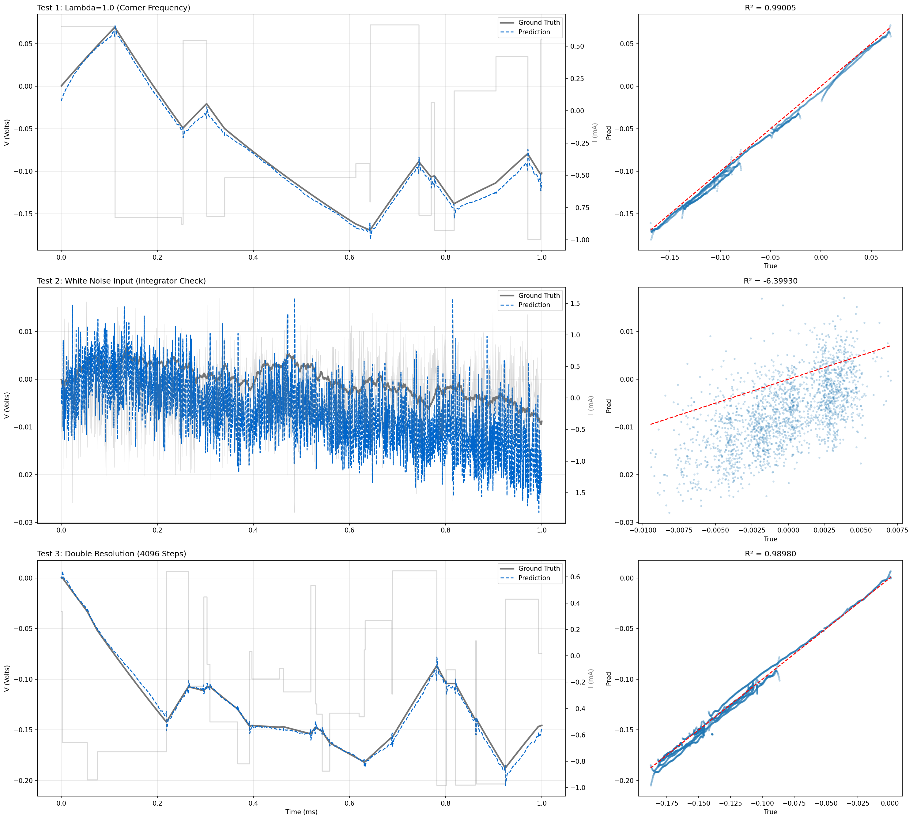
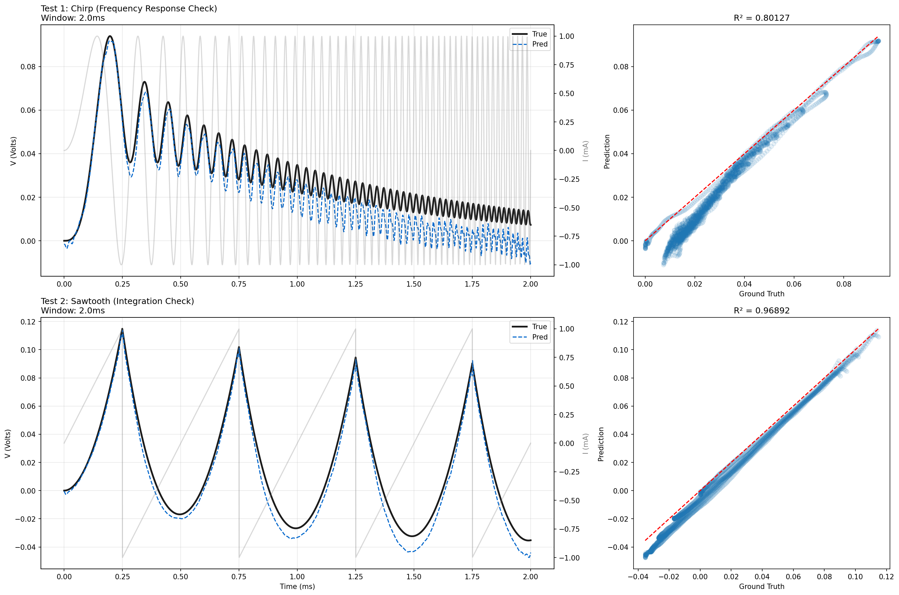

# RC Circuit Operator

SPINO's RC component learns the linear circuit voltage operator
$V(t) = \mathcal{F}(I(t),\, \lambda)$
where $\lambda = \tau / T_{end}$ is the dimensionless stiffness ratio.

---

## Architecture

1D Fourier Neural Operator (Li et al., 2021):

| Hyperparameter | Value |
|---|---|
| Fourier modes | 256 |
| Hidden channels | 64 |
| Input channels | 2 ($\hat{I}(t)$, $\lambda$) |
| Output channels | 1 ($\hat{V}(t)$) |
| Activation | SiLU |
| Domain padding | 0.1 (Gibbs mitigation) |
| Skip connection | Linear |

---

## Dimensionless Formulation

The RC ODE $C \frac{dV}{dt} + \frac{V}{R} = I(t)$ is non-dimensionalized to:

$$\lambda \frac{d\hat{V}}{d\hat{t}} + \hat{V} = \hat{I}(\hat{t})$$

Training on this form makes the operator invariant to physical time scale.
A 100 fs parasitic transient and a 10 s saturation drift are identical to the network
if their stiffness ratios match.

**Denormalization at inference:**

$$V(t) = \hat{V}(t) \cdot (I_{scale} \cdot R)$$

---

## Training

- **Data generation:** Custom Forward Euler solver with variable-horizon time scaling
- **Training distribution (spectral augmentation):**
  - 50 % square pulses (logic-like)
  - 25 % Gaussian white noise (forces integration operator learning)
  - 25 % super-dense switching (Nyquist-limit amplitude preservation)
- **Loss:** MSE + Sobolev (derivative matching) + dimensionless physics residual

---

## Results

### Adversarial Stress Tests

| Test | Description | R² |
|---|---|---|
| Corner frequency | λ=1.0, balanced resistive/capacitive regime | **0.9999** |
| White noise | Gaussian noise forcing continuous integration | **0.9884** |
| Resolution blind | Inference at 4096 steps (2× training resolution) | **0.9994** |
| Chirp | Frequency sweep; tests Bode response | **0.9710** |
| Sawtooth | Linear ramp integration check | **0.9998** |

The white noise result (R²=0.9884) confirms the model learned the integration operator
rather than memorizing pulse shapes. The chirp result reflects minor phase lag near the
Nyquist limit — an inherent FNO spectral bias effect.

### Simulation Throughput

The RC ODE is a scalar recurrence ($O(T)$ per sample); a direct Python loop solves it in
< 1 ms. The FNO forward pass at ~96 ms is slower on single-sample CPU inference.
The FNO's value proposition for RC is not latency but **generalization**: a single trained
operator replaces per-circuit solver setup across the full $\lambda$ spectrum, and batch GPU
throughput scales linearly with batch size where the loop does not.

---

## Figures

*Sweep across four tau corners: parasitic (100 ps), fast (20 µs), standard (1 ms), deep
saturation (1 s). Each row shows waveform comparison and parity plot.*

*Adversarial stress tests: corner frequency (λ=1.0), white noise integration, and double-
resolution blind inference.*

*Out-of-distribution generalization to chirp (frequency sweep) and sawtooth (polynomial
integration) — waveforms never seen during training.*

---

## Design Decisions

**Variable-horizon training:** Early models trained on fixed time windows ($T_{end} = 20$ ms)
predicted flat lines for fast circuits where transients occurred between grid points.
Dynamically scaling $T_{end}$ to match the sampled $\tau$ resolved this, and is the
motivation for the dimensionless formulation.

**Spectral augmentation:** Initial R² on white noise was 0.65 — the model had overfit to
smooth step shapes. Adding Gaussian noise and dense switching waveforms to the training
distribution (see Training) forced the operator to learn integration rather than shape matching.
