# Analog composition results

This note reports composed-circuit validation results against NGSpice for two
analog topologies: the single-stage CS amplifier and the 5T OTA.

Method details are documented in [Neural composition: CS amplifier method](composition.md)
and [Neural composition: 5T OTA method](ota_composition.md). Digital inverter chains are
included below only as a known limitation and regime-boundary result.

## CS amplifier

Method: [Neural composition: CS amplifier method](composition.md).
Characterization: [CS amplifier characterization](cs_amp.md).

### Characterization context

Two geometry points are validated:

1. **Cross-bin stress** (`L = 0.18 µm`): length in the `tiny` bin, widths in the
   `large` bin — the worst cross-bin combination for VCFiLM. Artefacts in
   `docs/assets/cs_amp/summary.json`.
2. **In-bin showcase** (`L = 0.40 µm`): length in the `small` bin with
   correspondingly selected widths. Artefacts in `docs/assets/cs_amp_l040/summary.json`.

### SPICE-only reference summary

| Reference | Wn (µm) | Ln (µm) | Wp (µm) | Lp (µm) | Vin* (V) | Vout* (V) | Peak \|gain\| (V/V) | Idd @ Vin* (A) | Loaded settling (s) |
|---|---:|---:|---:|---:|---:|---:|---:|---:|---:|
| `docs/assets/cs_amp/summary.json` | 6.0 | 0.18 | 4.5 | 0.18 | 0.85 | 0.60894 | 2.0519 | 1.285e-4 | 2.50e-8 |
| `docs/assets/cs_amp_l040/summary.json` | 1.6 | 0.40 | 2.5 | 0.40 | 0.81 | 0.60072 | 1.4167 | 1.565e-5 | 1.95e-7 |

### Composition runs

- CUDA, `L=0.18` stress: `docs/assets/cs_amp_fno_exp2/summary.json`
- CUDA, `L=0.40` showcase: `docs/assets/cs_amp_fno_l040_exp2/summary.json`
- CPU, `L=0.18` stress: `docs/assets/cs_amp_fno/summary.json`
- CPU, `L=0.40` showcase: `docs/assets/cs_amp_fno_l040/summary.json`

### Core fidelity metrics (CUDA)

| Metric | `L=0.18` stress | `L=0.40` showcase |
|---|---:|---:|
| DC nominal $\lvert \Delta V_\mathrm{out}\rvert / V_\mathrm{DD}$ | 0.9209% | 0.0492% |
| Transient Pearson $r$ | 0.99748 | 0.99981 |
| Transient max $\lvert\Delta V\rvert$ | 25.78 mV | 2.392 mV |
| Transient $R^2$ | -2.6595 | 0.9946 |
| Transient settling (FNO / SPICE) | 30 ns / 25 ns | 210 ns / 195 ns |
| NR iterations (DC / transient) | 5 / 3 | 5 / 2 |

### Runtime context

| Geometry/run | FNO cold (ms) | FNO warm (ms) | SPICE cold (ms) | SPICE warm (ms) |
|---|---:|---:|---:|---:|
| `L=0.18` stress CUDA | 2873.77 | 2697.09 | 13335.72 | 13031.04 |
| `L=0.40` showcase CUDA | 1757.65 | 1733.18 | 12528.74 | 12677.87 |
| `L=0.18` stress CPU | 26091.39 | 25852.92 | 13077.73 | 13018.72 |
| `L=0.40` showcase CPU | 19410.45 | 20193.68 | 12621.42 | 12482.44 |

Runtime is reported for reproducibility context; the scientific claim is
differentiable composition in the analog regime, not wall-clock superiority over NGSpice.

### Figure set (L=0.40 showcase)


### Error attribution (`L=0.18` stress geometry)

The `L=0.18` CUDA stress run shows the largest composition gaps. Those gaps were
causally decomposed into two separable mechanisms via a four-probe isolation sequence:
a **nominal-bias transient IV-surface** error and a **weak-inversion / near-off VTC**
failure that the step stimulus does not traverse. Full method, figures, and artefact
layout are in [Error attribution: L=0.18 CUDA stress geometry](attribution.md).

| Domain | Probe | Quantity | Value |
|---|---|---|---:|
| Transient | KCL residual (probe 2) | KCL max `|i|` at pinned SPICE `V_out` | 19.6 uA |
| Transient | KCL residual (probe 2) | KCL max `|i|` at pinned FNO `V_out` | 73 nA |
| Transient | KCL residual (probe 2) | SPICE/FNO KCL-max ratio | 268x |
| Transient | NR diagnostics (probe 4) | Iterations / max Jacobian diag ratio / line-search `alpha` | 3 / 616 / 1.0 |
| VTC | IV error (probe 1) | NFET bad/good rel. error ratio | 4551.5x |
| VTC | IV error (probe 1) | PFET bad/good rel. error ratio (1000x cap on each point before mean) | 3710x |
| VTC | IV error (probe 1) | PFET FNO vs SPICE at `V_in` ~ 0.25 V (SPICE-converged pins) | 13.7 A vs 785 pA |
| VTC | Substitution | Mean `|Delta V_out|` in bad region (`V_in` < 0.5 V) | 176 mV -> 4.4 mV (97.5%) |
| VTC | Substitution | Max `|Delta V_out|` in bad region (`V_in` < 0.5 V) | 379.7 mV -> 18.7 mV |
| VTC | Substitution | Good region (`V_in` >= 0.5 V): hybrid == FNO by gate | means unchanged (0.0%) |

_PFET ratio row_: uncapped mean bad/mean good ~`3.0e10` (dominated by the `V_in ~ 0.30` V spike); median ratio ~`266x`; geometric-mean ratio ~`1157x`. Definitions in [attribution.md](attribution.md).

In short: the transient mismatch is driven by FNO IV error at `V_gs` ~ 0.85-0.90 V
with a healthy Newton loop; the VTC mismatch is driven by weak-inversion IV error
at `V_in` < 0.5 V.

### Interpretation

The `L=0.40` showcase run materially improves both DC and transient agreement,
consistent with the geometry regime shift: `L=0.18` sits at the worst cross-bin
combination while `L=0.40` moves into a better-conditioned training region.

For the `L=0.18` stress geometry, the low-`Vin` VTC gap is one of two **causally
separated** mechanisms documented with probes and figures in
[Error attribution: L=0.18 CUDA stress geometry](attribution.md).

### Reproduction commands

```text
# SPICE characterization
python -m spino.circuit.characterize \
    --nfet-w 6.0 --nfet-l 0.18 --pfet-w 4.5 --pfet-l 0.18 \
    --vin-bias 0.85 \
    --output-dir docs/assets/cs_amp

python -m spino.circuit.characterize \
    --nfet-w 1.6 --nfet-l 0.4 --pfet-w 2.5 --pfet-l 0.4 \
    --vin-bias 0.81 \
    --output-dir docs/assets/cs_amp_l040

# Composition (CUDA)
python -m spino.circuit.compose \
    --device cuda \
    --nfet-w 6.0 --nfet-l 0.18 --pfet-w 4.5 --pfet-l 0.18 \
    --vin-bias 0.85 \
    --output-dir docs/assets/cs_amp_fno_exp2

python -m spino.circuit.compose \
    --device cuda \
    --nfet-w 1.6 --nfet-l 0.4 --pfet-w 2.5 --pfet-l 0.4 \
    --vin-bias 0.81 \
    --output-dir docs/assets/cs_amp_fno_l040_exp2

# Composition (CPU)
python -m spino.circuit.compose \
    --device cpu \
    --nfet-w 6.0 --nfet-l 0.18 --pfet-w 4.5 --pfet-l 0.18 \
    --vin-bias 0.85 \
    --output-dir docs/assets/cs_amp_fno

python -m spino.circuit.compose \
    --device cpu \
    --nfet-w 1.6 --nfet-l 0.4 --pfet-w 2.5 --pfet-l 0.4 \
    --vin-bias 0.81 \
    --output-dir docs/assets/cs_amp_fno_l040
```

---

## 5T OTA: multi-node analog composition

The 5T OTA is a single-stage operational transconductance amplifier with three
internal KCL nodes (n_tail, n_left, n_out), a differential input pair (M1/M2),
a PFET current-mirror load (M3/M4), and an NFET tail current source (M5). It is
the multi-node scaling demonstration for the differentiable composition method.
Full method documentation is in [Neural composition: 5T OTA method](ota_composition.md)
and SPICE characterization methodology is in [5T OTA characterization](ota_5t.md).

### SPICE-only reference summary (Phase 3a)

Designs selected from a 7×7 (W\_diff, W\_mirror) sweep at each L; M5 fixed at
W=2 µm, Vbias=1.2 V; stimulus ±50 mV differential step at Vcm=0.9 V, C\_load=1 pF.

| L (µm) | W\_diff (µm) | W\_mirror (µm) | Slew rate (V/µs) | Slew time (ns) | I\_tail (µA) | DC gain (V/V) |
|---:|---:|---:|---:|---:|---:|---:|
| 0.40 | 8.0 | 8.0 | 48.4 | 21.5 | 78.8 | 48.7 |
| 0.50 | 8.0 | 8.0 | 40.5 | 25.8 | 66.0 | 64.0 |

Sweep health: 49/49 converged at both L; 48/49 feasible at L=0.40, 41/49 at L=0.50.
Artefacts: `docs/assets/ota_5t_l040/`, `docs/assets/ota_5t_l050/`.

### Phase 3b gate outcomes (FNO composition vs SPICE)

| Gate | Criterion | L=0.40 | L=0.50 |
|---|---|---|---|
| Pearson r | ≥ 0.99 | **PASS** (0.9997) | **PASS** (0.9997) |
| max\|ΔV\| | ≤ 30 mV | **FAIL** (68.7 mV) | **FAIL** (68.9 mV) |
| Slew rate relative error | ≤ 10% | **PASS** (1.0%) | **PASS** (5.0%) |
| Slew time relative error | ≤ 10% | **FAIL** (16.3%) | **PASS** (8.5%) |
| NR iterations (DC / transient) | ≤ 25 | **PASS** (5 / 11) | **PASS** (6 / 12) |

The max|ΔV| and slew-time failures are pre-registered results (gate criteria locked
before Phase 3b ran) and are fully attributed to a training-data gap, not solver
tuning. See Attribution below.

The gradient-mechanism and shape-fidelity claims (Pearson r 0.9997, slew rate within
1 % at L = 0.40 and 5 % at L = 0.50, NR transient convergence in 11–12 of a 25-iter
budget) hold independent of the plateau-level offset. Attribution localises the
offset to one device (M4 PFET) in one regime (Vsd → 0), so the load-bearing fidelity
metrics for the composition method are not coupled to the residual; the triode
fine-tune (next subsection) tightens M4 by 22 % without closing the gate. The
production checkpoint is unchanged.

### Runtime context

| | FNO GPU (s) | SPICE (s) |
|---|---:|---:|
| L=0.40 (CUDA) | 63.5 | 6.3 |
| L=0.50 (CUDA) | 68.0 | 6.5 |

The FNO runtime is dominated by dense 3×400-element Jacobian assembly via
`jacobian(vectorize=True)` (vmap-batched VJPs). A GPU-native Krylov solver
using `torch.func.vmap` over the Arnoldi basis is the queued speedup path;
scipy GMRES was investigated and found ~7× slower on GPU due to sequential
JVP calls with Python/numpy overhead defeating GPU batching.

### Figure set (L=0.40 showcase)

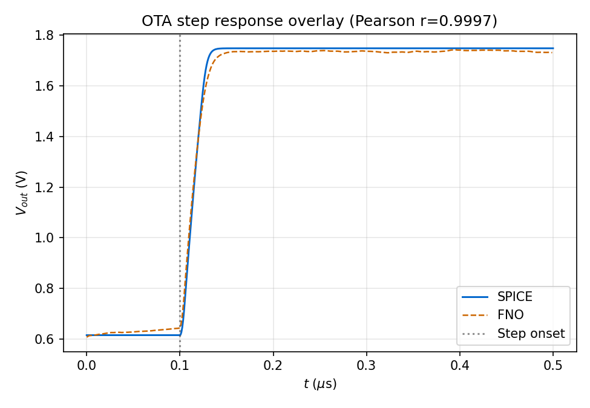

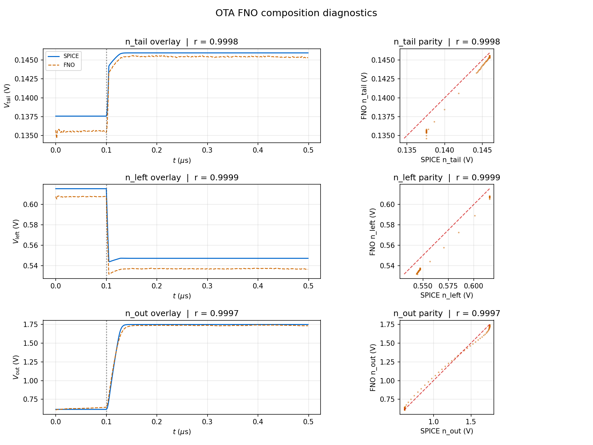

*Three-row parity panel: **n\_tail** (M5 drain, common source of diff pair), **n\_left** (M3
diode drain and M4 gate — the mirror control node), and **n\_out** (single-ended output,
M2/M4 drain junction). Left column: FNO vs SPICE time-domain overlay; right column:
scatter parity with identity line.*

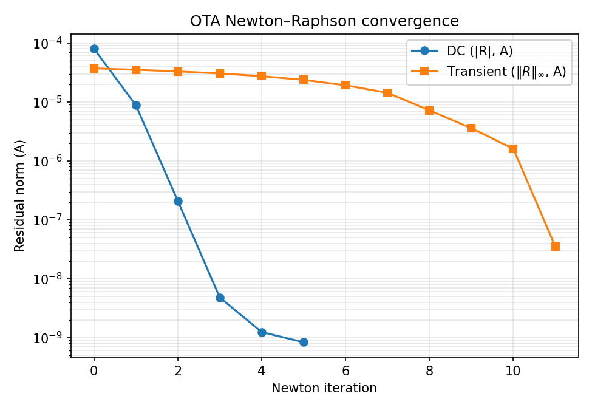

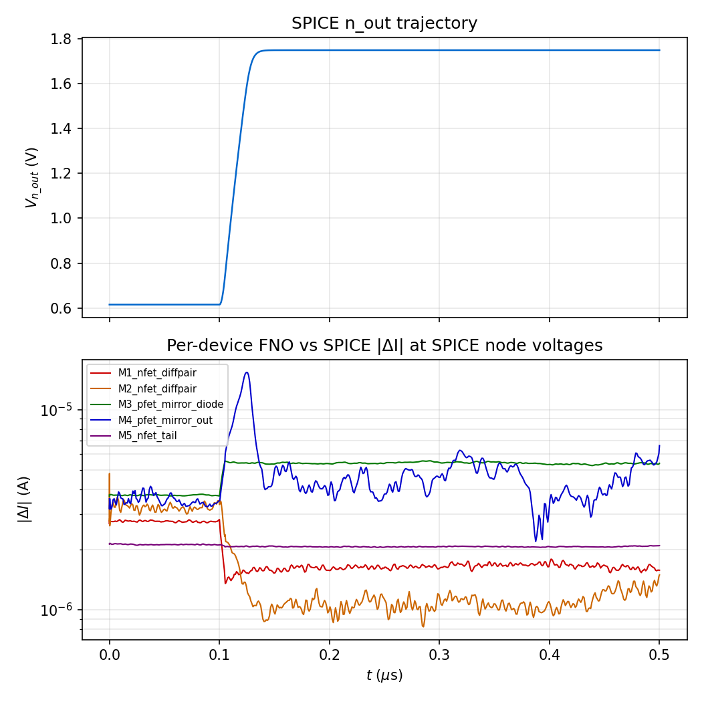

### Attribution (Probe 1 — IV branch errors at SPICE node voltages)

For each device, the FNO is evaluated at the SPICE node voltage trajectories and
the predicted drain current is compared to the SPICE branch current. A large error
at a specific device localizes the composition error source.

| Device | Role | max\|ΔI\| L=0.40 | max\|ΔI\| L=0.50 |
|---|---|---:|---:|
| M4 PFET mirror out | Dominant | **15.4 µA** | **9.2 µA** |
| M3 PFET mirror diode | Secondary | 5.6 µA | 2.2 µA |
| M2 NFET diff pair | Secondary | 4.8 µA | 3.1 µA |
| M5 NFET tail | Negligible | 2.1 µA | 0.5 µA |
| M1 NFET diff pair | Negligible | 2.8 µA | 1.3 µA |

Root cause: when n_out slews near VDD, M4 exits saturation (Vds → 0). PFET training
data underrepresents this triode-boundary regime, causing ~15 µA current overestimate
at L=0.40 → ~70 mV voltage offset at the output plateau. The slew-time failure at
L=0.40 is a downstream consequence: the 10–90% threshold shifts by ~3.5 ns.

Artefacts: `docs/assets/ota_5t_fno_l040/attribution/`, `docs/assets/ota_5t_fno_l050/attribution/`.

### PFET triode-boundary fine-tune: partial gate closure

Attribution localized the L=0.40 gate failure to M4 in the Vsd→0 triode regime, where
the production PFET training data was sparse. The targeted remediation was a 2K-sample
triode-boundary augmentation (Vsg ∈ [1.0, 1.6] V, Vsd ∈ [0.0, 0.3] V, PWL waveforms),
merged into a 46K dataset and used for a frozen-backbone fine-tune of the production
PFET (FiLM-conditioning layers only, 50 epochs, LR = 1e-4). The fine-tuned checkpoint
is `pmos_exp07_triode_finetune_KG1HfPbJ.pt`.

| Gate | Criterion | Production PFET | Triode fine-tune |
|---|---|---|---|
| Pearson r | ≥ 0.99 | 0.9997 | 0.9997 |
| max\|ΔV\| | ≤ 30 mV | **FAIL** (68.7 mV) | **FAIL** (61.0 mV) |
| Slew rate relative error | ≤ 10% | 1.0% | 1.7% |

Per-device IV error at SPICE node voltages (production sizing, W\_diff = W\_mirror = 8 µm, W\_tail = 2 µm):

| Device | Role | Production max\|ΔI\| | Fine-tune max\|ΔI\| | Δ |
|---|---|---:|---:|---:|
| M4 PFET mirror out | Triode target | **15.4 µA** | **12.0 µA** | **−22%** |
| M3 PFET mirror diode | Non-triode PFET | 5.6 µA | 6.0 µA | +8% |
| M2 NFET diff pair | NFET (untouched) | 4.8 µA | 4.8 µA | 0% |
| M1 NFET diff pair | NFET (untouched) | 2.8 µA | 2.8 µA | 0% |
| M5 NFET tail | NFET (untouched) | 2.1 µA | 2.1 µA | 0% |

**Interpretation.** The triode augmentation reduced M4's peak IV error by 22 % at
production sizing — a real, attribution-traceable improvement — but the 30 mV gate
still fails by 31 mV. M3 (diode-connected PFET, not in triode) regressed slightly,
consistent with frozen-backbone FiLM-only adaptation over-specializing to the
triode regime. The composition error reduction (68.7 → 61.0 mV, 11 %) is smaller
than M4's per-device improvement (22 %) because Newton coupling distributes the
remaining mismatch across all three KCL nodes.

The gap is no longer purely a training-data coverage problem: even with augmented
triode coverage, residual M4 error in the W = 8 µm geometry bin keeps composition
max\|ΔV\| above the gate. A larger augmentation set, full fine-tune (unfreeze
backbone) at a tighter LR, or a geometry-stratified retrain are candidate next
steps — deferred to future work. The production PFET checkpoint is unchanged;
the fine-tuned checkpoint is archived alongside the attribution artefacts as a
documented partial-closure result.

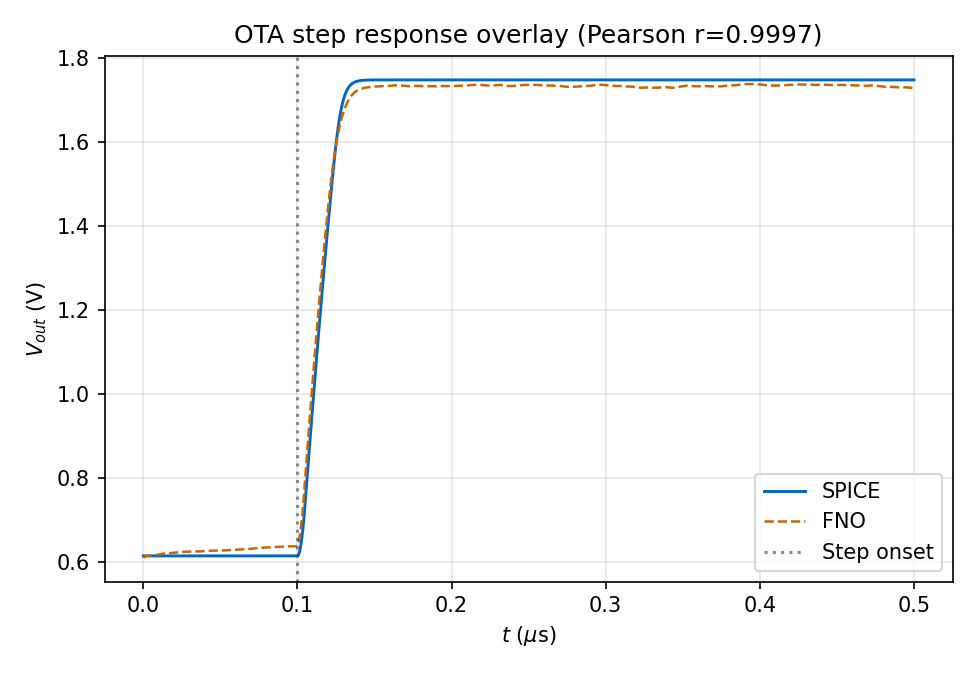

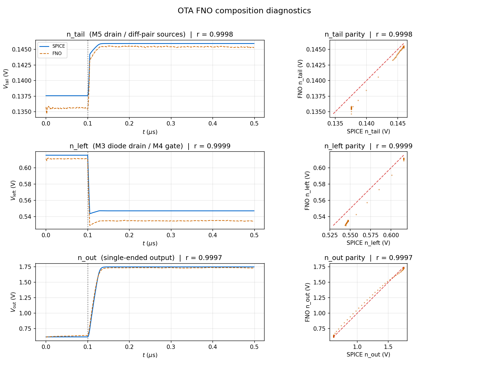

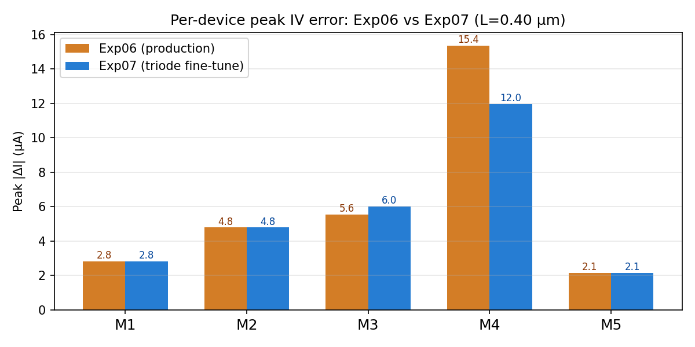

Artefacts: `docs/assets/ota_5t_fno_l040_exp07/`. Reproduction notebook:
[spino/ota_pfet_triode_attribution.ipynb](../spino/ota_pfet_triode_attribution.ipynb).

### Reproduction commands

```text
# SPICE characterization
python -m spino.circuit.characterize_ota \
    --nfet-l 0.40 --pfet-l 0.40 --tail-l 0.40 \
    --output-dir docs/assets/ota_5t_l040

python -m spino.circuit.characterize_ota \
    --nfet-l 0.50 --pfet-l 0.50 --tail-l 0.50 \
    --output-dir docs/assets/ota_5t_l050

# FNO composition (CUDA)
python -m spino.circuit.compose_ota \
    --nfet-l 0.40 --pfet-l 0.40 --tail-l 0.40 \
    --output-dir docs/assets/ota_5t_fno_l040

python -m spino.circuit.compose_ota \
    --nfet-l 0.50 --pfet-l 0.50 --tail-l 0.50 \
    --output-dir docs/assets/ota_5t_fno_l050

# Attribution (Probe 1)
python -m spino.circuit.ota_attribution \
    --run-dir docs/assets/ota_5t_fno_l040 \
    --nfet-l 0.40 --pfet-l 0.40 --tail-l 0.40

python -m spino.circuit.ota_attribution \
    --run-dir docs/assets/ota_5t_fno_l050 \
    --nfet-l 0.50 --pfet-l 0.50 --tail-l 0.50

# PFET triode-boundary fine-tune composition + attribution
# (see spino/ota_pfet_triode_attribution.ipynb for full pipeline)
python -m spino.circuit.compose_ota \
    --pfet-checkpoint spino/models/mosfet/pfet/pmos_exp07_triode_finetune_KG1HfPbJ.pt \
    --pfet-dataset    datasets/sky130_pmos_50k_triode.h5 \
    --diff-w 8.0 --mirror-w 8.0 --tail-w 2.0 \
    --nfet-l 0.40 --pfet-l 0.40 --tail-l 0.40 \
    --output-dir docs/assets/ota_5t_fno_l040_exp07

python -m spino.circuit.ota_attribution \
    --run-dir         docs/assets/ota_5t_fno_l040_exp07 \
    --pfet-checkpoint spino/models/mosfet/pfet/pmos_exp07_triode_finetune_KG1HfPbJ.pt \
    --pfet-dataset    datasets/sky130_pmos_50k_triode.h5 \
    --diff-w 8.0 --mirror-w 8.0 --tail-w 2.0 \
    --nfet-l 0.40 --pfet-l 0.40 --tail-l 0.40
```

---

## MLP ablation: architecture defense

To justify the FNO architecture choice, a per-timestep `MosfetMLP` baseline was trained on the
same 61K NFET dataset as the production VCFiLM-FNO. The MLP maps each timestep
independently: `I_D(t) = f(Vg(t), Vd(t), Vs(t), Vb(t), θ_embed)`. Off-diagonal Jacobian terms
`dI[t]/dV[t']` are exactly zero by construction — this is the structurally correct choice for a
quasi-static device.

Two capacity levels were evaluated (h64: 32K params, h128: 58K params) against the production
FNO (1.28M params). Fast Dataset R² is averaged over 64 fixed-seed samples from the training
distribution; SPICE metrics use deterministic ramp sweeps.

**Methodology note.** All reported metrics in this section (and throughout this document) come
from single-seed training runs. The MLP-vs-FNO comparison instead controls for tuning effort via
the capacity sweep h64 → h128: increasing MLP capacity *worsens* Fast Dataset R² (−4.42 → −5.43),
which rules out the "you didn't tune the MLP" rebuttal. The argument for the FNO architecture
choice is therefore structural — quasi-static MLPs cannot aggregate cross-timestep information,
which the random-PWL evaluation requires — rather than dependent on training-seed variance.

| Metric | MLP h64 | MLP h128 | FNO (production) |
|---|---|---|---|
| Fast Dataset R² (64-sample avg) | -4.42 | -5.43 | **0.9879** |
| SPICE Transfer R² | 0.9990 | 0.9989 | **0.9995** |
| SPICE Transfer SubTh-R² | **0.9856** | 0.9631 | 0.9861 |
| SPICE Output R² | 0.9456 | 0.9763 | **0.9960** |
| Speedup vs SPICE | 863x | 6501x | 473x |

The MLP matches FNO on controlled ramp sweeps (Transfer R² ≥ 0.999) but fails catastrophically
on arbitrary PWL waveforms (Fast Dataset R² ≈ −4 to −5). The gap **worsens** with more capacity,
ruling out underfitting as the cause. FNO spectral mixing acts as a **waveform-shape regularizer**:
by aggregating information across the full input trajectory, it generalizes to the diverse waveform
types present in the training distribution. This effect is empirically necessary even though
MOSFET physics does not require temporal dependencies.

The ablation also confirms that the inverter-chain failure (see below) is attributable to spurious
FNO off-diagonal Jacobian terms, not to a deficiency in the FNO's expressive capacity. An MLP
surrogate would produce an exactly diagonal Jacobian — but MLP fails on the waveform distribution
that makes it a viable surrogate in the first place.

#### Fast dataset (random PWL waveforms)

The Fast Dataset evaluation draws random PWL terminal voltage waveforms — the same distribution
the surrogate sees during training and the same distribution that drives KCL composition. The MLP's
catastrophic failure here is the load-bearing finding.

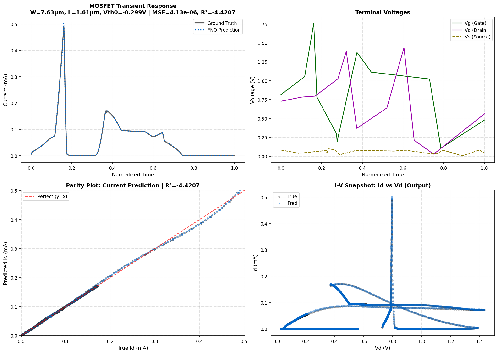

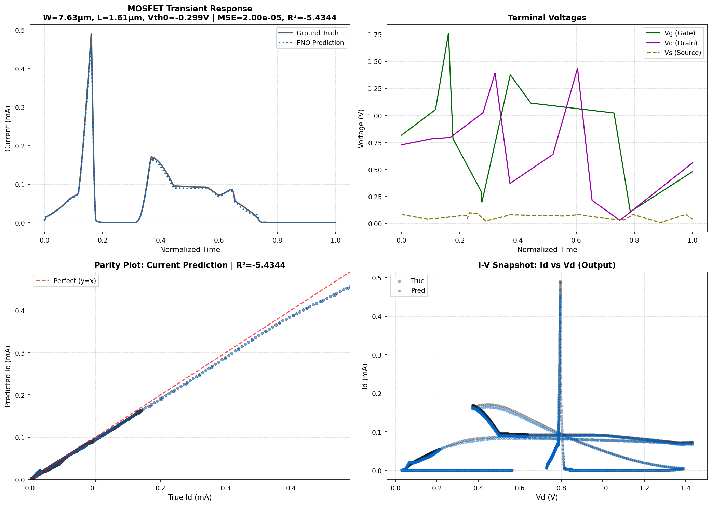

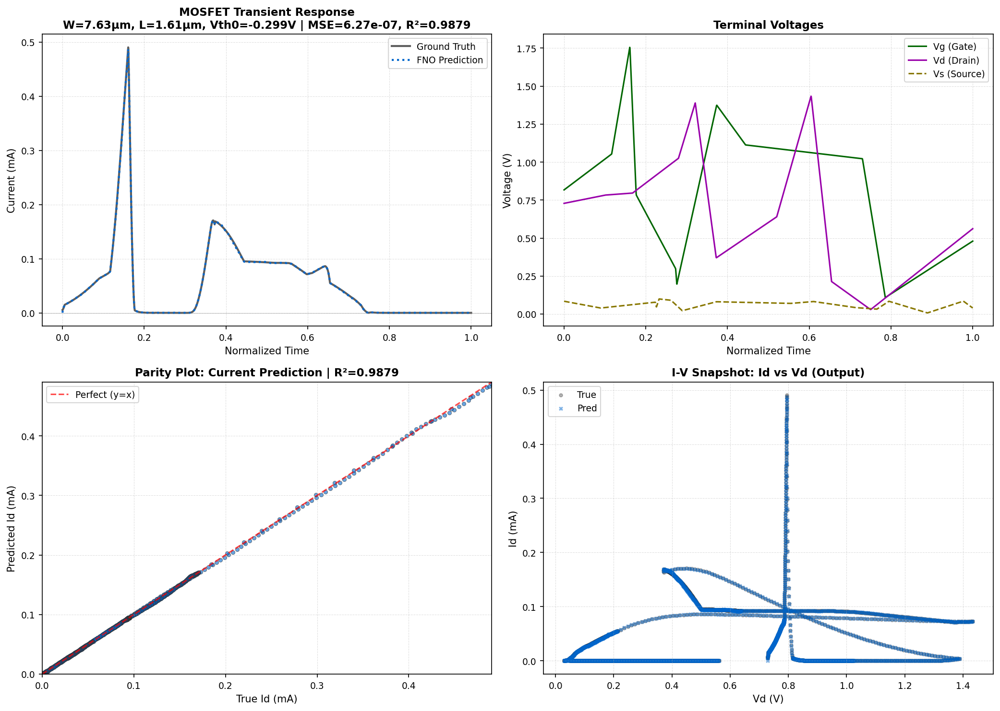

#### SPICE I-V sweeps (deterministic ramps)

The SPICE-validated transfer / output sweeps use monotonic ramp inputs. The MLP recovers R² ≥ 0.999
on these sweeps — its per-timestep representation is sufficient when the input itself is
quasi-monotonic. This is the "MLP looks fine on textbook curves" trap that the fast-dataset
evaluation breaks.

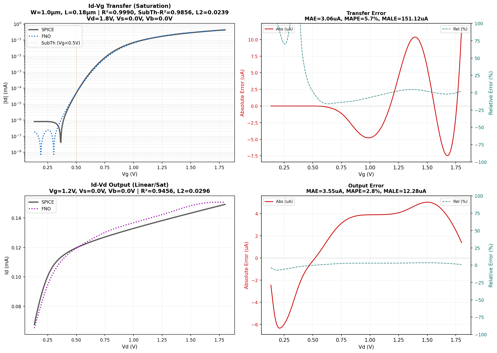

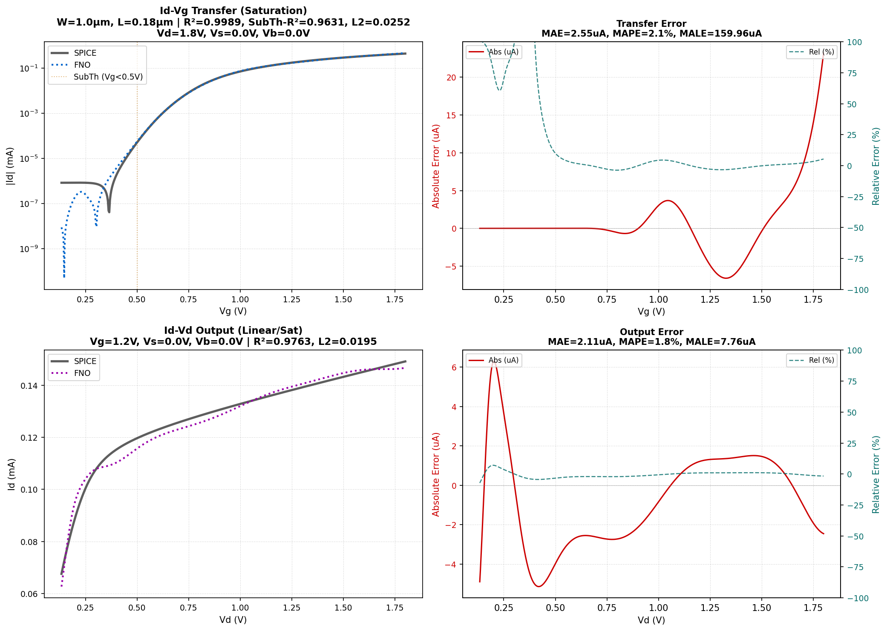

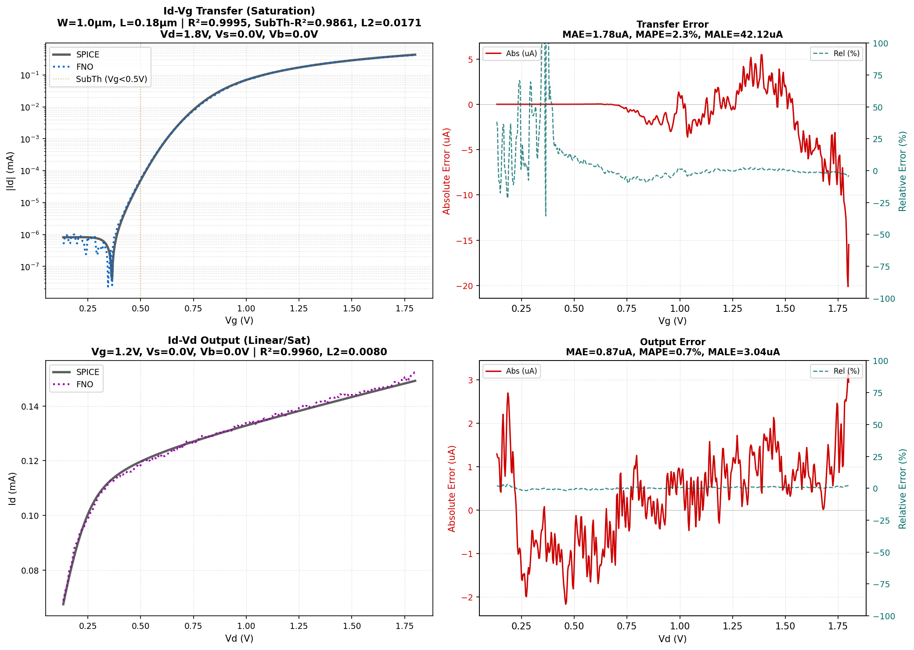

Artefacts: [`docs/assets/mosfet/nfet/mlp_ablation/`](assets/mosfet/nfet/mlp_ablation/).

---

## FNO safe operating region

The production NFET and PFET FNOs make per-bin drain-current predictions
whose accuracy is geometry- and bias-dependent. Probe 1 documents large
ratio errors at specific corners of the (V_gs, V_ds) plane (e.g., the
PFET 13.7 A spike at V_in ≈ 0.25 V on the CS amplifier VTC) and the M4
triode-boundary gap in the OTA. This subsection characterises *where* in
the (V_gs, V_ds) plane the surrogate is faithful enough to ground truth
that an optimiser using the FNO is not exploiting model error.

The metric is the per-bin ratio
$`|I_\mathrm{FNO}-I_\mathrm{SPICE}|/\max(|I_\mathrm{SPICE}|, I_\mathrm{floor})`$
with $`I_\mathrm{floor}=1\,\text{nA}`$ suppressing near-off division
noise. The safe-operating region at tolerance $`\tau`$ is the locus where
this ratio is at most $`\tau`$. Contours are reported at
$`\tau \in \{0.1, 0.3, 1.0\}`$ on a 91x91 (V_g, V_d) grid spanning
[0, 1.8] V at the IV cache geometries
(NFET: W = 6 µm, L = 0.18 µm; PFET: W = 4.5 µm, L = 0.18 µm) used by the
CS amplifier attribution.

| Device | τ = 0.1 coverage | τ = 0.3 coverage | τ = 1.0 coverage |
|---|---:|---:|---:|
| sky130 NFET | 76.0 % | 87.0 % | 94.4 % |
| sky130 PFET | 49.6 % | 79.5 % | 91.2 % |

The NFET surrogate is faithful to within 10 % over 76 % of the (V_g, V_d)
plane and within 30 % over 87 %. The PFET drops to 50 % coverage at the
10 % threshold; the OTA's M4 PFET triode-boundary gap, the CS amplifier
weak-inversion VTC mismatch, and the 13.7 A near-off spike all live in
the unsafe complement on the PFET surface. The PFET safe region at
$`\tau \le 0.3`$ (79.5 %) is the practical envelope for production
composition runs at this geometry; outside it, the FNO's local slope is
known to disagree with SPICE.

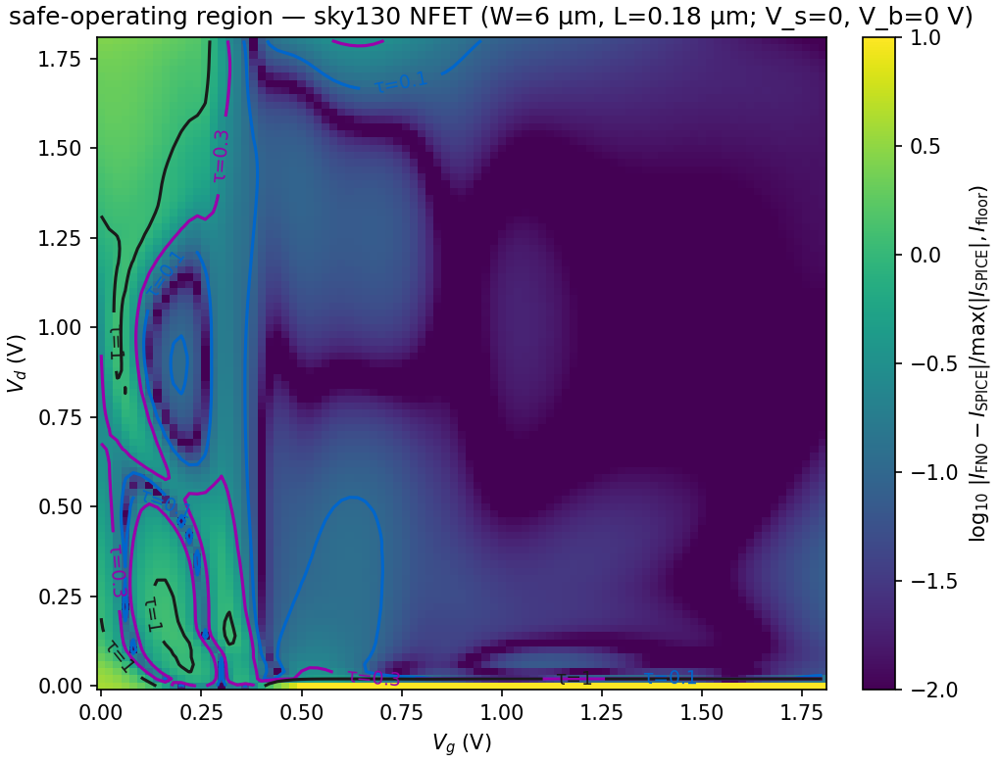
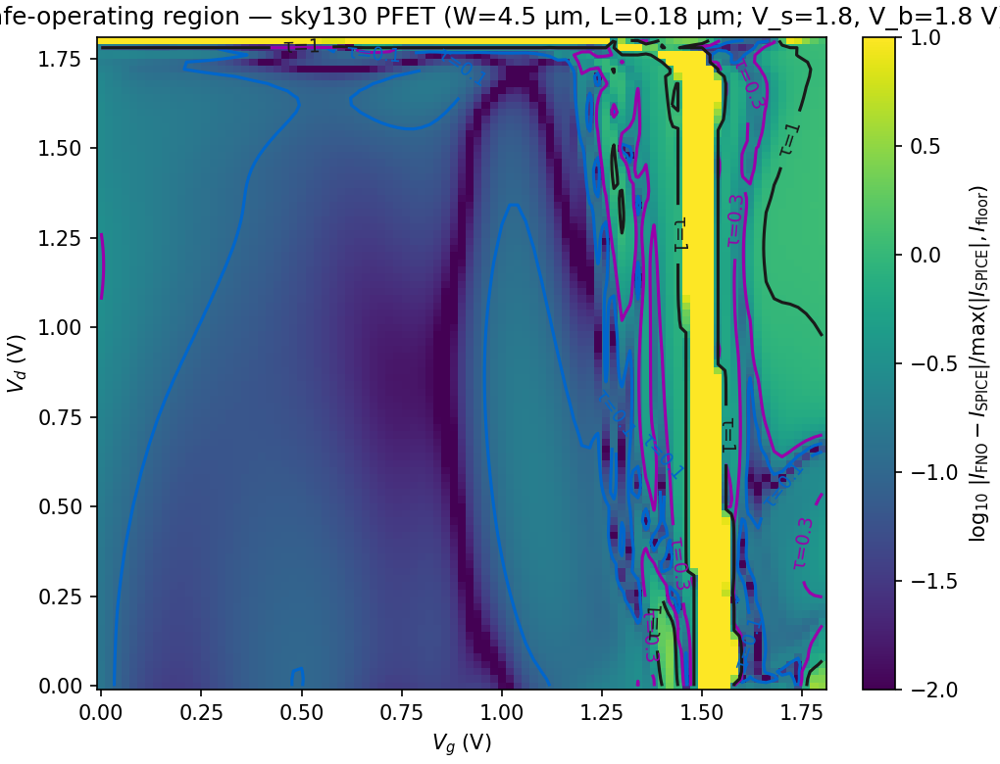

Both maps render $`\log_{10}`$ of the ratio error and overlay $`\tau`$
contours so the boundary between safe and unsafe regions is visible at a
glance. Bounding-box numbers are coarse because the unsafe complement is
not axis-aligned (the PFET, in particular, has a near-off thin band
along $`V_g \approx V_s`$ that drags the bounding box to the full grid
even though it occupies a small fraction of the plane).

Caveat on geometry. The cached IV grid is at the CS amplifier's L = 0.18 µm
geometry, not at the OTA sizing-converged L = 0.308 µm (v3) or
L_diff = L_mirror = 0.180 µm with L_tail = 0.318 µm (v4). The L = 0.18
surface is the worst-case sky130 core-bin geometry and is therefore an
honest upper bound on the PFET error envelope; the OTA operating
geometries sit further from training-data boundaries on the W and L axes
and the error envelope is expected to be at least as tight.

Reproduction and artefacts:

```bash
python -m spino.circuit.safe_region_probe \
    --output-dir runs/safe_region/cs_amp_l018
```

Heat maps, per-device ratio-error .npz grids (raw FNO + SPICE +
err_ratio arrays), and the coverage-bbox summary land under
[`docs/assets/safe_region/cs_amp_l018/`](assets/safe_region/cs_amp_l018/).

---

## Digital circuits: known limitation

The inverter-chain composition path was evaluated as a digital extension using
1-, 2-, and 4-stage CMOS chains. SPICE converges for these circuits. The
FNO-composed transient solver does not converge to acceptance-quality outputs,
so its waveforms, delay metrics, and parity statistics are diagnostic only.

Warm-pass numbers from
[`docs/assets/inv_chain/matrix/n{1,2,4}/rep00/summary.json`](assets/inv_chain/matrix/);
aggregate at
[`docs/assets/inv_chain/matrix/aggregate_summary.json`](assets/inv_chain/matrix/aggregate_summary.json):

| N | DC converged | DC iters | Transient converged | Transient iters | max\|ΔV\| (V) | Pearson r |
|---|---|---|---|---|---:|---:|
| 1 | ✓ | 0  | ✗ | 25 (cap) | 1.800 | NaN |
| 2 | ✓ | 3  | ✗ | 25 (cap) | 1.777 | NaN |
| 4 | ✓ | 5  | ✗ | 25 (cap) | 1.778 | NaN |

The max\|ΔV\| values are ≈ VDD (1.8 V) — the FNO trajectory is stuck near its
initial condition and never traverses the switching event. Pearson r and
crossing-time delay return NaN as a downstream consequence.

Measured transient timing is not evidence of a usable digital accelerator:
relative FNO/SPICE transient time was approximately `0.77x` at `N=1`,
`2.8x` at `N=2`, and `10.5x` at `N=4`, while the FNO transient failed to
converge. Those timings are therefore a negative result, not a performance
claim.

The root cause is structural. The MOSFET is quasi-static, so physical conductive
sensitivity should be local in time: $`dI[t] / dV[t'] = 0`$ for $`t \ne t'`$.
The FNO is a temporal operator with spectral convolutions across the whole
window, so autograd produces a dense $`(N \cdot T) \times (N \cdot T)`$
Jacobian containing off-diagonal temporal couplings. In the CS amplifier's
analog gain region, the physical conductive diagonal is large enough to dominate
those artifacts. In the inverter's digital saturation plateau, the physical
$`dI/dV_{DS}`$ term collapses, the spurious off-diagonal terms dominate
`linalg.solve(J, -R)`, and Newton steps oscillate into non-physical trajectories.

The training data reinforces this boundary: the current
`sky130_nmos_61k_plus_shortch_supp8k.h5` corpus is biased toward dynamic
analog-style waveforms with gate and drain varying together. It does not include
quasi-static fixed-gate drain sweeps or digital step families sufficient to teach
clean conductive Jacobians at fixed bias.

## Gradient-based 5T OTA sizing

Adam optimises
$`\theta = (W_\mathrm{diff}, W_\mathrm{mirror}, W_\mathrm{tail}, L, V_\mathrm{bias})`$
with gradients backpropagated through the FNO device surrogates and the KCL
Newton solver via the Implicit Function Theorem. Methodology, trajectory
plots, and reproduction commands in [`sizing.md`](sizing.md).

Run: $`\theta_\mathrm{init} = (3.0, 3.0, 1.0, 0.40, 0.9)`$, deliberately
~30 % below the SPICE-sweep optimum on slew. Specs:
$`\mathrm{SR} \ge 30`$ V/µs, $`P \le 200`$ µW. Adam,
$`\eta = 5 \times 10^{-2}`$, 50 iterations on one GPU.

| Stage | Outcome |
|---|---|
| Spec convergence | Slew crosses 30 V/µs at step 5; loss saturates at 0. |
| Power-cap engagement | At step 43 the FNO-predicted power hits the 200 µW cap; the multi-spec hinge fires and the gradient pulls $`L`$ off the 0.18 µm lower bound. |
| Final $`\theta`$ | $`(3.638, 3.606, 1.592, 0.308, 1.537)`$ µm/V; $`L`$ interior to the bound, both specs satisfied with margin. |
| FNO vs SPICE on slew | 41.0 → 38.83 V/µs (5.6 % gap, FNO overestimates; well above 30 V/µs spec). |
| FNO vs SPICE on power | 143 → 138.7 µW (3.5 % gap, 31 % under the 200 µW cap). |


Both specs are met simultaneously through gradient response, not bound
clamping: $`L`$ unpins at step 43 and the trajectory adjusts inside the
feasible region. The 5.6 % slew gap reflects measurable FNO error in
the parameter-space region the multi-spec pullback steers $`\theta`$
into; it is in the non-conservative direction (FNO over-predicts slew)
but stays well inside the 30 V/µs spec margin. The 3.5 % power gap is
bounded by the M5 FNO fidelity envelope at $`V_\mathrm{bias} \approx 1.54`$ V.
Method and the differentiable $`I_\mathrm{tail}`$ path (M5 FNO forward,
bilinear BSIM physics interpolation, $`V_\mathrm{tail}`$ detached from
autograd) are in [`sizing.md`](sizing.md) §SPICE validation.

Full $`\theta`$ trajectory and reproduction commands in
[`sizing.md`](sizing.md); figures under
[`docs/assets/sizing/`](assets/sizing/). Per-θ-point gradient-verification
bounds (IFT plumbing and FNO surrogate fidelity at three pinned θ from
the trajectory) are reported in
[`sizing.md` §"Gradient-verification bounds"](sizing.md#gradient-verification-bounds);
the FNO's worst-case ∂slew/∂L bias of ~10× vs SPICE at the L = 0.18 µm
bound is documented there and gated to zero contribution by the
inactive slew ReLU during the bound-pinned trajectory window.

### FD-SPICE Adam baseline

The same Adam loop with forward finite-difference SPICE gradients
(6 NGSpice simulations per step) produces a similar trajectory and a
spec-feasible final design, at 300 circuit simulations vs the FNO/IFT
path's ~1 SPICE-equivalent (final validation only). The per-iteration
ratio is roughly $`6\times`$ and scales linearly with the number of
optimisation variables. Wall-clock on this single 5-variable problem is
comparable (~92 min CPU vs ~4.3 h GPU); whether the per-iteration
advantage translates into total runtime advantage is a function of
problem scale and is left to follow-up work (Miller opamp, multi-corner,
multi-spec).

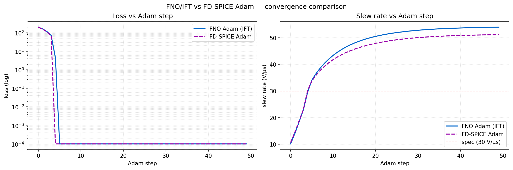

See [`sizing.md`](sizing.md) §FD-SPICE Adam baseline for the full
comparison table and the overlaid $`\theta`$-trajectory figure.

## Off-corner spot-check bound (single (ff, 125 °C) probe)

The FNO device operators were trained on Sky130 ``tt`` BSIM parameters at
27 °C only. The composition layer carries no corner-awareness in its
conditioning. To bound how well the surrogate transfers to off-corner
foundry conditions, this probe runs the FNO-composed transient once and
compares it against two SPICE references at the production sizing
($`W_\mathrm{diff} = W_\mathrm{mirror} = 8`$ µm, $`W_\mathrm{tail} = 2`$ µm,
$`L = 0.40`$ µm, $`V_\mathrm{bias} = 1.2`$ V): NGSpice at ``tt`` / 27 °C
(the training corner) and NGSpice at ``ff`` / 125 °C (single off-corner
point).

| Comparison | Pearson r | max\|ΔV\| | SPICE slew (V/µs) |
|---|---|---|---|
| FNO vs SPICE ``tt`` @ 27 °C | 0.99966 | 68.7 mV | 48.28 |
| FNO vs SPICE ``ff`` @ 125 °C | 0.99912 | 171.8 mV | 46.80 |

FNO slew rate at the same design point: 48.29 V/µs.

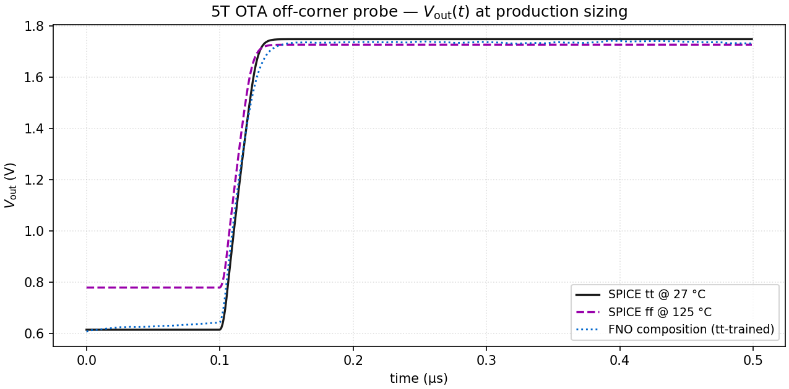

Two effects separate cleanly in the data. Shape fidelity holds: Pearson r
stays $`> 0.999`$ at both corners, and the FNO-predicted slew rate matches
``tt`` SPICE to 0.01 V/µs and ``ff`` SPICE to 1.5 V/µs (3 % off). DC
operating-point bias does not transfer: the ``ff`` / 125 °C corner shifts
the pre-step quiescent $`V_\mathrm{out}`$ from 0.61 V to 0.78 V, and the
FNO continues to predict the ``tt`` quiescent level. The 2.5× degradation
in max\|ΔV\| (68.7 → 171.8 mV) is therefore primarily a DC-bias
generalisation gap, not a transient-shape gap. A corner-aware conditioning
vector (e.g., BSIM4 parameters queried at the target corner) is the
natural mitigation and is left to follow-up work.

Reproduction:

```bash
python -m spino.circuit.off_corner_probe \
    --output-dir runs/off_corner/ota_ff_125c
```

Reproducibility artefacts under [`docs/assets/off_corner/`](assets/off_corner/):
[`summary.json`](assets/off_corner/summary.json) (Pearson r, max|ΔV|, slew rate
per corner, FNO and SPICE wall times, design point) and the V_out overlay
PNG. The local-run-tree analogue is `runs/off_corner/ota_ff_125c/` for
re-generation.

