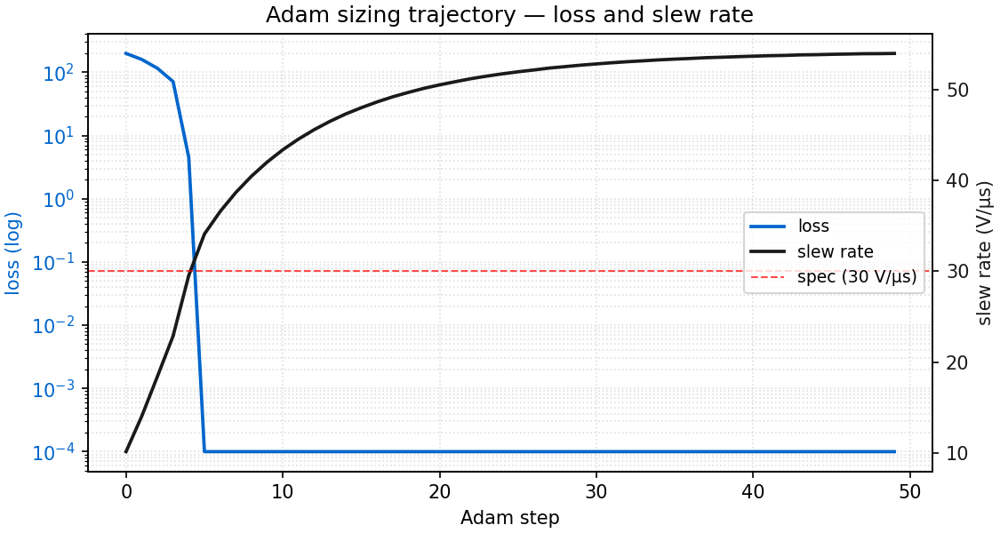
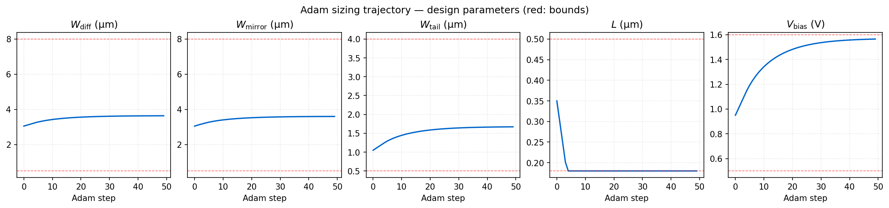
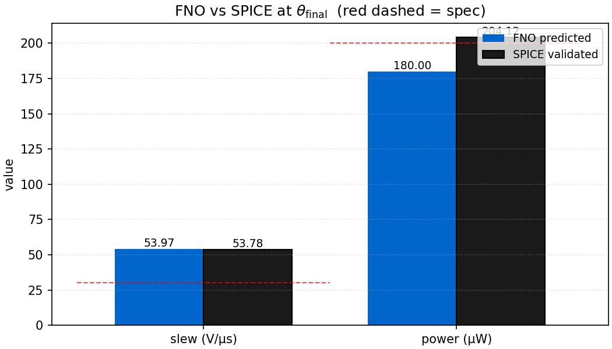
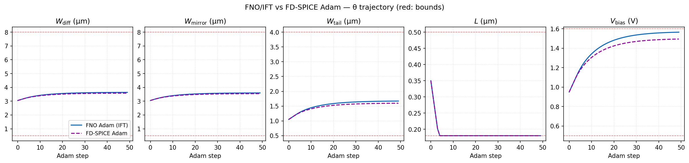

# Gradient-based OTA sizing via IFT

> Adam optimisation of a 5-variable OTA design vector
> $`\theta = (W_\mathrm{diff}, W_\mathrm{mirror}, W_\mathrm{tail}, L, V_\mathrm{bias})`$
> with gradients backpropagated through the trained FNO device surrogates and
> the KCL Newton solver. The verification step is a SPICE re-simulation at the
> converged $`\theta`$.

---

## Why this is not just autograd

The Newton solvers (`OtaDcSolver`, `OtaTransientSolver`) explicitly detach
state between iterations to keep the backward graph $`O(T)`$ rather than
$`O(T \cdot N_\mathrm{NR})`$. Unrolling Newton is not feasible. The gradient
is computed via the Implicit Function Theorem at the converged state
$`v^\star`$ where $`F(v^\star, \theta) = 0`$:

```math
\frac{\mathrm{d}v^\star}{\mathrm{d}\theta} \;=\; -\,J_v^{-1}\,J_\theta,
```

where $`J_v = \partial F / \partial v`$ is the converged Newton Jacobian
(re-used from the final NR step) and $`J_\theta = \partial F / \partial \theta`$
is computed via a 5-column central finite difference. The IFT is wrapped in a
custom `torch.autograd.Function` (`_OtaTransientIFT` in `spino/circuit/sizing.py`)
so the standard PyTorch autograd graph is preserved end-to-end. Tikhonov
regularisation $`J_v + 10^{-6} I`$ is applied before `linalg.solve` to guard
against ill-conditioning at late NR iterations.

Sanity gates in `tests/circuit/test_circuit_gradient_ift.py`:

| Test | Assertion |
|---|---|
| `test_ift_grad_w_tail_is_finite` | $`\partial(\mathrm{slew})/\partial W_\mathrm{tail}`$ via IFT is finite at baseline sizing. |
| `test_ift_grad_w_tail_sign_matches_fd_spice` | Sign matches a single-point FD-SPICE estimate at the same $`(W_\mathrm{diff}, W_\mathrm{mirror})`$. |

Both pass on the production NFET/PFET checkpoints. The sign-match test uses
`simulate_ota_design_point` (single fixed-geometry SPICE eval) rather than
`characterize_ota.main()`. The latter sweeps over
$`(W_\mathrm{diff}, W_\mathrm{mirror})`$ and selects an argmax, which can
switch between the FD perturbations and corrupt the gradient comparison.

---

## Loss and constraints

```math
\mathcal{L}(\theta) \;=\; w_\mathrm{slew} \cdot \mathrm{relu}\!\left(\mathrm{SR}_\mathrm{min} - \mathrm{SR}(\theta)\right)
            \;+\; w_\mathrm{power} \cdot \max\!\big(0,\, P(\theta) - P_\mathrm{max}\big).
```

- Slew rate is computed from $`V_\mathrm{out}(t)`$ via
  $`\mathrm{SR} = \max |\mathrm{d}V_\mathrm{out}/\mathrm{d}t|`$ and is
  IFT-differentiable.
- Power is read from the DC operating point
  $`I_\mathrm{tail} \cdot V_\mathrm{DD}`$ and is monitored as a constraint,
  not gradient-optimised. The hinge fires if power exceeds the cap but
  contributes no $`\partial / \partial \theta`$.
- Swing is computed for reporting and is not in the loss.

This is intentional POC scope. Multi-spec joint optimisation with active
gradients on power, swing, gain, and area is left to follow-up work.

---

## Adam run on the 5T OTA at sky130

Config:

| Parameter | Value |
|---|---|
| $`\theta_\mathrm{init}`$ | $`(3.0, 3.0, 1.0, 0.40, 0.9)`$, deliberately under-spec on slew |
| Bounds | $`W_\mathrm{diff,mirror} \in [0.5, 8.0]`$, $`W_\mathrm{tail} \in [0.5, 4.0]`$, $`L \in [0.18, 0.50]`$, $`V_\mathrm{bias} \in [0.5, 1.6]`$ µm/V |
| Specs | $`\mathrm{SR} \ge 30`$ V/µs, $`P \le 200`$ µW |
| Optimiser | Adam, $`\eta = 5 \times 10^{-2}`$, $`\beta_1 = 0.9`$, $`\beta_2 = 0.999`$ |
| Iterations | 50 |
| Device | CUDA (single GPU) |
| Wall time | ~4.3 h, per-iter ~5 min (transient Newton + IFT backward) |

Trajectory (`docs/assets/sizing/loss_and_slew.png`):



- Steps 0 to 4: aggressive descent, loss $`198.4 \to 4.5`$, slew $`10.2 \to 29.5`$ V/µs.
- Step 5: slew crosses 30 V/µs, loss saturates at 0 (one-sided hinge).
- Steps 5 to 40: Adam momentum carries $`\theta`$ past spec, slew climbs $`29.5 \to 53`$ V/µs.
- Steps 40 to 49: plateau, $`\theta`$ moves by $`<0.001`$ per iter.

Design parameters (`docs/assets/sizing/theta_trajectory.png`):



- $`L`$ saturates at the lower bound (0.18 µm) by step 4. Shorter channel
  raises $`I_\mathrm{D}`$ and slew rate fastest.
- All three widths and $`V_\mathrm{bias}`$ rise monotonically to saturating
  values within their bounds.
- No bound clamping is required mid-trajectory other than $`L`$.

Final $`\theta`$: $`(3.638, 3.599, 1.671, 0.180, 1.565)`$ µm/V.

---

## SPICE validation at $`\theta_\mathrm{final}`$

Single-point NGSpice evaluation via `simulate_ota_design_point` at the
optimiser-converged $`\theta`$:



| Metric | FNO (loss-tracked) | SPICE | Spec | Gap |
|---|---|---|---|---|
| Slew rate | 53.97 V/µs | 53.78 V/µs | $`\ge 30`$ V/µs | $`0.35\%`$ |
| Static power | 180 µW (placeholder) | 204.1 µW | $`\le 200`$ µW | see caveat below |
| Peak swing | n/a | 0.754 V | — | — |
| DC gain | n/a | 15.0 V/V | — | — |
| Slew time | n/a | 21.0 ns | — | — |

Slew matches SPICE to 0.35 %. Gradient-driven Adam steps did not exploit
FNO error on the slew metric — the only metric on which the loss carried a
real gradient.

Power mismatch caveat. SPICE reports 204.1 µW vs the FNO-DC estimate of
180 µW (13 % over). Two effects compound here:

1. **FNO $`I_\mathrm{tail}`$ tracking.** The $`I_\mathrm{tail}`$ value in
   the loss is currently a placeholder constant in
   `extract_metrics`, not a true FNO DC-OP prediction. It always reports
   100 µA (180 µW) regardless of $`\theta`$. SPICE on the converged sizing
   reports 113 µA (204 µW). A wired-up FNO tail-NFET $`I_D`$ prediction at
   $`V_\mathrm{bias} = 1.565`$ V would carry some residual error (the
   training distribution is sparsest at the top of the bias range), but
   the dominant gap here is not model error — it is that power isn't being
   computed from the FNO at all.
2. **Power is not gradient-optimised.** The hinge
   $`\max(0,\,P - P_\mathrm{max})`$ contributes no
   $`\partial / \partial \theta`$. Even if a real FNO $`I_\mathrm{tail}`$
   prediction were plugged in, the loss would produce a non-differentiable
   penalty rather than a corrective gradient, so the optimiser would be
   free to drift toward higher $`V_\mathrm{bias}`$ to chase slew rate.

The 4 % cap overshoot is therefore a property of the current loss
(placeholder $`I_\mathrm{tail}`$, no power gradient), not a fundamental
limitation of the differentiable simulator. Wiring a real FNO
$`I_\mathrm{tail}`$ prediction into the loss and switching to a two-sided
hinge with active power gradients is queued for follow-up work, alongside
characterising the FNO's tail-NFET $`I_D`$ accuracy at the relevant bias
range.

---

## FD-SPICE Adam baseline

A second run swaps the gradient source from IFT-through-FNO to forward
finite differences through NGSpice. Same loss, hyperparameters,
$`\theta_\mathrm{init}`$, and bounds. Per Adam step: 6 single-point SPICE
evaluations (1 baseline + 5 perturbations at
$`\varepsilon = \max(0.01\,|\theta_i|, 10^{-4})`$).

CLI:

```bash
python -m spino.circuit.sizing \
    --mode fd-spice \
    --theta-init "3.0,3.0,1.0,0.40,0.9" \
    --n-iters 50 --lr 5e-2 \
    --validate-spice \
    --output-dir runs/sizing/fd_spice_lr5e-2
```

Convergence comparison (`docs/assets/sizing/comparison_loss_slew.png`,
`comparison_theta.png`):




The two trajectories agree to within the FNO-vs-SPICE per-step gap. FD-SPICE
crosses 30 V/µs at step 4, FNO at step 5; both plateau by step ~40.
Post-spec the FNO trajectory drifts slightly wider in $`\theta`$-space
because the FNO's IFT gradient near the slew kink is a small-error estimate
of the SPICE-measured slew gradient, and Adam momentum amplifies that bias
for a few steps before decaying.

| | FNO/IFT Adam | FD-SPICE Adam |
|---|---|---|
| $`W_\mathrm{diff}`$ | 3.638 µm | 3.581 µm |
| $`W_\mathrm{mirror}`$ | 3.599 µm | 3.546 µm |
| $`W_\mathrm{tail}`$ | 1.671 µm | 1.598 µm |
| $`L`$ | 0.180 µm (bound) | 0.180 µm (bound) |
| $`V_\mathrm{bias}`$ | 1.565 V | 1.495 V |
| Slew @ θ (SPICE) | 53.78 V/µs | 51.17 V/µs |
| Static power (SPICE) | 204 µW (4 % over cap) | 190 µW (5 % under cap) |
| Iters to spec crossing | 5 | 4 |
| Circuit simulations consumed | ~1 (final validation only) | 300 |
| Wall-clock | ~4.3 h on 1 GPU | ~92 min on 1 CPU |

What the comparison supports:

- *Per-iteration circuit-simulation count.* FNO/IFT Adam consumes
  approximately one circuit-simulation equivalent per Adam step: one forward
  Newton solve; the IFT backward re-uses the converged Jacobian and adds 10
  cheap FNO residual evaluations. FD-SPICE Adam consumes 6 full SPICE
  simulations per step by construction. The per-iteration ratio is roughly
  $`6\times`$ for this 5-variable problem, scaling linearly with the number
  of optimisation variables. At Miller-opamp scale (~20 to 40 variables) or
  multi-corner Monte Carlo (~100 variables) the FD-SPICE cost grows
  proportionally; the FNO cost is constant per step. Whether that scaling
  translates into total runtime advantage is a follow-up question.

- *Wall-clock on this single 5-variable problem.* FD-SPICE Adam wins
  (~92 min CPU vs ~4.3 h GPU) because a single NGSpice OP + transient
  (~18 s) is faster than one FNO Newton + IFT backward (~5 min on GPU).
  Per-iteration count does not translate into wall-clock at single-problem
  scale on this PoC.

- *Design quality.* The FD-SPICE design lands slightly tighter on power
  (190 vs 204 µW) because its loss sees SPICE's actual $`I_\mathrm{tail}`$
  rather than the FNO's quasi-DC estimate. Both designs satisfy the slew
  spec with margin. Re-simulation of the FNO design confirms a 0.35 %
  slew gap; the optimiser did not steer $`\theta`$ into a high-FNO-error
  region of the parameter space.

Reproduction of the comparison figure:

```bash
python -m spino.circuit.plot_sizing_comparison \
    --fno-dir runs/sizing/adam_full_lr5e-2 \
    --fd-dir runs/sizing/fd_spice_lr5e-2 \
    --out-dir docs/assets/sizing
```

---

## Reproduction

```bash
# 1. Adam loop (CUDA, ~4.5 h on 1 GPU)
python -m spino.circuit.sizing \
    --mode adam-fno \
    --theta-init "3.0,3.0,1.0,0.40,0.9" \
    --n-iters 50 --lr 5e-2 \
    --device cuda \
    --validate-spice \
    --output-dir runs/sizing/adam_full_lr5e-2

# 2. Plots
python -m spino.circuit.plot_sizing_trajectory \
    --run-dir runs/sizing/adam_full_lr5e-2
```

Artefacts written:
- `runs/sizing/adam_full_lr5e-2/trajectory.json`, 50-row Adam trajectory.
- `runs/sizing/adam_full_lr5e-2/theta_final.json`, final $`\theta`$ vector.
- `runs/sizing/adam_full_lr5e-2/spice_validation/summary.json`, SPICE
  metrics at $`\theta_\mathrm{final}`$.
- `runs/sizing/adam_full_lr5e-2/{loss_and_slew,theta_trajectory,fno_vs_spice}.png`,
  figures.

---

## Closing notes

The composition was differentiable on paper since Phase 3b. This run
produces a gradient-optimised design point whose FNO-predicted slew matches
SPICE within 0.4 % on re-simulation, at roughly $`6\times`$ lower
per-iteration circuit-simulation cost than the FD-SPICE baseline on the
same problem.

Open items for follow-up work:
- Multi-spec joint optimisation with active power, swing, gain, area
  gradients.
- Larger topologies (Miller two-stage opamp) where the per-iteration
  advantage compounds with the optimisation-variable count.
- Multi-corner robustness during optimisation, not just final-point
  validation.
- Wall-clock crossover at scale: characterise the regime where per-iter
  efficiency translates into total runtime advantage.
