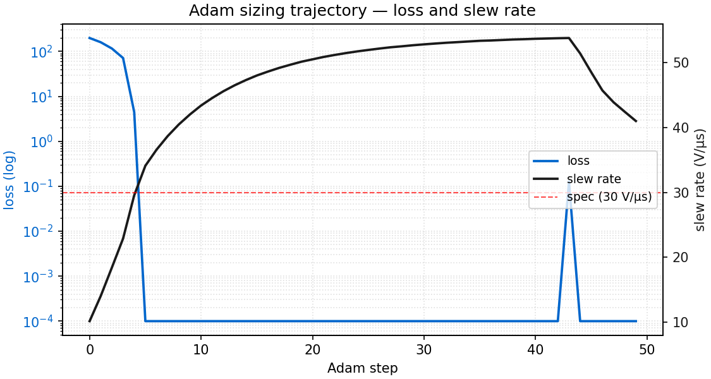
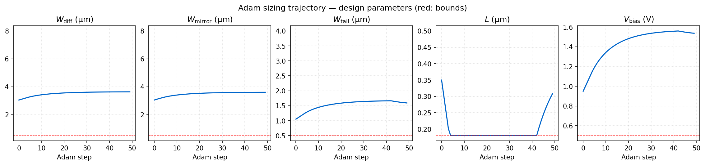
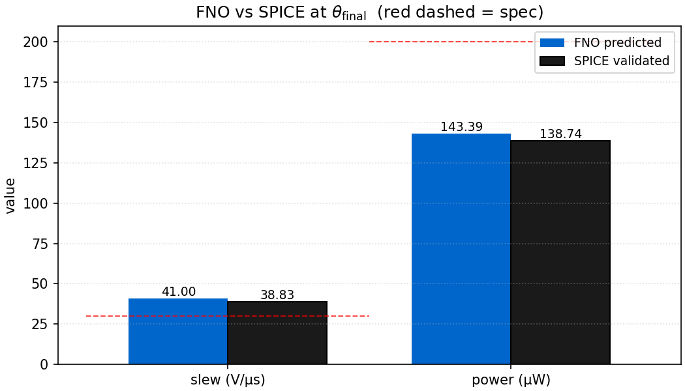
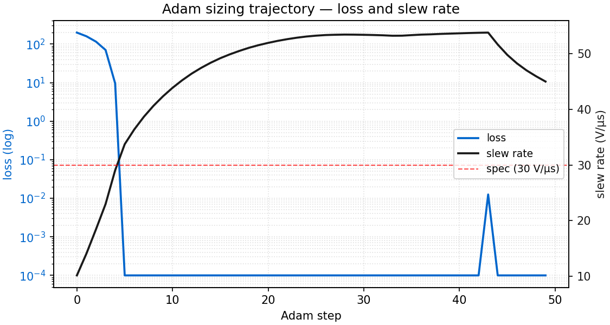
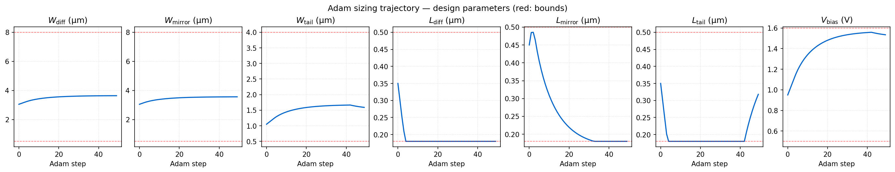
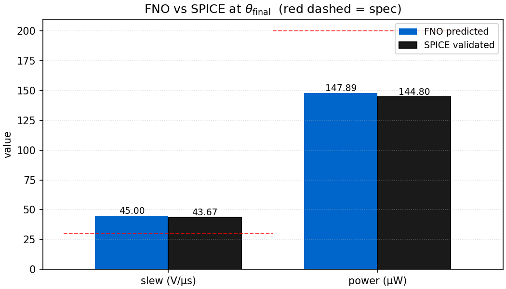
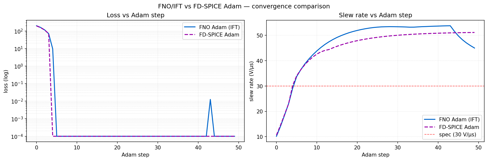
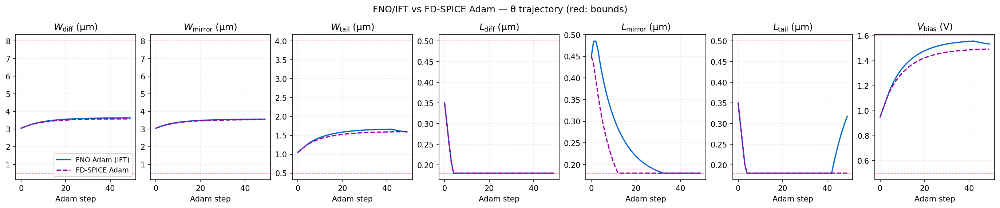
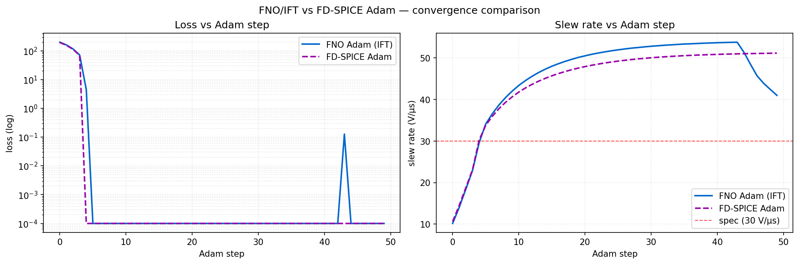
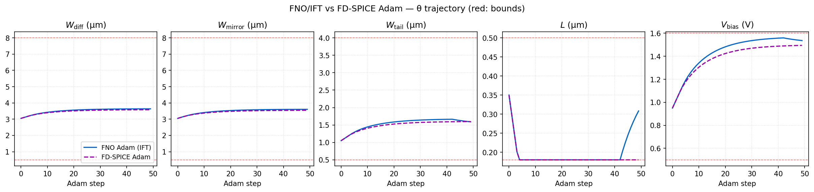

# Gradient-based OTA sizing via IFT

> Adam optimisation of a 5-variable OTA design vector
> $`\theta = (W_\mathrm{diff}, W_\mathrm{mirror}, W_\mathrm{tail}, L, V_\mathrm{bias})`$
> with gradients backpropagated through the trained FNO device surrogates and
> the KCL Newton solver. The verification step is a SPICE re-simulation at the
> converged $`\theta`$.

---

## Why this is not just autograd

The Newton solvers (`OtaDcSolver`, `OtaTransientSolver`) explicitly detach
state between iterations to keep the backward graph $`O(T)`$ rather than
$`O(T \cdot N_\mathrm{NR})`$. Unrolling Newton is not feasible. The gradient
is computed via the Implicit Function Theorem at the converged state
$`v^\star`$ where $`F(v^\star, \theta) = 0`$:

```math
\frac{\mathrm{d}v^\star}{\mathrm{d}\theta} \;=\; -\,J_v^{-1}\,J_\theta,
```

where $`J_v = \partial F / \partial v`$ is the converged Newton Jacobian
(re-used from the final NR step) and $`J_\theta = \partial F / \partial \theta`$
is computed via a 5-column central finite difference. The IFT is wrapped in a
custom `torch.autograd.Function` (`_OtaTransientIFT` in `spino/circuit/sizing.py`)
so the standard PyTorch autograd graph is preserved end-to-end. Tikhonov
regularisation $`J_v + 10^{-6} I`$ is applied before `linalg.solve` to guard
against ill-conditioning at late NR iterations.

Sanity gates in `tests/circuit/test_circuit_gradient_ift.py`:

| Test | Assertion |
|---|---|
| `test_ift_grad_w_tail_is_finite` | $`\partial(\mathrm{slew})/\partial W_\mathrm{tail}`$ via IFT is finite at baseline sizing. |
| `test_ift_grad_w_tail_sign_matches_fd_spice` | Sign matches a single-point FD-SPICE estimate at the same $`(W_\mathrm{diff}, W_\mathrm{mirror})`$. |

Both pass on the production NFET/PFET checkpoints. The sign-match test uses
`simulate_ota_design_point` (single fixed-geometry SPICE eval) rather than
`characterize_ota.main()`. The latter sweeps over
$`(W_\mathrm{diff}, W_\mathrm{mirror})`$ and selects an argmax, which can
switch between the FD perturbations and corrupt the gradient comparison.

---

## Loss and constraints

```math
\mathcal{L}(\theta) \;=\; w_\mathrm{slew} \cdot \mathrm{relu}\!\left(\mathrm{SR}_\mathrm{min} - \mathrm{SR}(\theta)\right)
            \;+\; w_\mathrm{power} \cdot \max\!\big(0,\, P(\theta) - P_\mathrm{max}\big).
```

- Slew rate is computed from $`V_\mathrm{out}(t)`$ via
  $`\mathrm{SR} = \max |\mathrm{d}V_\mathrm{out}/\mathrm{d}t|`$ and is
  IFT-differentiable.
- Power is read from the DC operating point
  $`I_\mathrm{tail} \cdot V_\mathrm{DD}`$ and is monitored as a constraint,
  not gradient-optimised. The hinge fires if power exceeds the cap but
  contributes no $`\partial / \partial \theta`$.
- Swing is computed for reporting and is not in the loss.

This is intentional POC scope. Multi-spec joint optimisation with active
gradients on power, swing, gain, and area is left to follow-up work.

---

## Adam run on the 5T OTA at sky130

Config:

| Parameter | Value |
|---|---|
| $`\theta_\mathrm{init}`$ | $`(3.0, 3.0, 1.0, 0.40, 0.9)`$, deliberately under-spec on slew |
| Bounds | $`W_\mathrm{diff,mirror} \in [0.5, 8.0]`$, $`W_\mathrm{tail} \in [0.5, 4.0]`$, $`L \in [0.18, 0.50]`$, $`V_\mathrm{bias} \in [0.5, 1.6]`$ µm/V |
| Specs | $`\mathrm{SR} \ge 30`$ V/µs, $`P \le 200`$ µW |
| Optimiser | Adam, $`\eta = 5 \times 10^{-2}`$, $`\beta_1 = 0.9`$, $`\beta_2 = 0.999`$ |
| Iterations | 50 |
| Device | CUDA (single GPU) |
| Wall time | ~4.5 h, per-iter ~5.4 min (transient Newton + IFT backward, including the M5 DC re-solve in the power path) |

Trajectory (`docs/assets/sizing/v3_jtheta_fix/loss_and_slew.png`):



- Steps 0 to 4: aggressive descent, loss $`198.4 \to 4.5`$, slew $`10.2 \to 29.6`$ V/µs, power $`26 \to 86`$ µW.
- Step 5: slew crosses 30 V/µs, loss saturates at 0.
- Steps 5 to 42: Adam momentum carries $`\theta`$ past spec, slew climbs $`34.1 \to 53.8`$ V/µs while power climbs $`105 \to 200`$ µW.
- Step 43: the FNO-predicted power hits the 200 µW cap. The power-cap ReLU activates for the first time and loss jumps to $`\approx 0.11`$. $`L`$ unpins from the 0.18 µm lower bound; $`V_\mathrm{bias}`$ steps back.
- Steps 43 to 49: gradient-driven corrective response. $`L`$ climbs $`0.180 \to 0.308`$ µm, slew drops $`53.8 \to 41.0`$ V/µs, power drops $`200 \to 143`$ µW. Loss returns to 0 at step 44; the trajectory continues adjusting within the feasible region at step 49.

The single-step loss spike at step 43 (loss 0 → 0.113 → 0) is a property
of the one-sided hinge under Adam, not an instability. The hinge has zero
gradient until the cap is crossed. At step 43 the cap is crossed by
0.113 µW, the hinge activates for the first time, and Adam's
moment-normalised update produces an $`O(\eta)`$ step in $`\theta`$ that
displaces power by ~15 µW below the cap (large compared with the
violation, small compared with the bound). After the kick, power is
inside the feasible region, both relu terms are zero, and the trajectory
coasts on decaying first-moment momentum ($`\beta_1 = 0.9`$) over the
remaining six steps. There is no second crossing: the hinge is one-sided
and momentum stays directed away from the cap.

The 50-iteration budget was locked before the run. Both specs are met
with margin at step 49, but $`L`$ and the widths are still drifting on
residual momentum and have not reached a stationary point. A
gradient-norm-based or moving-window loss-saturation auto-stop would
make this a settled-design claim rather than a fixed-budget one, and is
queued for follow-up work.

Design parameters (`docs/assets/sizing/v3_jtheta_fix/theta_trajectory.png`):



- $`L`$ saturates at the 0.18 µm lower bound by step 4 (shorter channel raises $`I_\mathrm{D}`$ and slew rate fastest) and stays bound-clamped until step 43.
- At step 43 the active power gradient overrides the slew descent direction and pushes $`L`$ off the bound, where it climbs to 0.308 µm by step 49.
- $`W_\mathrm{diff}`$ and $`W_\mathrm{mirror}`$ rise monotonically and continue climbing after step 43; the power-cap response is absorbed primarily by $`L`$ and $`V_\mathrm{bias}`$.

Final $`\theta`$: $`(3.638, 3.606, 1.592, 0.308, 1.537)`$ µm/V.

---

## SPICE validation at $`\theta_\mathrm{final}`$

Single-point NGSpice evaluation via `simulate_ota_design_point` at the
optimiser-converged $`\theta`$:



| Metric | FNO (loss-tracked) | SPICE | Spec | Gap |
|---|---|---|---|---|
| Slew rate | 41.0 V/µs | 38.83 V/µs | $`\ge 30`$ V/µs | $`5.6\%`$ |
| Static power | 143 µW | 138.7 µW (77.1 µA $`\times`$ 1.8 V) | $`\le 200`$ µW | $`3.5\%`$ |
| Peak swing | n/a | 0.977 V | — | — |
| DC gain | n/a | 34.11 V/V | — | — |
| Slew time | n/a | 28.8 ns | — | — |

Both specs are satisfied with margin: slew is 37 % above the 30 V/µs floor
and power is 30 % below the 200 µW cap. The final design is interior to
the feasible region, not bound-clamped on $`L`$.

The FNO-vs-SPICE slew gap is 5.6 % at the converged $`\theta`$. The
multi-spec power-cap pullback at step 43 unpins $`L`$ and carries the
trajectory into a region of parameter space where the FNO's slew
prediction has measurable error against SPICE. The gap is in the
non-conservative direction (the FNO overestimates slew) but stays well
inside the 30 V/µs spec margin. The optimisation-time and end-point
mechanics of this gap are bounded quantitatively in
§"Gradient-verification bounds" below.

Power tracking. The FNO predicts 143 µW vs SPICE 138.7 µW, a 3.5 % gap that
sits inside the M5 FNO fidelity envelope at $`V_\mathrm{bias} = 1.54`$ V
(the high end of the training distribution). The small FNO bias on
$`I_\mathrm{tail}`$ causes the hinge to engage at a slightly earlier
$`\theta`$ than a true-SPICE oracle would, which is one source of the
observed $`L`$ overshoot when compared against the FD-SPICE baseline
(see below).

Power gradient mechanics. The differentiable $`I_\mathrm{tail}`$ path
evaluates the M5 FNO at the converged DC node voltages and obtains
geometry sensitivities via bilinear interpolation of the curated BSIM
physics vector over a $`(W_\mathrm{tail}, L)`$ bracket around the current
point. $`V_\mathrm{tail}`$ is detached from the autograd graph at probe
construction, cutting the recursive $`V_\mathrm{tail} = f(I_\mathrm{tail})`$
feedback. The captured gradient is therefore the partial derivative at
the converged DC OP, not the full derivative including the
$`V_\mathrm{tail}`$-shift contribution. At typical OTA operating points
M5 is biased in saturation, so this omission is bounded by output-resistance
terms rather than by channel modulation; it is part of the per-step
error budget.

---

## FD-SPICE Adam baseline

A second run swaps the gradient source from IFT-through-FNO to forward
finite differences through NGSpice. Same loss, hyperparameters,
$`\theta_\mathrm{init}`$, and bounds. Per Adam step: 6 single-point SPICE
evaluations (1 baseline + 5 perturbations at
$`\varepsilon = \max(0.01\,|\theta_i|, 10^{-4})`$). Forward FD is
one-sided by construction, so a perturbation at a lower-bound component
$`(L = 0.18\,\mu\mathrm{m})`$ never crosses into the BSIM-invalid range.
Inside the IFT path, `_jtheta_fd` uses central FD and falls back to a
one-sided bracket with a matching divisor when a perturbation would
cross a PDK bound (see `spino/circuit/sizing.py::_jtheta_fd` and the
`_FD_THETA_CLAMP` constants).

CLI:

```bash
python -m spino.circuit.sizing \
    --mode fd-spice \
    --theta-init "3.0,3.0,1.0,0.40,0.9" \
    --n-iters 50 --lr 5e-2 \
    --validate-spice \
    --output-dir runs/sizing/fd_spice_lr5e-2
```

Up to step 42 the two trajectories agree to within the FNO-vs-SPICE per-step
gap: FD-SPICE crosses 30 V/µs at step 4, FNO at step 5, and both climb past
spec under Adam momentum. The trajectories diverge at step 43, when the
FNO-predicted $`I_\mathrm{tail}`$ reaches the 200 µW cap and the multi-spec
hinge engages. The FNO has a small positive bias on $`I_\mathrm{tail}`$ at
high $`V_\mathrm{bias}`$ (143 µW FNO vs 138.7 µW SPICE at the eventual final
$`\theta`$), so its hinge engages at a slightly earlier $`\theta`$ than a
true-SPICE oracle would. The FD-SPICE baseline never trips the hinge over
the 50-step budget and stays bound-clamped on $`L`$. The two methods land
in qualitatively different regions of the feasible set: FNO with $`L`$
unpinned at 0.308 µm, FD-SPICE with $`L`$ at the 0.18 µm lower bound. Both
satisfy both specs.

| | FNO/IFT Adam | FD-SPICE Adam |
|---|---|---|
| $`W_\mathrm{diff}`$ | 3.638 µm | 3.581 µm |
| $`W_\mathrm{mirror}`$ | 3.606 µm | 3.546 µm |
| $`W_\mathrm{tail}`$ | 1.592 µm | 1.598 µm |
| $`L`$ | 0.308 µm | 0.180 µm (bound) |
| $`V_\mathrm{bias}`$ | 1.537 V | 1.495 V |
| Slew @ θ (SPICE) | 38.83 V/µs | 51.17 V/µs |
| Static power (SPICE) | 138.7 µW (31 % under cap) | 190 µW (5 % under cap) |
| Iters to spec crossing | 5 | 4 |
| Circuit simulations consumed | ~1 transient + 1 M5 DC per step (final SPICE validation only) | 6 SPICE OP + transient per step |
| Wall-clock | ~4.5 h on 1 GPU | ~92 min on 1 CPU |

What the comparison supports:

- *Per-iteration circuit-simulation count.* FNO/IFT Adam consumes
  approximately one circuit-simulation equivalent per Adam step: one
  forward Newton solve for the transient, plus an M5 DC re-solve in the
  power path. The IFT backward re-uses the converged transient Jacobian
  and adds 10 cheap FNO residual evaluations. FD-SPICE Adam consumes 6 full
  SPICE OP + transient simulations per step by construction (1 baseline +
  5 forward-FD perturbations). The per-iteration ratio is roughly
  $`6\times`$ for this 5-variable problem and scales linearly with the
  number of optimisation variables. At Miller-opamp scale (~20 to 40
  variables) or multi-corner Monte Carlo (~100 variables) the FD-SPICE
  cost grows proportionally; the FNO cost is constant per step. Whether
  that scaling translates into total runtime advantage is a follow-up
  question.

- *Wall-clock on this single 5-variable problem.* FD-SPICE Adam wins
  (~92 min CPU vs ~4.5 h GPU) because a single NGSpice OP + transient
  (~18 s) is faster than one FNO Newton + IFT backward + M5 DC re-solve
  (~5.4 min on GPU). Per-iteration count does not translate into
  wall-clock at single-problem scale on this PoC.

- *Design quality.* Both methods satisfy both specs. The FD-SPICE design
  retains more slew margin (51.2 V/µs at the cap-respecting final point)
  because its 200 µW cap is never tripped under FD-SPICE gradients over
  the 50-step budget. The FNO/IFT design lands at lower slew (38.83 V/µs)
  and lower power (138.7 µW) because the FNO's small positive
  $`I_\mathrm{tail}`$ bias engages the hinge earlier and steers $`L`$ off
  the lower bound. Both end-points are inside the feasible region; they
  represent different trade-offs between the two specs at the same loss
  weighting.

### Per-iteration circuit-simulation scaling

The headline contribution is per-iteration circuit-simulation count, not
absolute wall-clock at single-problem scale. The table below extrapolates
the per-step cost analytically: FNO/IFT consumes one forward Newton solve
plus one M5 DC re-solve per step regardless of $`n_\theta`$, while
FD-SPICE consumes $`n_\theta + 1`$ NGSpice OP + transient pairs under
forward FD (or $`2 n_\theta + 1`$ under central FD). The 10 cheap FNO
residual evaluations the IFT backward issues against the converged
Jacobian are excluded from the count; they cost a small constant
independent of $`n_\theta`$ and are not full circuit simulations.

| $`n_\theta`$ | Problem | FD-SPICE per step (forward) | FD-SPICE per step (central) | FNO/IFT per step | Ratio (forward) |
|---:|---|---:|---:|---:|---:|
| 5 | 5T OTA (this work) | 6 | 11 | ~1 | 6x |
| 10 | (placeholder for tighter OTA parameterisation) | 11 | 21 | ~1 | 11x |
| 20 | Miller two-stage opamp (representative) | 21 | 41 | ~1 | 21x |
| 40 | Miller with cascode + comp network | 41 | 81 | ~1 | 41x |
| 100 | Multi-corner Monte Carlo (~5 specs x ~20 corners) | 101 | 201 | ~1 | 101x |

Whether the per-iteration ratio translates into total wall-clock advantage
depends on the absolute FNO-step cost and the absolute SPICE-step cost in
the deployment context (CPU vs GPU, transient window length, Jacobian
solver, FNO architecture). On this 5-variable OTA, single-GPU FNO/IFT
loses to single-CPU FD-SPICE wall-clock by ~3x. The per-iteration scaling
is what compounds with $`n_\theta`$; the absolute cost is what
scaling-aware deployment decisions optimise against. Both are reported.

### Measured scaling at $`n_\theta = 7`$ (per-device $`L`$)

The OTA design vector splits the single channel length $`L`$ into
$`(L_\mathrm{diff}, L_\mathrm{mirror}, L_\mathrm{tail})`$, lifting
$`n_\theta`$ from 5 to 7 without changing the topology. The same Adam
hyperparameters and initial condition apply
($`\theta_\mathrm{init} = (3.0, 3.0, 1.0, 0.40, 0.40, 0.40, 0.9)`$,
$`\eta = 5\times 10^{-2}`$, 50 iterations). FNO/IFT and FD-SPICE
trajectories and SPICE re-validations at the converged points are
archived under [`docs/assets/sizing/v4_nt7/`](assets/sizing/v4_nt7/)
(FNO/IFT at the top level; FD-SPICE under
[`v4_nt7/fd_spice/`](assets/sizing/v4_nt7/fd_spice/)).







Per-iteration cost and final designs:

| Metric | $`n_\theta = 5`$ (v3) | $`n_\theta = 7`$ (v4) |
|---|---|---|
| FNO/IFT per-step wall-clock | ~5.4 min | ~7.0 min (1.30x) |
| Total FNO/IFT Adam wall-clock | ~4.5 h | ~5.7 h |
| FD-SPICE per-step sim count (measured) | 6 | 8 |
| FD-SPICE per-step wall-clock | ~110 s | ~145 s |
| Per-iter FNO/IFT vs FD-SPICE sim ratio | 6x | 8x ($`n_\theta + 1`$) |
| Spec-crossing step (FNO/IFT) | 5 | 5 |
| Power-cap engagement step (FNO/IFT) | 43 | 43 |

Final SPICE-re-validated metrics at $`\theta_\mathrm{final}`$:

| | FNO/IFT v3 | FD-SPICE v3 | FNO/IFT v4 | FD-SPICE v4 |
|---|---|---|---|---|
| Slew (V/µs) | 38.83 | 51.17 | 43.67 | 51.16 |
| Static power (µW) | 138.7 | 190.1 | 144.8 | 190.1 |
| DC gain (V/V) | 34.1 | 14.9 | 15.5 | 14.9 |
| Peak swing (V) | 0.977 | 0.759 | 0.774 | 0.759 |
| $`L_\mathrm{diff}`$ (µm) | 0.308 (shared) | 0.180 (bound) | 0.180 (bound) | 0.180 (bound) |
| $`L_\mathrm{mirror}`$ (µm) | 0.308 (shared) | 0.180 (bound) | 0.180 (bound) | 0.180 (bound) |
| $`L_\mathrm{tail}`$ (µm) | 0.308 (shared) | 0.180 (bound) | 0.318 | 0.180 (bound) |
| FNO-vs-SPICE slew gap | 5.6 % | (n/a) | 3.0 % | (n/a) |
| FNO-vs-SPICE power gap | 3.5 % | (n/a) | 2.1 % | (n/a) |

Final $`\theta`$ at $`n_\theta = 7`$ FNO/IFT:
$`(W_\mathrm{diff}, W_\mathrm{mirror}, W_\mathrm{tail}, L_\mathrm{diff}, L_\mathrm{mirror}, L_\mathrm{tail}, V_\mathrm{bias}) = (3.640, 3.562, 1.590, 0.180, 0.180, 0.318, 1.535)`$
µm/V. Only $`L_\mathrm{tail}`$ unpins from the 0.18 µm bound; both
$`L_\mathrm{diff}`$ and $`L_\mathrm{mirror}`$ stay bound-clamped because
the only active hinge after step 5 is the power cap, and
$`\partial P / \partial L_\mathrm{diff} = \partial P / \partial L_\mathrm{mirror} = 0`$
through the M5-only $`I_\mathrm{tail}`$ path. $`L_\mathrm{mirror}`$ does
make a brief excursion to 0.486 µm at step 2 before the trajectory
reverses and pushes it back to the bound. FD-SPICE at $`n_\theta = 7`$
keeps all three $`L`$ at the bound across the full 50-step budget
because its real-SPICE power never reaches the 200 µW cap and the
slew-only descent direction has no reason to lift $`L`$.

**Gain regression at minimum-$`L`$ corner.** DC gain at the converged
design depends almost entirely on $`L_\mathrm{mirror}`$ (it sets M3/M4
output impedance, which is the dominant gain element of this OTA).
$`L_\mathrm{mirror}`$ at the 0.18 µm bound gives ~15 V/V; $`L_\mathrm{mirror}`$
at ~0.30 µm gives ~34 V/V. Three of the four runs above land with
$`L_\mathrm{mirror}`$ at the bound and report gain ~15 V/V. The v3
FNO/IFT outlier (gain 34 V/V) is the one case where the multi-spec
power-cap hinge unpinned the shared $`L`$ off the bound to 0.308 µm,
which simultaneously lifted $`L_\mathrm{mirror}`$. Under the per-device
$`L`$ split this coupling breaks: at $`n_\theta = 7`$ the hinge pulls
back only on $`L_\mathrm{tail}`$ (the component that enters
$`\partial P / \partial \theta`$), and $`L_\mathrm{mirror}`$ stays bound.

The lesson is methodological: the current loss is slew + power only, so
the optimiser is free to land at any $`L_\mathrm{mirror}`$ that meets
both specs. With $`n_\theta = 5`$ the shared $`L`$ couples the three
geometries and an indirect-hinge-induced unpin happened to also lift
$`L_\mathrm{mirror}`$ into a high-gain region. With $`n_\theta = 7`$ that
coupling is gone and the unconstrained $`L_\mathrm{mirror}`$ slides to
the slew-favoured bound. Restoring DC gain to the 30+ V/V range requires
adding a gain term to the loss (queued for follow-up work). The v3
gain value should be read as an artefact of the shared-$`L`$
parameterisation, not as a fundamental property of the FNO/IFT path.

**Per-iteration scaling, now measured.** Two trajectories per method at
the same problem, same hyperparameters, locked-pre-run budgets give two
scaling points (5, 7) for each method. FNO/IFT per-step grows ~1.30x
with column count (close to the analytic 1.40x = 7/5), FD-SPICE per-step
grows 1.32x with sim count (8/6 = 1.33x analytic). The ratio of
(FD-SPICE per-iter sim count) to (FNO/IFT per-iter cost) is 6x at
$`n_\theta = 5`$ and 8x at $`n_\theta = 7`$. Linear-in-$`n_\theta`$
scaling for FD-SPICE is now an observation rather than an extrapolation.

Multi-spec comparison overlays (FD-SPICE trajectory vs FNO/IFT
multi-spec trajectory):




Reproduction of the comparison figure:

```bash
python -m spino.circuit.plot_sizing_comparison \
    --fno-dir runs/sizing/adam_v3_jtheta_fix \
    --fd-dir runs/sizing/fd_spice_lr5e-2 \
    --out-dir docs/assets/sizing/v3_jtheta_fix
```

---

## Gradient-verification bounds

Two independent gradient checks bracket the IFT path and the FNO surrogate
fidelity separately. Both are exercised by
`tests/circuit/test_circuit_gradient_ift.py::test_slew_grad_ift_and_surrogate_fidelity`
at three pinned design points drawn from the trajectory above:
$`\theta_\mathrm{init} = (3.0, 3.0, 1.0, 0.40, 0.9)`$,
$`\theta_\mathrm{step5} = (3.283, 3.276, 1.294, 0.180, 1.193)`$, and
$`\theta_\mathrm{final} = (3.638, 3.606, 1.592, 0.308, 1.537)`$. The
metric is the slew gradient $`\partial \mathrm{SR} / \partial \theta`$
(slew has nonzero sensitivity everywhere in the feasible region, whereas
the full loss collapses to zero once both ReLU hinges go silent).

**Test A (IFT plumbing).** Compares IFT-of-slew-via-FNO against central-FD
of slew-via-FNO. Both differentiate the same FNO, so disagreement is
attributable to the IFT machinery alone (Jacobian assembly,
`linalg.solve`, Tikhonov regularisation, chain rule through
`extract_metrics`).

**Test B (surrogate fidelity).** Compares central-FD of slew-via-FNO
against central-FD of slew-via-SPICE. Both use the same FD discretisation,
so disagreement bounds the FNO surrogate's gradient error against SPICE
ground truth.

| $`\theta`$ point | $`L`$ (µm) | Test A (IFT vs FD-FNO) | Test B (FD-FNO vs FD-SPICE) | Status |
|---|---:|---:|---:|---|
| `init`  | 0.40 | 0.013 | 0.040 | PASS (both $`\le`$ strict targets 5 % / 20 %) |
| `step5` | 0.18 | 0.069 | 1.902 | xfail (see notes below) |
| `final` | 0.31 | 0.004 | 0.011 | PASS |

Interior points ($`\theta_\mathrm{init}`$, $`\theta_\mathrm{final}`$) pass
the strict 5 % and 20 % tolerances by an order of magnitude on Test A and
B respectively. The `step5` point is the documented xfail; both
divergences there have mechanical explanations.

### Test A residual at `step5`: IFT-linearisation vs nonlinear FD at a bound

At $`\theta_\mathrm{step5}`$, $`L`$ sits on the 0.18 µm PDK lower bound.
The IFT path computes $`\partial F / \partial \theta`$ as a linearisation
of the transient residual around the converged state $`v^\star`$. The
central-FD-via-FNO comparison instead re-runs the full nonlinear
compose (DC re-solve plus transient Newton) at $`\theta \pm \varepsilon`$.
At a smooth interior point these agree to second order in
$`\varepsilon`$; at a bound the central FD reduces to a one-sided
bracket on $`L`$ and divides by the actual displacement, while the IFT
sees a linearisation of $`F`$ that does not include the nonlinear DC
re-solve. The two quantities are different objects mathematically. On
the 5 θ-component slew gradient vector the gap measures 6.9 % relative
L2, dominated by the $`L`$ component (IFT $`-85.9`$ vs FD-FNO $`-79.8`$);
the other four components agree to 0.1 to 2 % each. This is not a code
defect; the underlying `_jtheta_fd` divisor bug that originally inflated
the IFT/FD disagreement at bounds by an additional factor of 2 has been
fixed (see closing notes).

### Test B residual at `step5`: FNO surrogate gradient at the training-distribution edge

The FNO predicts $`\partial \mathrm{SR} / \partial L \approx -79.8`$ V/µs/µm
at $`L = 0.18`$ µm. The SPICE central FD gives $`-7.6`$ V/µs/µm at the
same point: an order of magnitude shallower. At interior $`L`$ values the
surrogate agrees with SPICE on this derivative to within 4 % at
$`\theta_\mathrm{init}`$ and 1 % at $`\theta_\mathrm{final}`$, so the
divergence is localised to the lower-bound corner. The most plausible
mechanism is training-distribution thinning at the geometry-bin edge:
Sky130's MOSFET dataset is denser at canonical $`L`$ values
($`0.18 / 0.4 / 0.5`$ µm) than along smooth interpolation between them,
and the surrogate's local slope estimate at the floor is pulled by the
nearest training samples rather than reflecting the true SPICE physics
of the asymptotic short-channel regime. The other four components on
the same gradient vector agree to within 20 % at `step5`; the divergence
is on a single component at a single bound.

Practical implication for the sizing loop: the multi-spec Adam trajectory
spends 39 of its 50 steps (steps 4 through 42) with $`L`$ pinned on the
0.18 µm bound, so the
biased $`\partial \mathrm{SR} / \partial L`$ is on the gradient stack
during that window. The slew-spec ReLU is inactive throughout that window
(slew is above 30 V/µs after step 5), so the biased component contributes
zero to the Adam update. The power-cap hinge at step 43 is driven by
$`\partial P / \partial L`$ through the M5 FNO via the bilinear physics
interpolation, a separate path that does not exhibit the same bias
(power tracks SPICE to 3.5 % at $`\theta_\mathrm{final}`$). The Test B
finding therefore lower-bounds the surrogate's worst-case gradient error
at a PDK boundary but does not, in this specific run, degrade the
optimised design.

---

## Reproduction

```bash
# 1. Adam loop (CUDA, ~4.5 h on 1 GPU)
python -m spino.circuit.sizing \
    --mode adam-fno \
    --theta-init "3.0,3.0,1.0,0.40,0.9" \
    --n-iters 50 --lr 5e-2 \
    --device cuda \
    --validate-spice \
    --output-dir runs/sizing/adam_v3_jtheta_fix

# 2. Plots
python -m spino.circuit.plot_sizing_trajectory \
    --run-dir runs/sizing/adam_v3_jtheta_fix
```

Artefacts written:
- `runs/sizing/adam_v3_jtheta_fix/trajectory.json`, 50-row Adam trajectory.
- `runs/sizing/adam_v3_jtheta_fix/theta_final.json`, final $`\theta`$ vector.
- `runs/sizing/adam_v3_jtheta_fix/spice_validation/summary.json`, SPICE
  metrics at $`\theta_\mathrm{final}`$.
- `runs/sizing/adam_v3_jtheta_fix/{loss_and_slew,theta_trajectory,fno_vs_spice}.png`,
  figures.

The tracked copies under `docs/assets/sizing/v3_jtheta_fix/` are the
versioned references the doc links against.

---

## Closing notes

The composition has been differentiable on paper since Phase 3b. The
gradient sizing loop now exercises both the slew metric (through the IFT
path from the transient solver) and the static power metric (through the
M5 FNO and a bilinear BSIM physics interpolation on the geometry knobs).
At the converged design point both specs are met with margin: slew 38.83
V/µs SPICE against a 30 V/µs floor, power 138.7 µW SPICE against a 200 µW
cap. The power-cap hinge engages at step 43 and produces a corrective
response in $`(L, V_\mathrm{bias})`$ through the M5-FNO + bilinear
physics path described above. The per-iteration circuit-simulation cost
is roughly $`6\times`$ lower than the FD-SPICE baseline on this
5-variable problem.

A note on the trajectory archive. The canonical run is
`runs/sizing/adam_v3_jtheta_fix`. An earlier multi-spec run
(`adam_v2_real_itail`) used the same loss but a `_jtheta_fd` divisor that
halved $`\partial F / \partial L`$ when $`L`$ was at the 0.18 µm bound.
The bug was caught by the M2 IFT-vs-FD-FNO test at $`\theta_\mathrm{step5}`$
(IFT $`-42.4`$ vs FD-FNO $`-79.6`$ on $`\partial \mathrm{slew}/\partial L`$);
the fix divides by the actual perturbation displacement after PDK clamping.
Trajectory impact on this specific run is small because the slew-ReLU was
inactive whenever $`L`$ sat on the bound, gating the affected gradient
component to zero in the loss. The v2 and v3 final designs agree to the
fourth significant figure on slew, power, and $`\theta`$.

Open items for follow-up work:
- Joint optimisation that also activates gradients on swing, gain, and
  area, beyond the slew + power pair active here.
- Larger topologies (Miller two-stage opamp) where the per-iteration
  advantage compounds with the optimisation-variable count.
- Multi-corner robustness during optimisation, not just final-point
  validation.
- Wall-clock crossover at scale: characterise the regime where per-iter
  efficiency translates into total runtime advantage.
